# ما الجديد

### [8.8.79] فرز الإشارات حسب الصفحة أو التاريخ
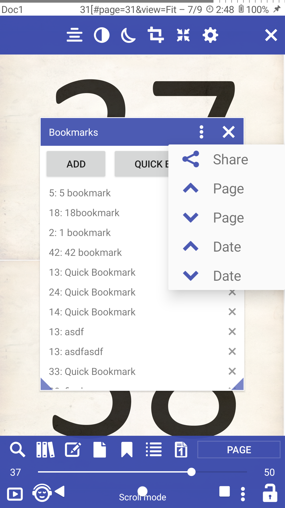

### [8.8.37] ادخل إلى المكتبة من الكتاب
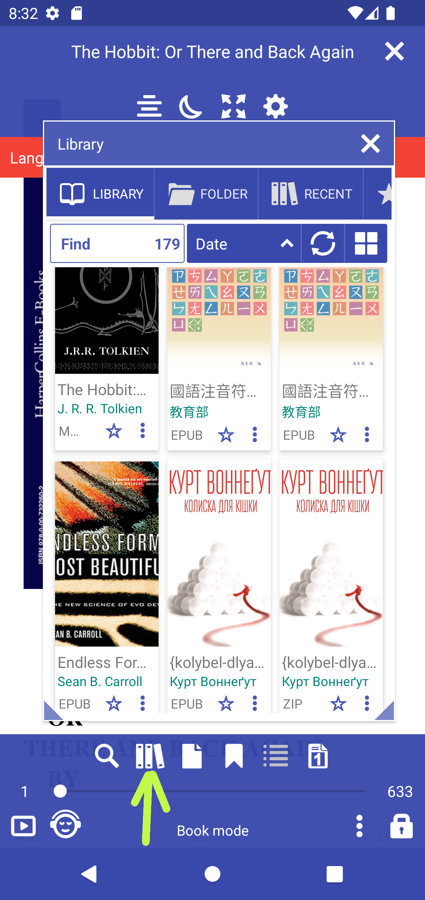

### [8.8.16] دعم الصور الخارجية (http: //) في كتب EPUB.

يجب تمكين الميزة التجريبية

### [8.8.0] تغيير محرك العرض داخل التطبيق

**MuPDF_1.11** محرك عرض Librera الأساسي

**MuPDF_1.20.x** محرك عرض حديث ، سريع ودقيق ولكن يمكن أن يكون به أخطاء وأعطال

||||
|-|-|-|
|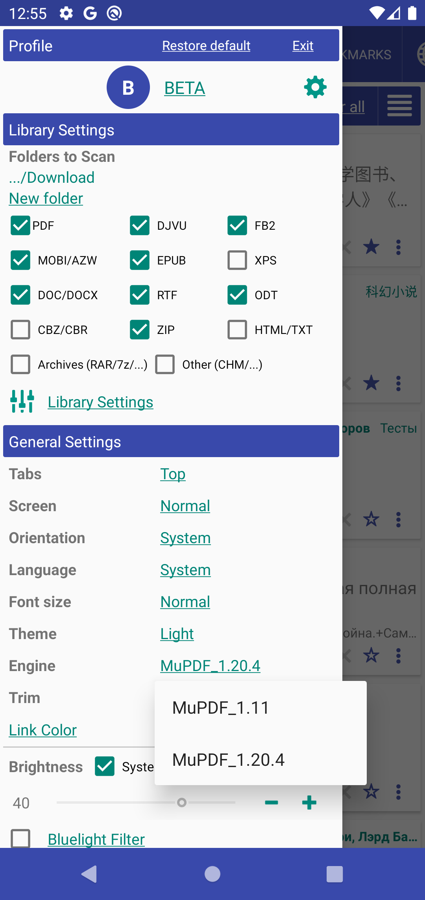|||

### [8.6.44] تدوير الصفحة في القائمة السفلية
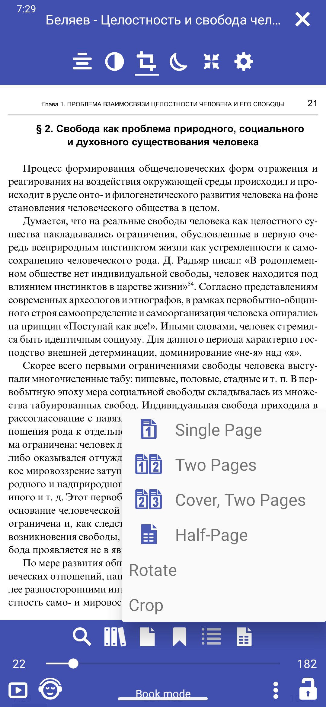

### [8.6.47] دعم CSS مخصص ودعم الجدول
تمت إضافة إمكانية اختيار ملف css لأنماط المستخدم
```
/sdcard/Librera/profile.Librera/device.[]/*.css

app-Librera.css - Librera default user styles for documents
app-MuPDF.css - Default MUPDF styles with Table support
```

||||
|-|-|-|
|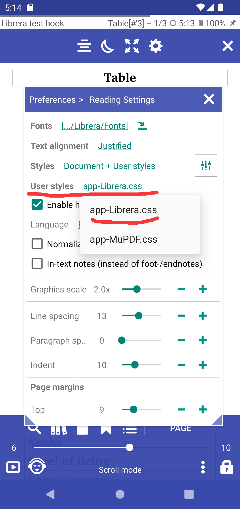|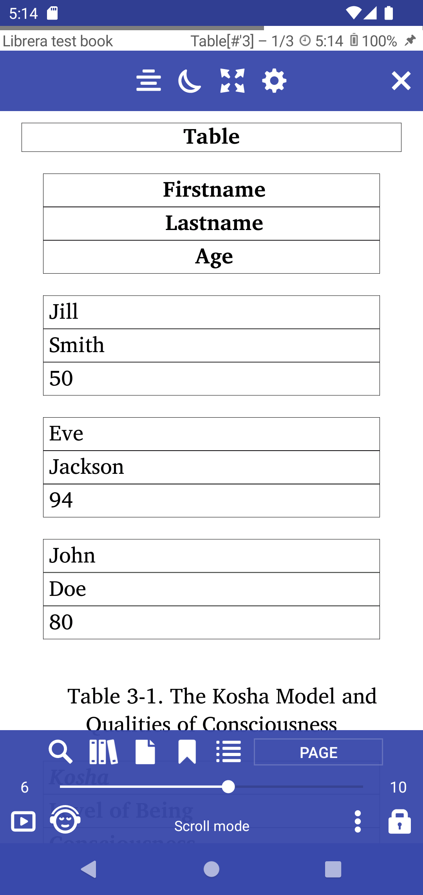|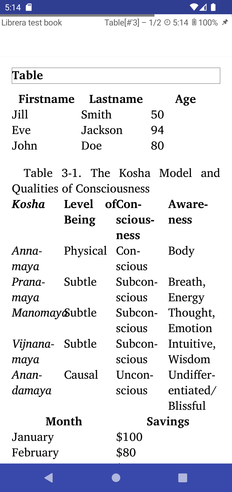|

### [8.6.44] تدوير الصفحة في القائمة السفلية


### [8.6.43] تدوير الصفحة 90 درجة ، وقطع الحدود البيضاء ، ومقطع إلى صفحتين

||||
|-|-|-|
|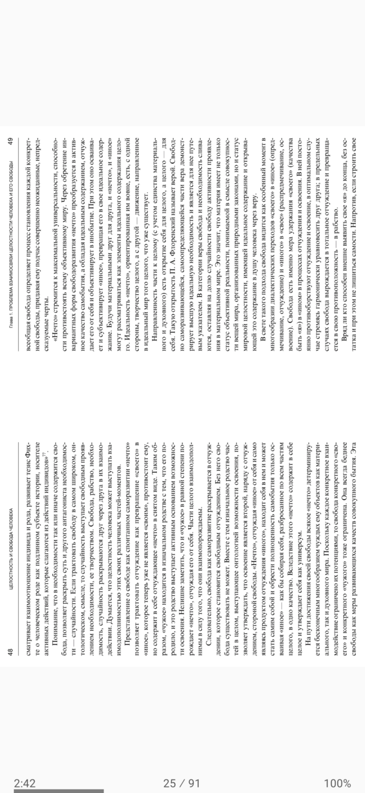|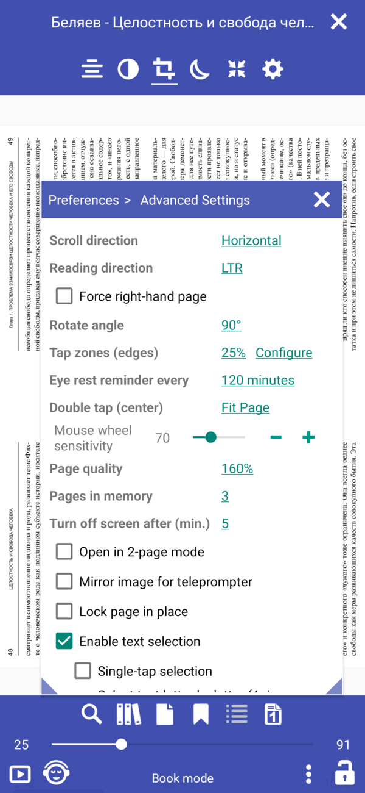|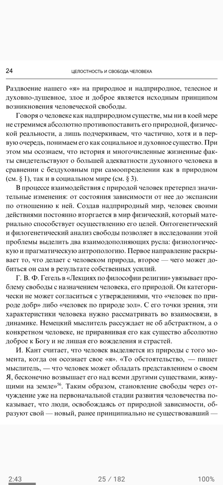|

### [8.6.41] إظهار اسم السلسلة ، الترتيب حسب فهرس السلاسل


### [8.6.40] هيئ ما سيتم عرضه في علامة التبويب المفضلة
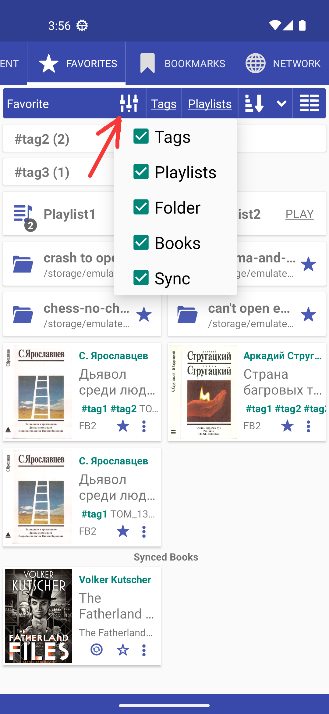

### [8.6.39] تم نقل بحث الويب وقواميس الويب إلى ملفات المستخدم app-WebDict.json و app-WebSearch.json

```
> /storage/emulated/0/Librera/profile.Librera/device.[name]/app-WebSearch.json
[
{"name": "_ Disabled dict starts with _", "path": "https://translate.google.com/#%s/%s/%s"},
{"name": "Google", "path": "http://www.google.com/search?q=%s"},
{"name": "StartPage", "path": "https://www.startpage.com/sp/search?query=%s"},
{"name": "DuckDuckGo", "path": "https://duckduckgo.com/?q=%s"}
]
```

### [8.6.36] أضف بحث الويب في Google و DuckDuckGo و StartPage
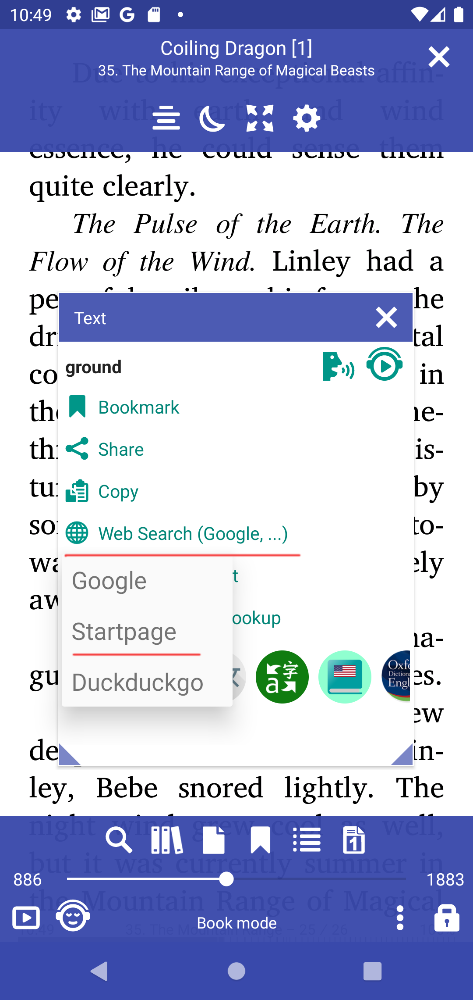


### [8.6.32] علامة التبويب المفضلة - خيارات فرز القائمة
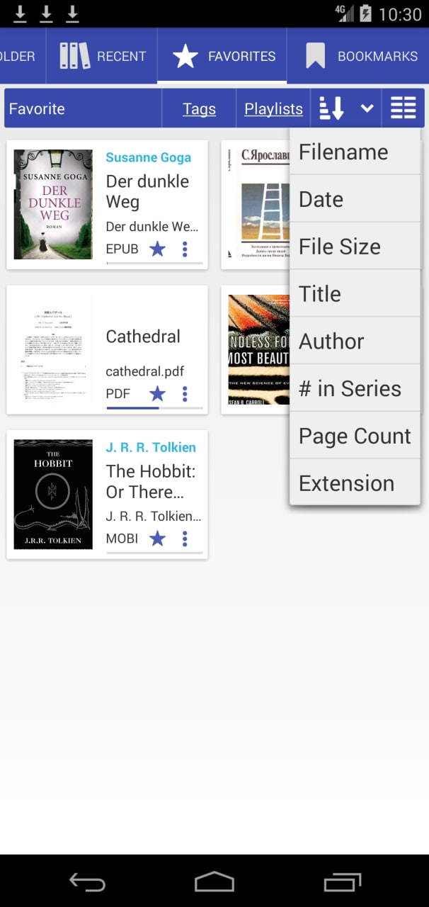

### [8.6.30] Librera Old لنظام Android 4.0 والإصدارات الأحدث [تنزيل](https://github.com/foobnix/LibreraReader/releases/)
### [8.6.21] أنشئ مجلدًا باسم الكتاب للكتب التي تم تنزيلها OPDS
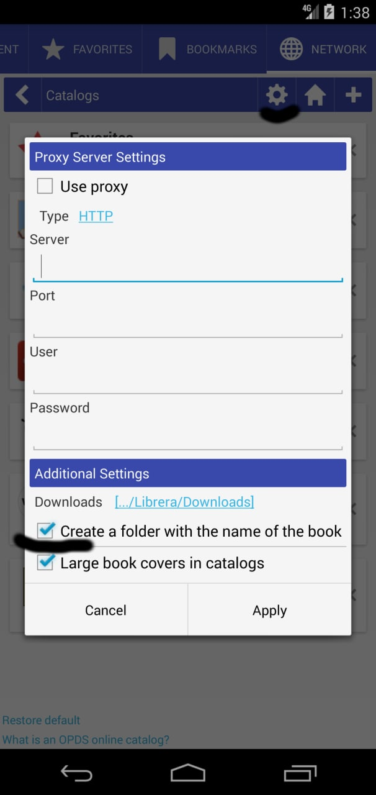

### [8.6.19] عامل مقياس صورة مخصص (مقياس رسومي) لـ Epub

||||
|-|-|-|
|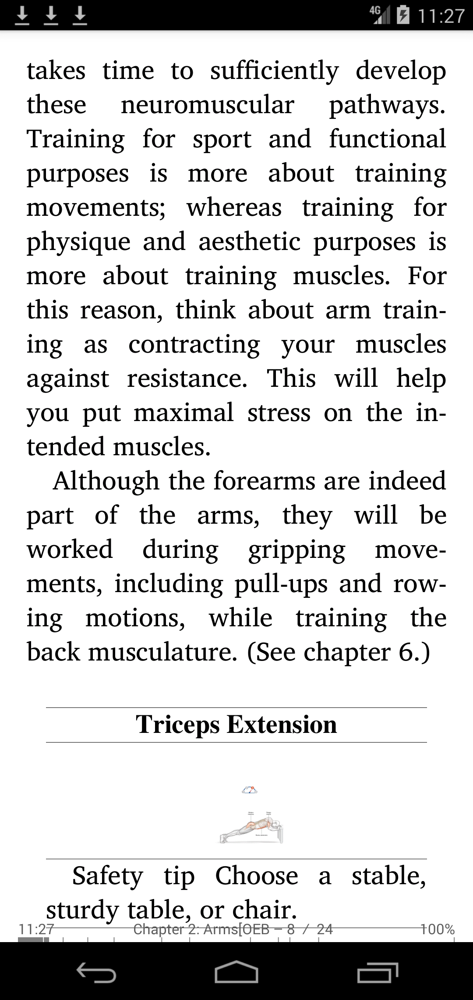|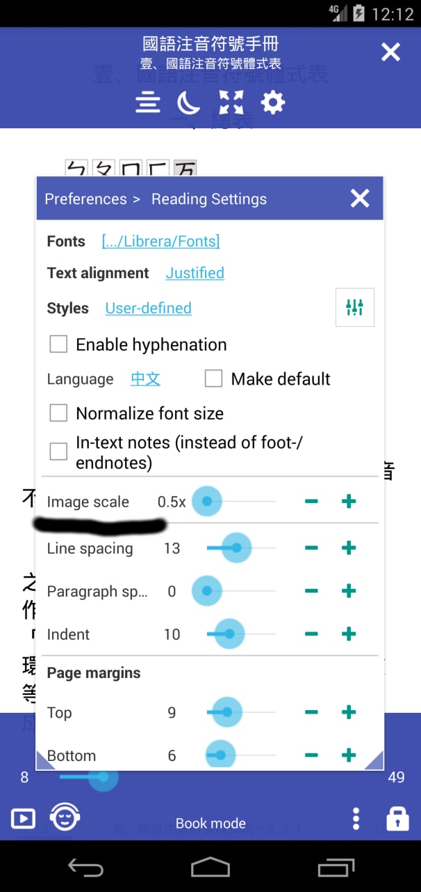|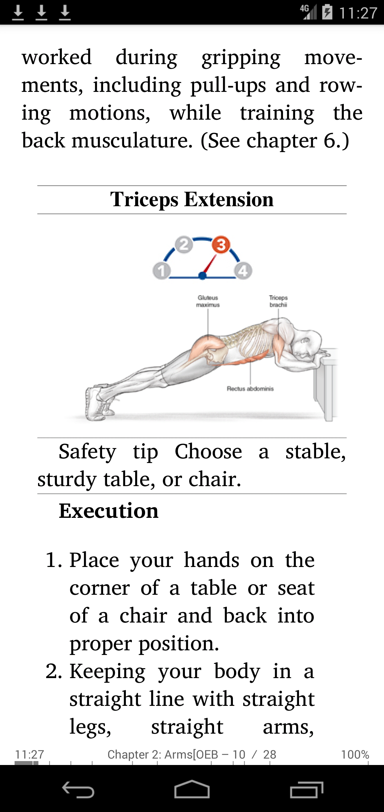|

### [8.6.01] رموز متجهة جديدة ، واجهة مستخدم محسّنة
### [8.5.50] إظهار عدد الكتب في كل مجلد
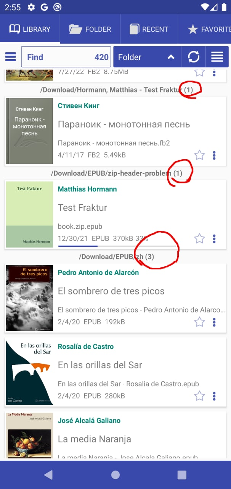

### [8.5.40] إخفاء الكتب المقروءة في علامة تبويب المجلد وعلامة التبويب &quot;المكتبة&quot;
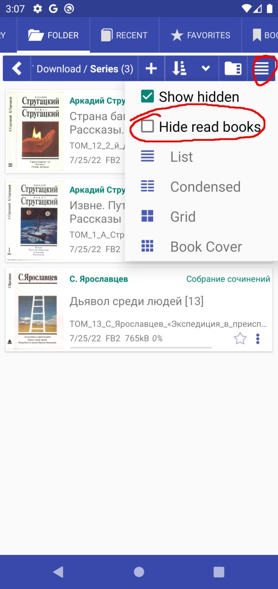


### [8.5.27] استعادة استعلام البحث عند بدء التشغيل

### [8.5.12] دعم EPUB والرسوم الهزلية مع صور WEBP
### [8.4.21] ترميز نص معين مسبقًا لملفات TXT
### [8.4.08] افتح الكتب دائمًا في وضع صفحتين

### [8.3.97] تمكين تعطيل تكامل قائمة السياق (تحديد النص)
|||
|-|-|
|||

### [8.3.94] ربط GitBook

|||
|-|-|
|||

### [8.3.90] تحسين إمكانية الوصول

### [8.3.84] تنسيق مجلد تنزيل OPDS &quot;[اسم المؤلف]/اسم الكتاب&quot;

### [8.3.80] اختيار النص: سيتم تحديد الكلمة الأخيرة الواصلة في الصفحة على أنها مكتملة


### [8.3.78] لغة واصلة افتراضية لجميع الكتب


### [8.3.77] صورة طبق الأصل للكمبيوتر عن بعد

||||
|-|-|-|
||||

### [8.3.70] إظهار وصف الكتاب

|||
|-|-|
|||


### [8.3.58] عدد الكتب في المجلد


### [8.3.49] إجراء &quot;فتح باستخدام&quot; الافتراضي لفتح الكتاب

|||
|-|-|
|||


### [8.3.41] علامات التبويب &quot;الرموز فقط&quot;

||||
|-|-|-|
||||


### [8.2.37] ملف جديد ، مجلد جديد ، انتقل إلى خيارات المجلد


### [8.2.36] مسار تعديل &quot;الانتقال إلى المجلد&quot; (نقرة طويلة)


### [8.2.22] الوضع المرجعي كما في عرض العيار

|||
|-|-|
|||

### [8.2.21] الدعم الأساسي لملفات .md Markdown

### [8.2.20] أرسل الصفحة كنص/صورة من مربع حوار الانتقال إلى الصفحة.


### [8.2.19] تحديد تنسيقات الكتاب لأوضاع القراءة (الإعدادات المسبقة لوضع القراءة)

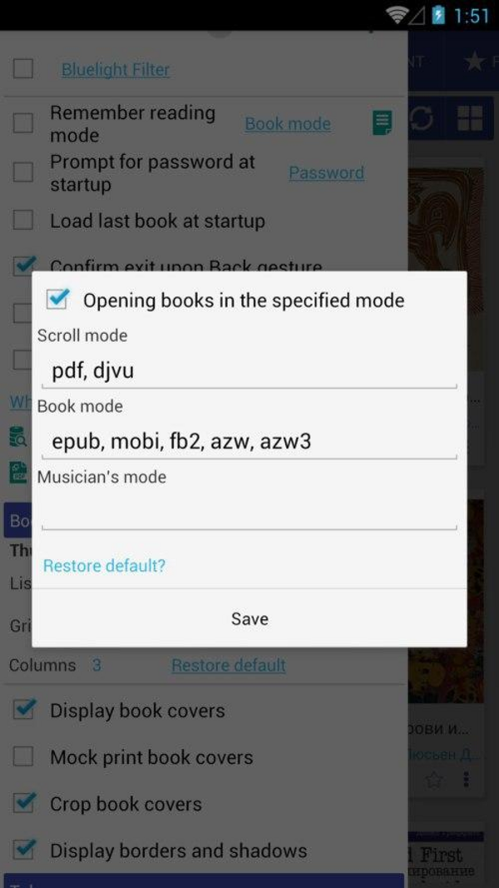
