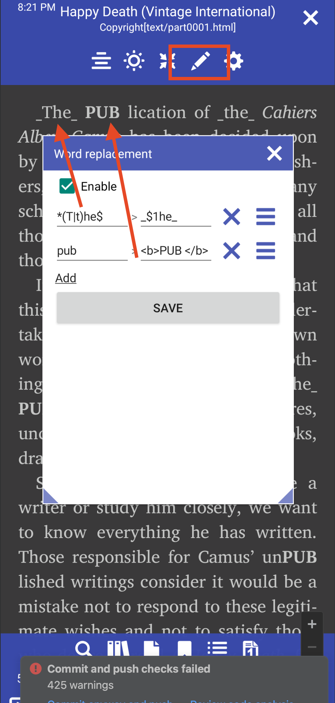
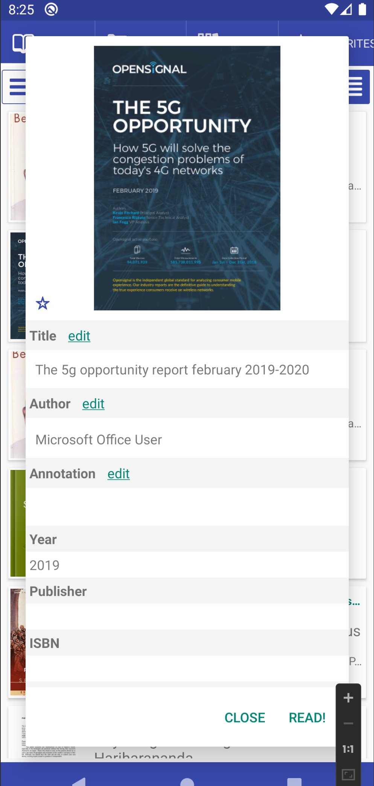
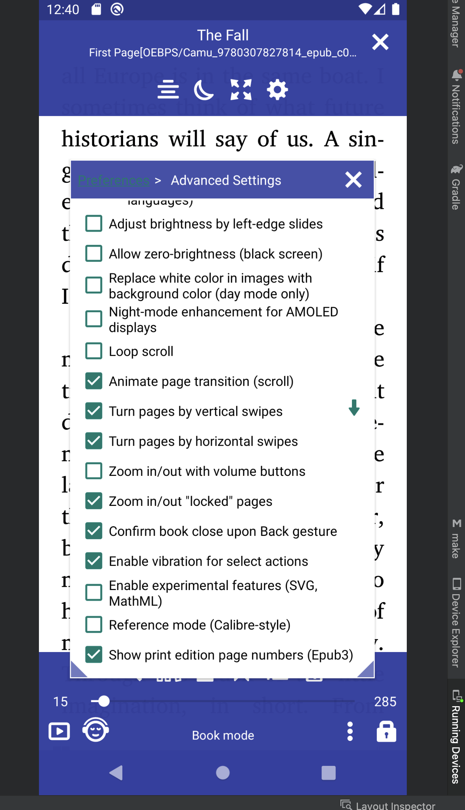
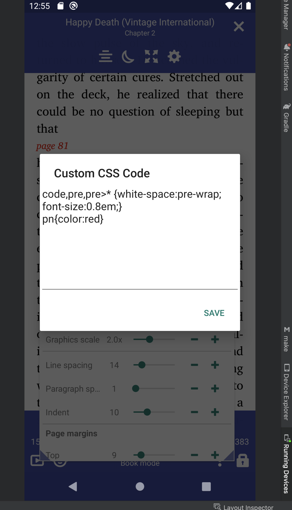
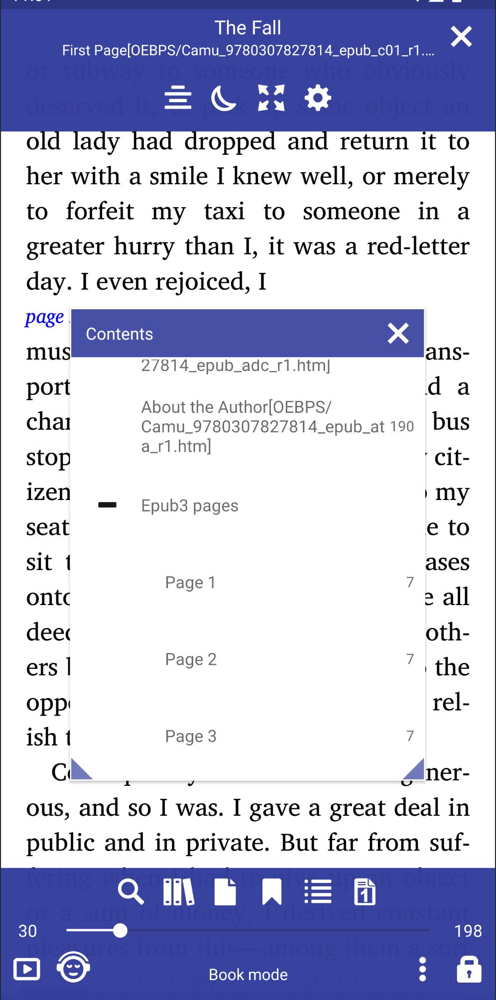

# What is new

### [8.9.150] Changing words within the book



### [8.9.127] Edit PDF meta tags



### [8.9.117] Clicking the back button twice to exit an activity

### [8.9.76] Show print edition page numbers (Epub3)

|||||
|-|-|-|-|
|||||


### [8.9.54] Accent color

||||
|-|-|-|
||||

### [8.9.50] Folder preview


### [8.8.104] Highlighting initial letters

||||
|-|-|-|
||||

### [8.8.79] Search for some text in the Library books

* It's possible to filter library results
* Sentence search is possible


### [8.8.79] Sort bookmarks by page or by date


### [8.8.37] Access Library from the book


### [8.8.16] Support external (http://) images in EPUB books.

Experimental feature should be enabled

### [8.8.0] Changing the rendering engine within the app

**MuPDF_1.11** basic Librera rendering engine

**MuPDF_1.20.x** modern rendering engine, fast, accurate but can be with bugs, crashes 

||||
|-|-|-|
||||

### [8.6.44] Rotate page in the bottom menu


### [8.6.47] Custom CSS support and Table support
Added possibility to choose user styles css file
```
/sdcard/Librera/profile.Librera/device.[]/*.css

app-Librera.css - Librera default user styles for documents
app-MuPDF.css - Default MUPDF styles with Table support
```

||||
|-|-|-|
||||

### [8.6.44] Rotate page in the bottom menu


### [8.6.43] Rotate the page 90 degrees, cut out the white borders, cut into two pages

||||
|-|-|-|
||||

### [8.6.41] Show series name, order by series index


### [8.6.40] Configure what to show in the favorites tab


### [8.6.39] Moved Web Search and Web Dictionaries to the user files app-WebDict.json and app-WebSearch.json

```
> /storage/emulated/0/Librera/profile.Librera/device.[name]/app-WebSearch.json
[
{"name": "_ Disabled dict starts with _", "path": "https://translate.google.com/#%s/%s/%s"},
{"name": "Google", "path": "http://www.google.com/search?q=%s"},
{"name": "StartPage", "path": "https://www.startpage.com/sp/search?query=%s"},
{"name": "DuckDuckGo", "path": "https://duckduckgo.com/?q=%s"}
]
```

### [8.6.36] Add Web Search in Google, DuckDuckGo, StartPage


### [8.6.32] Favorite Tab - list sorting options


### [8.6.30] Librera Old for Android 4.0+ [Download](https://github.com/foobnix/LibreraReader/releases/)
### [8.6.21] Create a folder with the name of the book for OPDS downloaded books


### [8.6.19] Custom image scale (Graphic scale) factor for Epub

||||
|-|-|-|
||||

### [8.6.01] New vector icons, improved UI 
### [8.5.50] Show book count in each folder


### [8.5.40] Hide read books in Folder tab and Library Tab


### [8.5.27] Restore search query at startup

### [8.5.12] Support EPUB and comics with WEBP images
### [8.4.21] Preset text encoding for .TXT files
### [8.4.08] Always open books in 2-page mode

### [8.3.97] Enable disable context menu integration (text selection)
|||
|-|-|
|||

### [8.3.94] Bind a GitBook

|||
|-|-|
|||

### [8.3.90] Accessibility optimization

### [8.3.84] OPDS download folder format "[Author name]/Book name"

### [8.3.80] Text selection: hyphenated last word on page will be selected as complete


### [8.3.78] Default hyphen language for all books


### [8.3.77] Mirror image for telepromter

||||
|-|-|-|
||||

### [8.3.70] Show book description

|||
|-|-|
|||


### [8.3.58] books-in-folder count


### [8.3.49] "Open with" default open book action

|||
|-|-|
|||


### [8.3.41] Tabs "Icons only"

||||
|-|-|-|
||||


### [8.2.37] New file, New Folder, Go to the folder options


### [8.2.36] "Go to folder" edit path (long click)


### [8.2.22] Reference Mode like In Calibre View

|||
|-|-|
|||

### [8.2.21] Basic support of .md Markdown files

### [8.2.20] Send page as text/image from the Go to Page dialog.


### [8.2.19] Specify book formats for reading modes (reading-mode presets)

