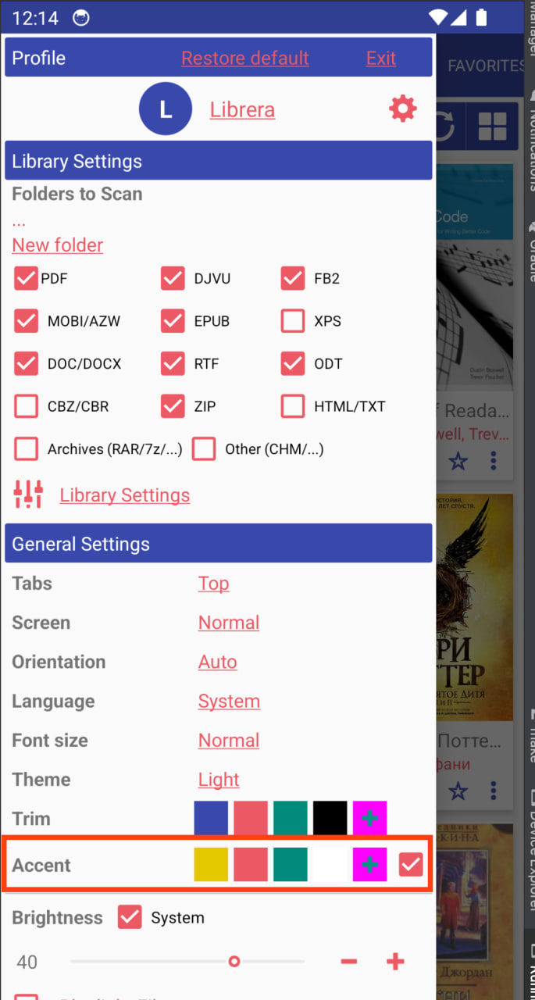
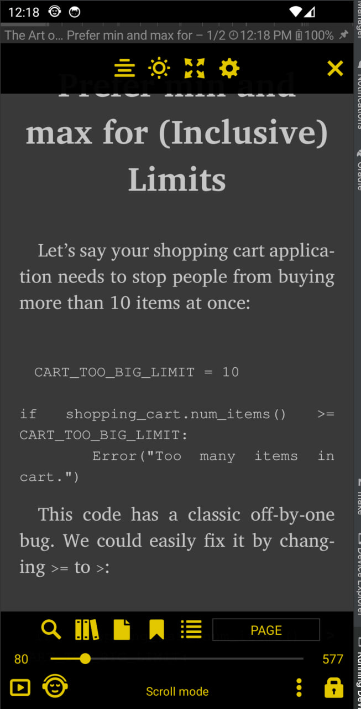
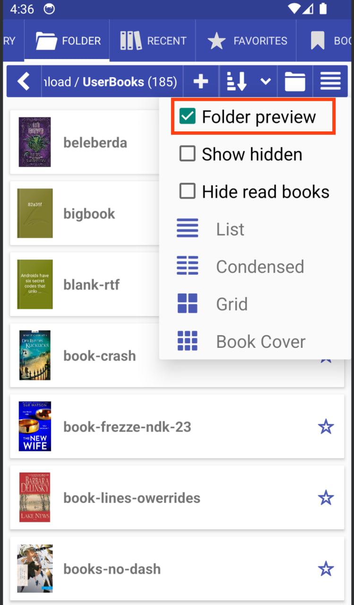
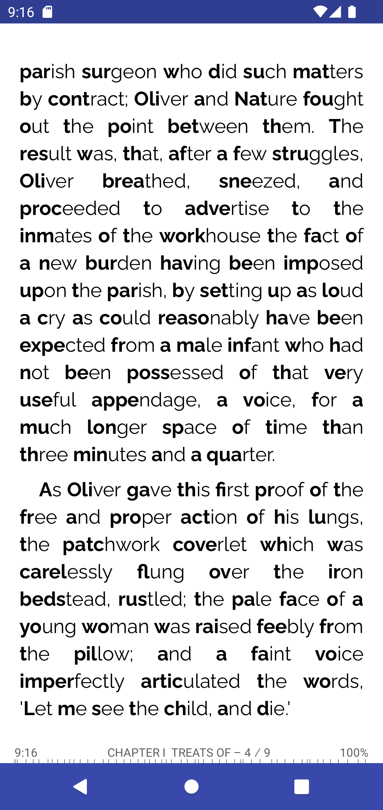
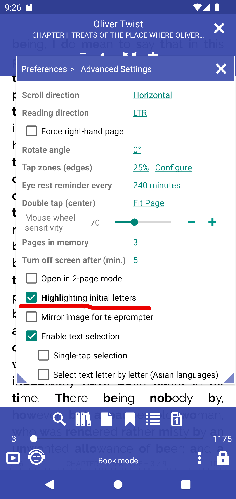
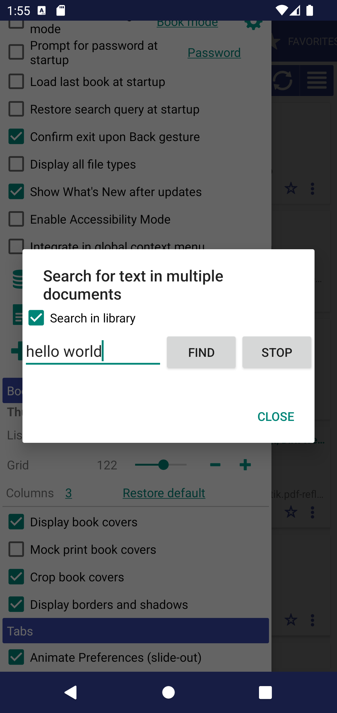

# Cosa c'è di nuovo

### [8.9.54] Colore in risalto

||||
|-|-|-|
||||

### [8.9.50] Anteprima della cartella


### [8.8.104] Evidenziando le lettere iniziali

||||
|-|-|-|
||||

### [8.8.79] Cerca del testo nei libri della Biblioteca

* È possibile filtrare i risultati della raccolta
* È possibile la ricerca di frasi



### [8.8.79] Ordina i segnalibri per pagina o per data


### [8.8.37] Accedi alla Biblioteca dal libro


### [8.8.16] Supporta immagini esterne (http://) nei libri EPUB.

La funzione sperimentale dovrebbe essere abilitata

### [8.8.0] Modifica del motore di rendering all'interno dell'app

**MuPDF_1.11** motore di rendering Librera di base

**MuPDF_1.20.x** moderno motore di rendering, veloce, preciso ma può essere con bug, arresti anomali

||||
|-|-|-|
||||

### [8.6.44] Ruota pagina nel menu in basso


### [8.6.47] Supporto CSS personalizzato e supporto per tabelle
Aggiunta la possibilità di scegliere il file CSS degli stili utente
```
/sdcard/Librera/profile.Librera/device.[]/*.css

app-Librera.css - Librera default user styles for documents
app-MuPDF.css - Default MUPDF styles with Table support
```

||||
|-|-|-|
||||

### [8.6.44] Ruota pagina nel menu in basso


### [8.6.43] Ruota la pagina di 90 gradi, ritaglia i bordi bianchi, taglia in due pagine

||||
|-|-|-|
||||

### [8.6.41] Mostra il nome della serie, ordina per indice della serie


### [8.6.40] Configura cosa mostrare nella scheda Preferiti


### [8.6.39] Ricerca Web e dizionari Web spostati nei file utente app-WebDict.json e app-WebSearch.json

```
> /storage/emulated/0/Librera/profile.Librera/device.[name]/app-WebSearch.json
[
{"name": "_ Disabled dict starts with _", "path": "https://translate.google.com/#%s/%s/%s"},
{"name": "Google", "path": "http://www.google.com/search?q=%s"},
{"name": "StartPage", "path": "https://www.startpage.com/sp/search?query=%s"},
{"name": "DuckDuckGo", "path": "https://duckduckgo.com/?q=%s"}
]
```

### [8.6.36] Aggiungi Ricerca Web in Google, DuckDuckGo, StartPage


### [8.6.32] Scheda Preferiti - elenca le opzioni di ordinamento


### [8.6.30] Librera Old per Android 4.0+ [Download](https://github.com/foobnix/LibreraReader/releases/)
### [8.6.21] Creare una cartella con il nome del libro per i libri scaricati da OPDS


### [8.6.19] Fattore di scala dell'immagine personalizzato (scala grafica) per Epub

||||
|-|-|-|
||||

### [8.6.01] Nuove icone vettoriali, interfaccia utente migliorata
### [8.5.50] Mostra il conteggio dei libri in ogni cartella


### [8.5.40] Nascondi i libri letti nella scheda Cartella e nella scheda Libreria


### [8.5.27] Ripristina query di ricerca all'avvio

### [8.5.12] Supporta EPUB e fumetti con immagini WEBP
### [8.4.21] Codifica del testo preimpostata per i file .TXT
### [8.4.08] Apri sempre i libri in modalità a 2 pagine

### [8.3.97] Abilita disabilita l'integrazione del menu contestuale (selezione del testo)
|||
|-|-|
|||

### [8.3.94] Associa un GitBook

|||
|-|-|
|||

### [8.3.90] Ottimizzazione dell'accessibilità

### [8.3.84] Formato cartella download OPDS &quot;[Nome autore]/Nome libro&quot;

### [8.3.80] Selezione del testo: l'ultima parola sillabata sulla pagina verrà selezionata come completa


### [8.3.78] Lingua trattino predefinita per tutti i libri


### [8.3.77] Immagine speculare per telepromter

||||
|-|-|-|
||||

### [8.3.70] Mostra la descrizione del libro

|||
|-|-|
|||


### [8.3.58] conteggio libri nella cartella


### [8.3.49] &quot;Apri con&quot; azione libro aperto predefinita

|||
|-|-|
|||


### [8.3.41] Schede &quot;Solo icone&quot;

||||
|-|-|-|
||||


### [8.2.37] Nuovo file, Nuova cartella, Vai alle opzioni della cartella


### [8.2.36] Percorso di modifica &quot;Vai alla cartella&quot; (clic lungo)


### [8.2.22] Modalità di riferimento come In Calibre View

|||
|-|-|
|||

### [8.2.21] Supporto di base per i file .md Markdown

### [8.2.20] Invia pagina come testo/immagine dalla finestra di dialogo Vai a pagina.


### [8.2.19] Specifica i formati dei libri per le modalità di lettura (impostazioni predefinite modalità di lettura)


