# O que há de novo (atualizado)

### [8.3.97] permite desativar a integração do menu de contexto (seleção de texto)

|||
|-|-|
|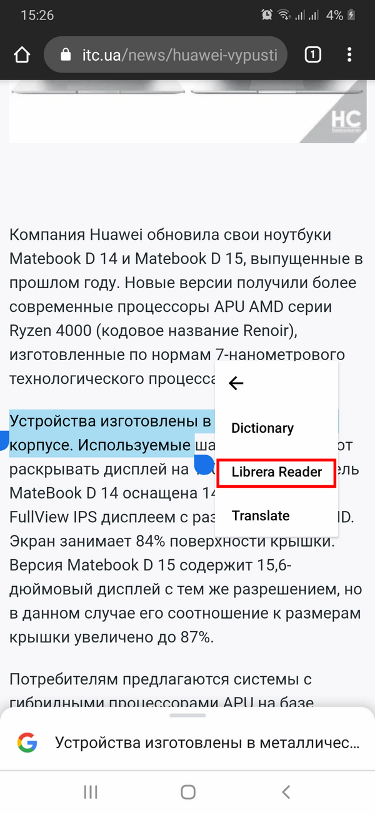|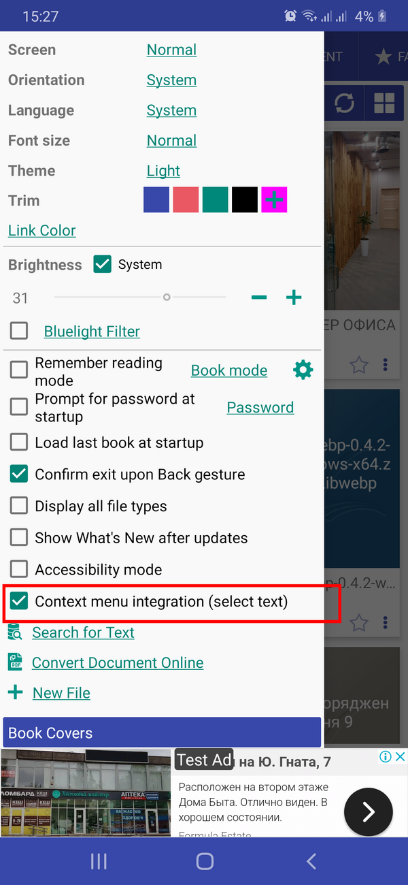|

### [8.3.94] Vincule um GitBook

|||
|-|-|
|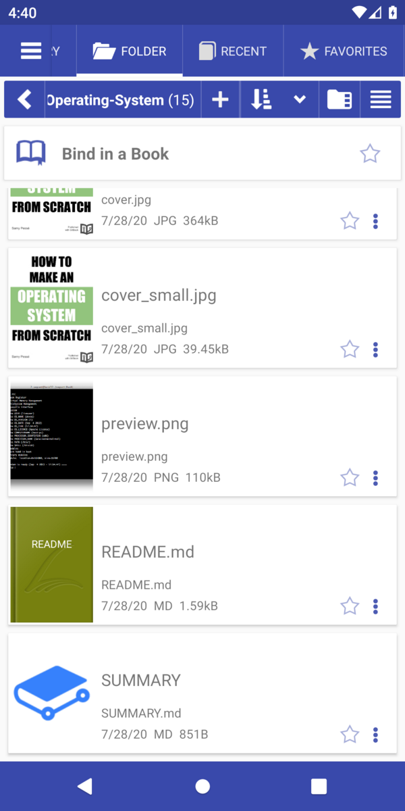|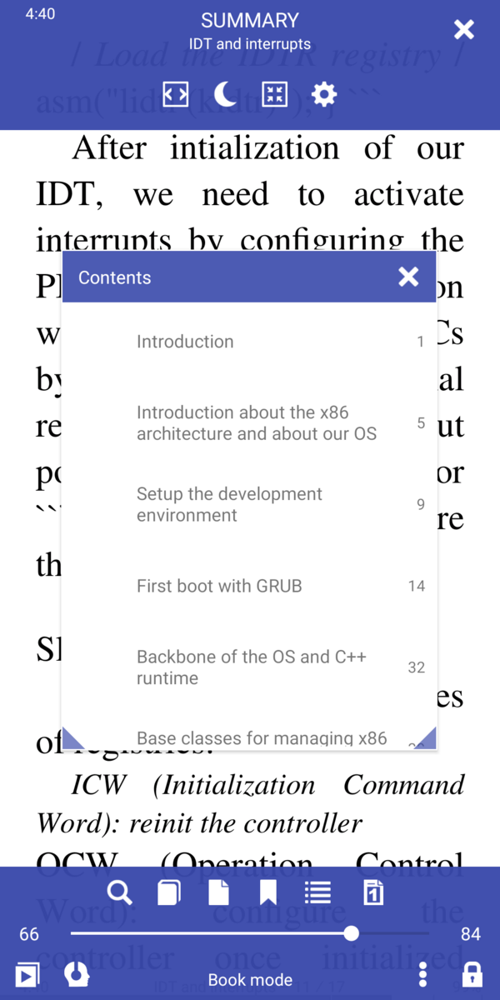|

### [8.3.90] Otimização de acessibilidade

### [8.3.84] Formato da pasta de download OPDS &quot;[Nome do autor]/Nome do livro&quot;

### [8.3.80] Seleção de texto: a última palavra com hífen na página será selecionada como concluída

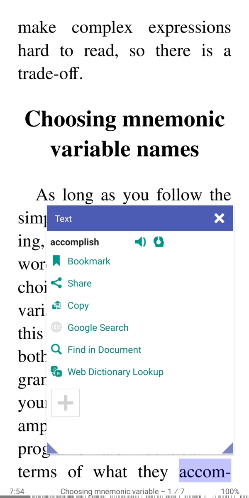

### [8.3.78] Idioma de hífen padrão para todos os livros

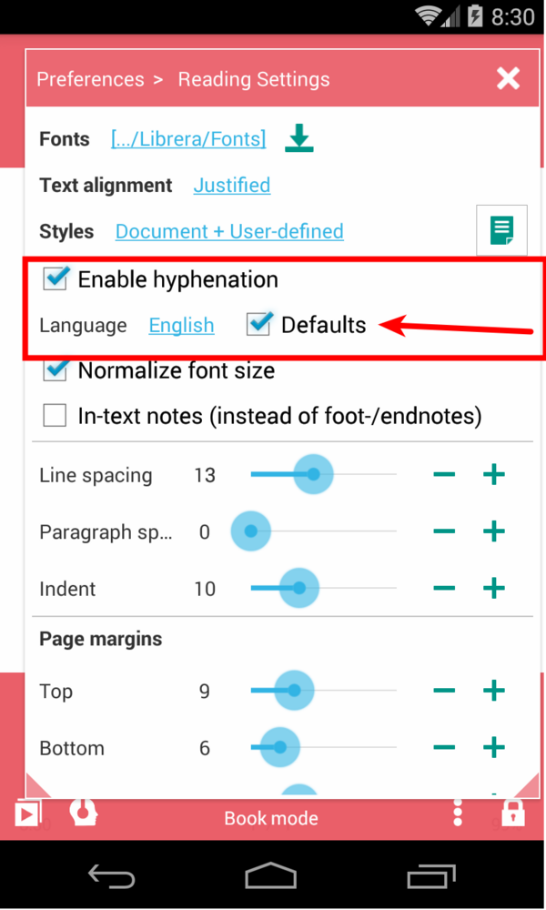

### [8.3.77] Imagem espelhada para o telepromter

||||
|-|-|-|
||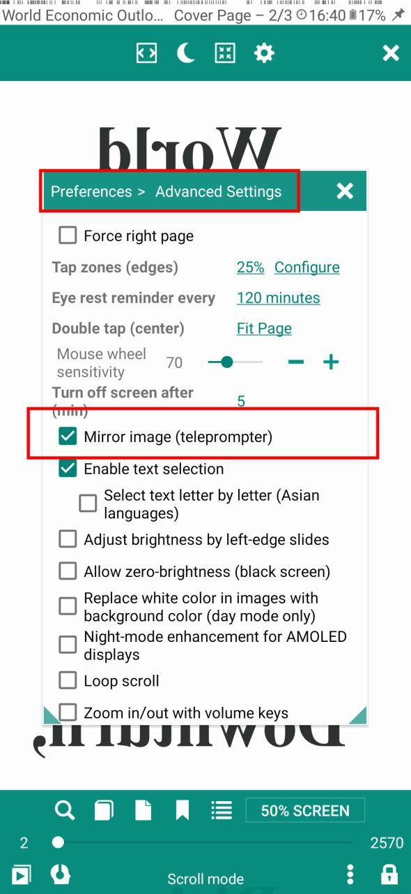|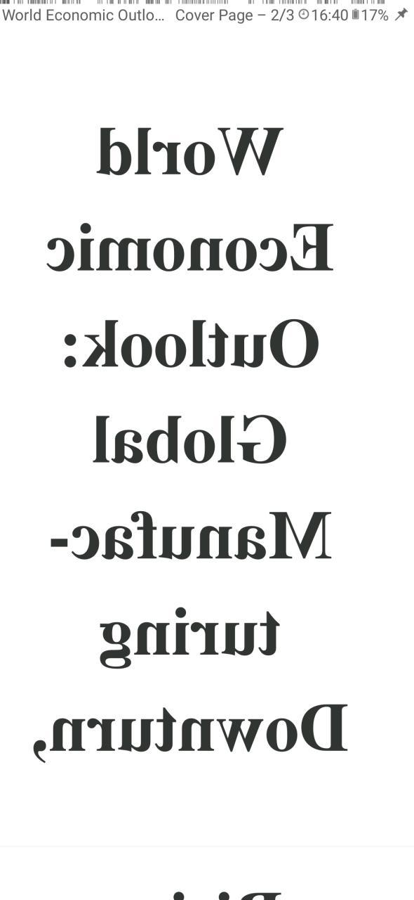|

### [8.3.70] Mostrar descrição do livro

|||
|-|-|
|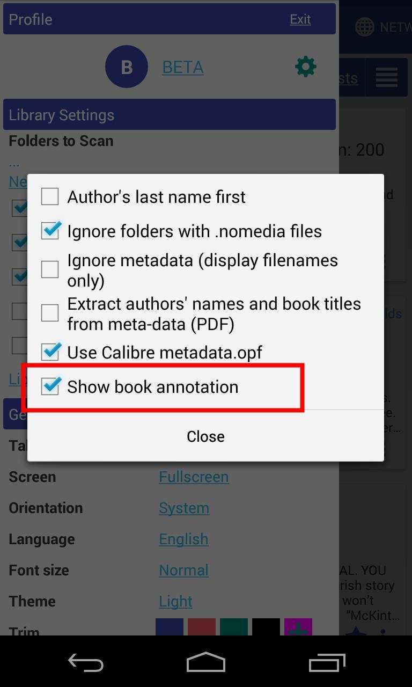||

### [8.3.58] contagem de livros na pasta

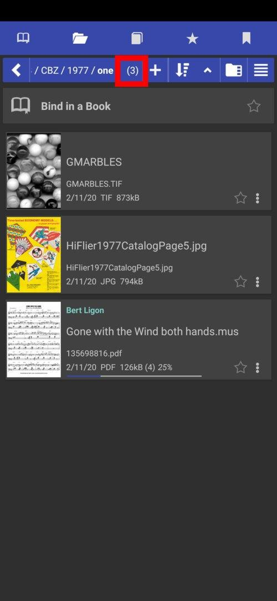

### [8.3.49] &quot;Abrir com&quot; ação padrão de livro aberto

|||
|-|-|
|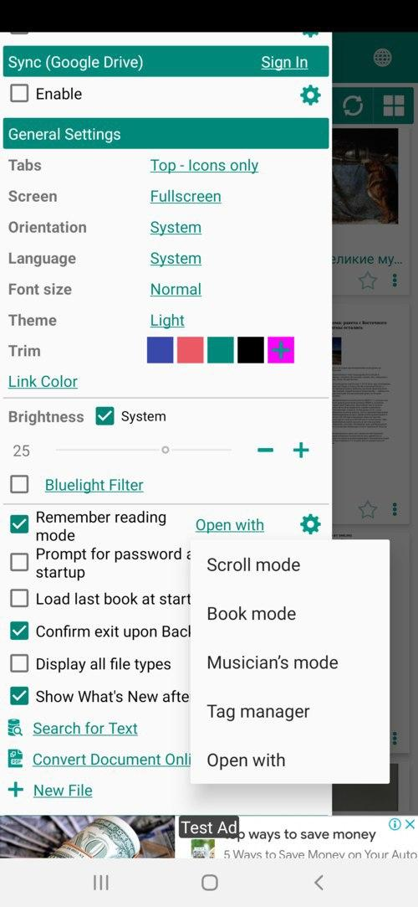||

### [8.3.41] Guias &quot;Somente ícones&quot;

||||
|-|-|-|
|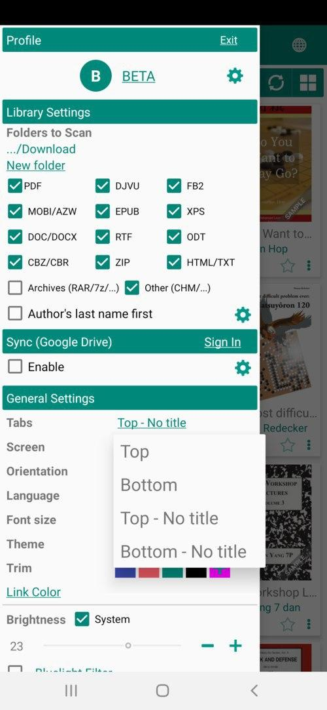|||

### [8.2.37] Novo arquivo, Nova Pasta, Vá para as opções de pasta

### [8.2.36] Caminho de edição &quot;Ir para a pasta&quot; (clique longo)

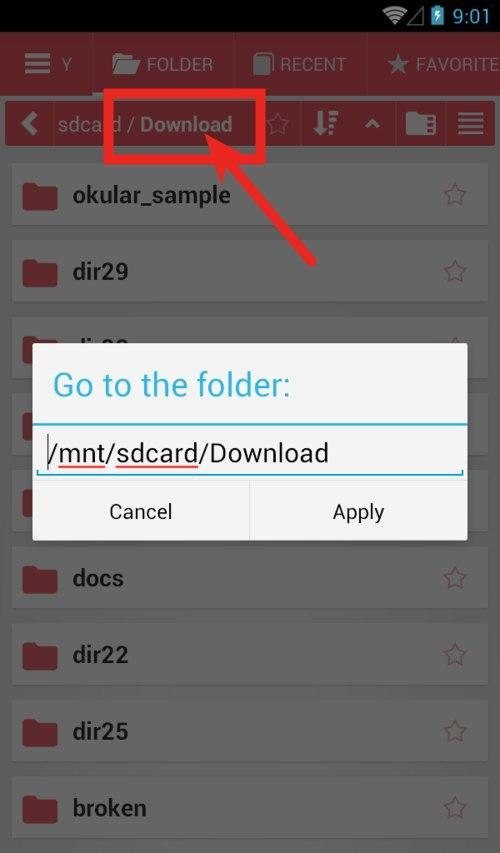

### [8.2.22] Modo de referência como na exibição de calibre

|||
|-|-|
|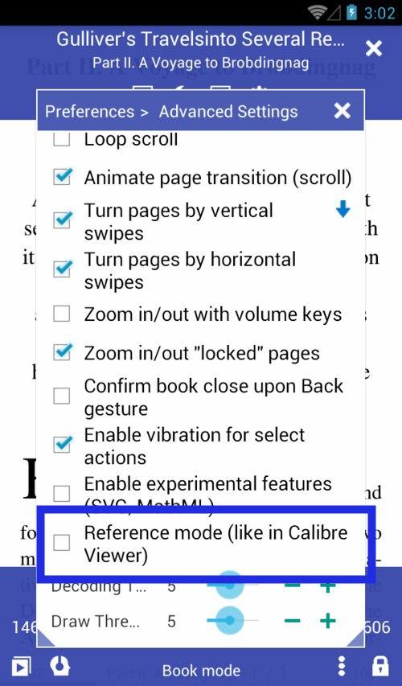|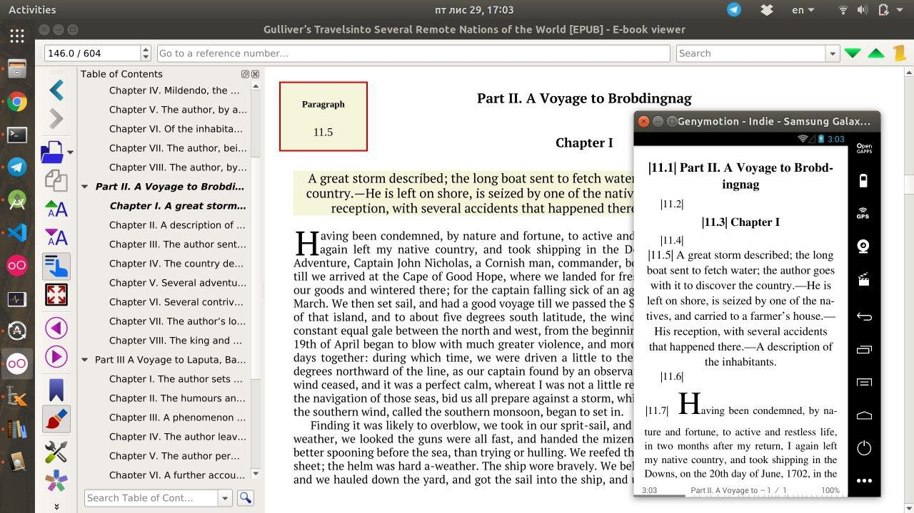|

### [8.2.21] Suporte básico aos arquivos .md Markdown

### [8.2.20] Envie a página como texto/imagem na caixa de diálogo Ir para página.

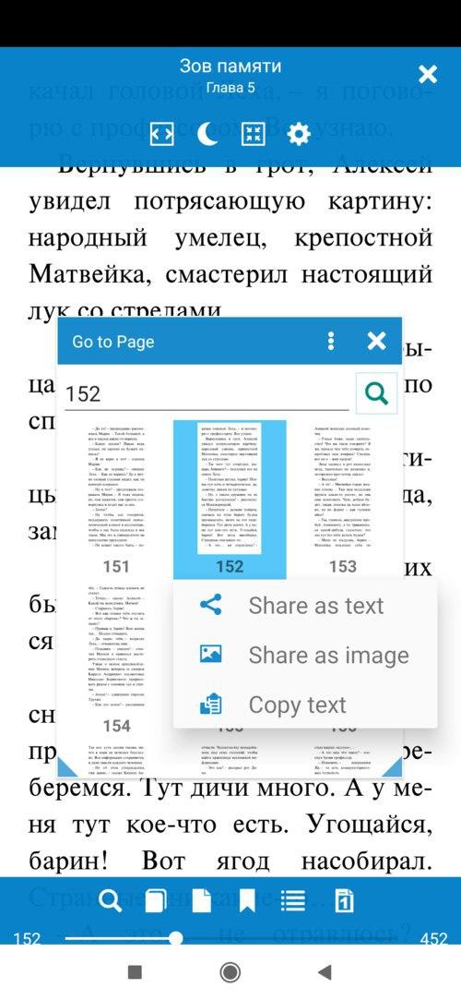

### [8.2.19] Especifique os formatos dos livros para os modos de leitura (predefinições do modo de leitura)

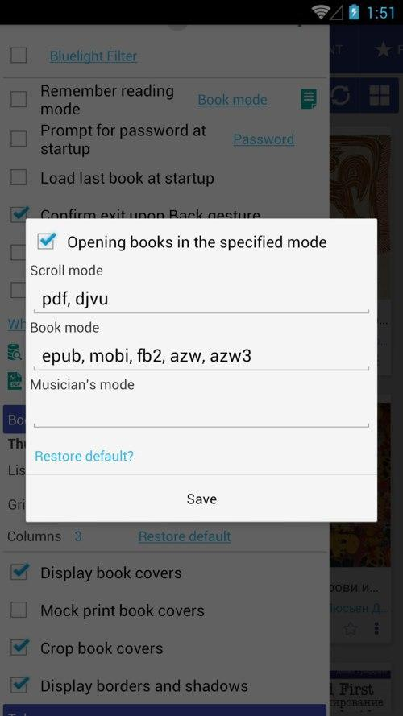
