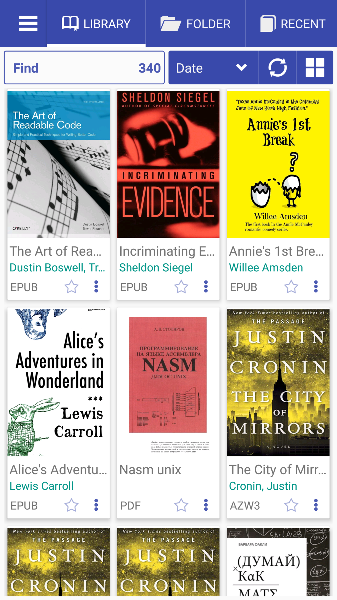
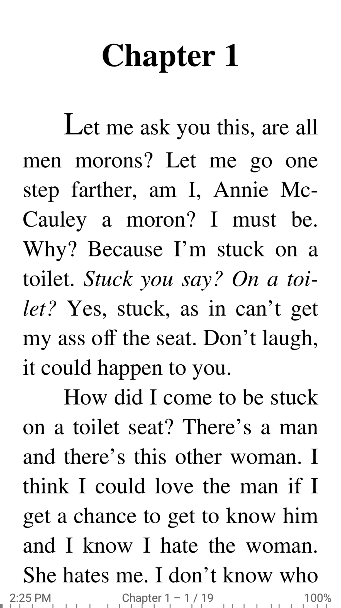

# Acerca de la aplicación Librera Book Reader para Android

> **Librera Reader** (también conocido como **Lirbi Reader**, **PDF Reader**) es una aplicación altamente personalizable y rica en funciones
para leer libros en formato PDF, EPUB, MOBI, DjVu, FB2, TXT, RTF, AZW, AZW3, HTML, CBZ, CBR en dispositivos Android.
Con su interfaz intuitiva pero potente, Librera hace que la lectura de libros electrónicos sea un verdadero placer.
Incluso cuenta con un exclusivo modo de músico con desplazamiento automático y manos libres.
A partir de hoy, puede presumir de más de **10 millones** descargas a dispositivos que ejecutan todos los sabores del sistema operativo Android.

||||
|-|-|-|
||||

# Solo algunas características principales de librera

* Descubrimiento de documentos fácil por criterios configurables:
* Escaneo automático (de carpetas preestablecidas por el usuario)
* Examinar (con un explorador de archivos en la aplicación)
* Reciente (con un indicador de progreso de lectura)
* Soporte para marcadores, anotaciones y tablas de contenido EPUB3
* Soporte para nubes y catálogos en línea
* Sincronización en dispositivos Android a través de Google Drive (progreso de lectura, marcadores, etc.)
* Modos configurables de día y noche
* Color de enlace configurable (por lo tanto, color de notas al pie y notas finales)
* Soporte para muchos diccionarios populares en línea (incluidos traductores) y fuera de línea
* Bloqueo de desplazamiento vertical
* Centrado automático y manual de documentos
* entrada de código CSS personalizado
* Vista de una página de documentos de dos páginas
* Modo de músico con velocidad de desplazamiento configurable
* lectura TTS personalizable y reproductor multimedia incorporado
* Búsqueda de texto de varias palabras
* Conversión de documentos en línea
* Lectura de documentos archivados (.zip)
* Soporte para idiomas RTL (tailandés, hebreo, árabe, etc.)
* Importar y exportar configuraciones, copia de seguridad automática de la sesión actual
* Iniciales principales en documentos FB2
* Y un montón de otras características que puedes consultar.

Con **Librera Reader**, puede crear fácilmente bibliotecas autosuficientes de todos sus documentos especificando qué formatos incluir y qué carpetas escanear. Todas las colecciones de documentos se pueden ver como una lista o cuadrícula. Los documentos se identifican fácilmente mediante portadas de miniaturas de tamaño y estilo ajustables y descripciones detalladas. Su biblioteca se puede ordenar por ruta, nombre, tamaño, fecha, etc., y hay un filtro para ayudar a localizar documentos específicos o grupos de documentos.

Mientras lee, los documentos pueden bloquearse en un modo de desplazamiento vertical y navegar por la página o la pantalla. El texto puede ser redistribuido y anotado. La funcionalidad de las teclas de volumen es configurable, y los fondos y las fuentes se pueden personalizar a través de la ventana de configuración intuitiva. Los extractos (selecciones) se pueden traducir, compartir, copiar y buscar dentro del documento o en Internet.

Sin embargo, la mejor manera de apreciar completamente Librera Reader es usar su versión PRO. Puede comenzar con uno gratuito, con publicidad primero, y decidir por ustedes mismos. Prometemos que no te decepcionará. Una vez que esté convencido, obtenga una licencia PRO para ayudar al desarrollo posterior de la aplicación.
