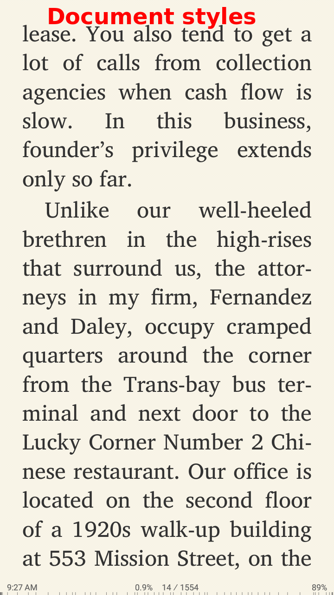
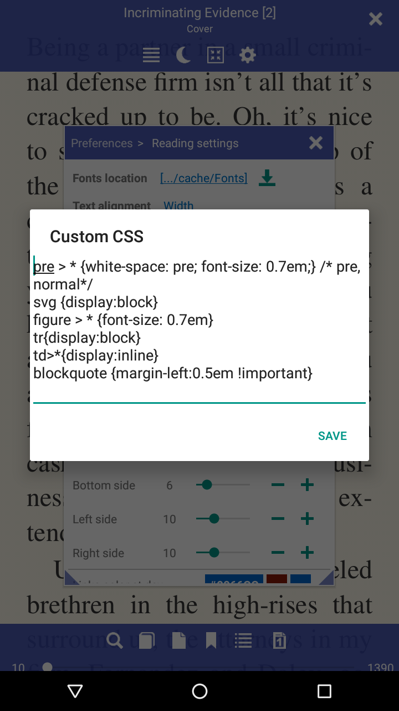

[FAQ](/wiki/faq)

# Customize book css styles

> Some user like to customize and configure book view. For some book need to fix css for better display.
You can simply make this with Librera Reader

App support three **Styles** view mode, you can change display options.

1. Document and User styles
2. Document Styles
3. User styles

To change book style go to
__*Book preferences -> Reading Settings*__

* 1 - Change style modes or edit custom CSS styles
* 2 - Document styles mode
* 3 - Edit custom user CSS

|1|2|3|
|-|-|-|
|||

By default enable Document and User styles together

For some books with code samples is easy to change code block size with user css
<pre>
{white-space: pre; font-size: 0.7em;} //  pre -  without break lines
</pre>

or

<pre>
{white-space: normal; font-size: 0.7em;} // normal - with break lines
</pre>