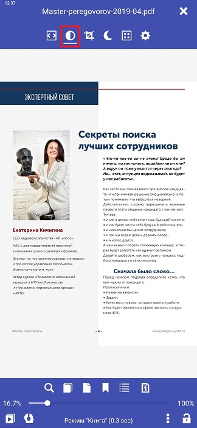

[<](/wiki/faq)
---

# Contrasto e luminosità in PDF (effetto bianco e nero)

> Librera Book Reader consente di personalizzare in modo flessibile l'aspetto del documento.
Quando si configurano queste impostazioni, il documento diventa in bianco e nero.
Spostando il dispositivo di scorrimento per aggiungere/ridurre il parametro necessario,
sullo sfondo della finestra di dialogo delle impostazioni, puoi vedere i suoi effetti sul documento.
È possibile configurare tutti e tre i parametri insieme così e sulla separazione. Questo effetto viene spesso utilizzato nei lettori E-Ink

Per una lettura confortevole È possibile regolare le impostazioni:
* Contrasto
* Luminosità
* Enfatizza tutto (effetto testo in grassetto)

## Contrasto
* Fai clic sull'icona Contrasto e luminosità
* Utilizzare il dispositivo di scorrimento per selezionare il tipo di documento desiderato
* Dopo l'impostazione, fai clic sulla croce nella finestra di dialogo delle impostazioni.

||||
|-|-|-|
||||

## Luminosità
* Fai clic sull'icona Contrasto e luminosità
* Utilizzare il dispositivo di scorrimento per selezionare il tipo di documento desiderato
* Dopo l'impostazione, fai clic sulla croce nella finestra di dialogo delle impostazioni.

||||
|-|-|-|
||||

## Enfatizza tutto (effetto testo in grassetto)
* Fai clic sull'icona Contrasto e luminosità
* Abilita casella di controllo Enfatizza tutto
* Dopo l'impostazione, fai clic sulla croce nella finestra di dialogo delle impostazioni

||||
|-|-|-|
||||

> Se si desidera ripristinare le impostazioni &quot;predefinite&quot; modificate, fare clic nella finestra di dialogo Impostazioni contrasto e luminosità - &quot;Ripristina impostazioni predefinite&quot; e confermare &quot;OK&quot;. Le impostazioni e la vista del documento tornano allo stato originale.
