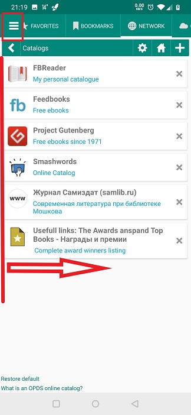

[<](/wiki/faq)
---
#  How to reset all default settings

> If you need to reset all the Librera settings to their original state, as after the first installation, then it can be done in several stages.

In order to do a reset you need to:
 * Click in the upper left corner to bring up the menu, or swipe it from the left to the right
 * Long click on the program logo or its name 
 * Confirm your action " OK"

**After confirmation, the program will reboot, reset all settings to default.**
**Notes, tags, and reading progress you have added are not deleted on reset.**

||||
|-|-|-|
||||
