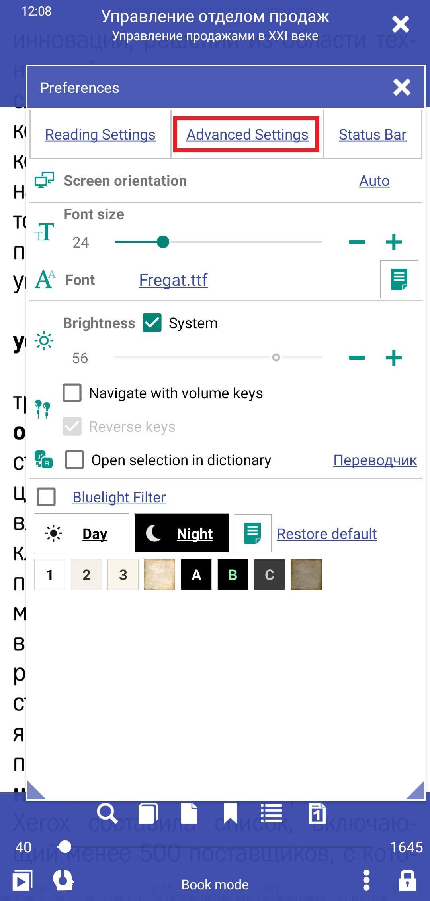

[<](/wiki/faq)
---

# Come impostare la selezione del testo

> Librera ti consente di lavorare in modo flessibile con la selezione del testo. Nel testo è possibile selezionare sia singole parole sia intere frasi, pagine.
Successivamente, inviando il testo selezionato, ad esempio, ai segnalibri o al traduttore.

Per abilitare e configurare le modalità di selezione È necessario:
* Fai clic sull'icona delle impostazioni
* Vai alla scheda del menu delle impostazioni avanzate.

||||
|-|-|-|
||||
> Quando la modalità di selezione è disattivata nel testo del libro, quando si tocca una nota a piè di pagina, la transizione non funziona. Se devi navigare per nota a piè di pagina, abilita la prima voce &quot;Abilita selezione testo&quot;.

La modalità di selezione è configurata abilitando le caselle di controllo:
* Abilita selezione testo: abilita o disabilita la selezione del testo nel documento. Il testo viene evidenziato solo con un tocco lungo
* Tocca una volta per selezionare il testo: la selezione del testo si verifica quando fai clic breve sulla parola
* Seleziona il testo lettera per lettera - per le lingue geroglifiche.

La selezione del testo può essere una singola parola, una frase o l'intera pagina:
* Tocca la parola breve o la pressione lunga, a seconda delle tue impostazioni
* Per evidenziare più di una parola, quindi fai scorrere il dito su più parole, la proposta. Puoi anche usare i marcatori di inizio e fine
testo selezionato, ingrandendoli o riducendo la distanza di acquisizione delle parole tra di loro
* Per visualizzare il menu quando sono in alto i top corti e lo schermo intero, tocca a lungo al centro dello schermo.

||||
|-|-|-|
||||

Testo selezionato puoi:
* Aggiungi questo libro ai preferiti
* Trasferimento a un'altra applicazione
* Riproduci il discorso
* Invia per traduzione
* Effettua una ricerca in un documento o su Internet
* Copia per ulteriore elaborazione

