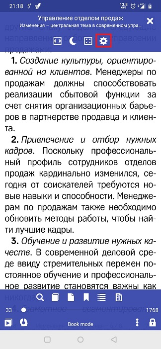
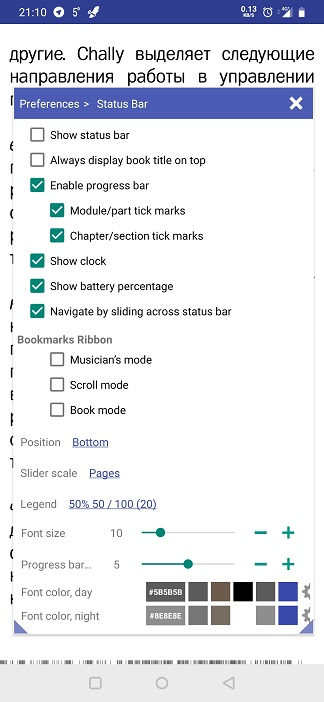
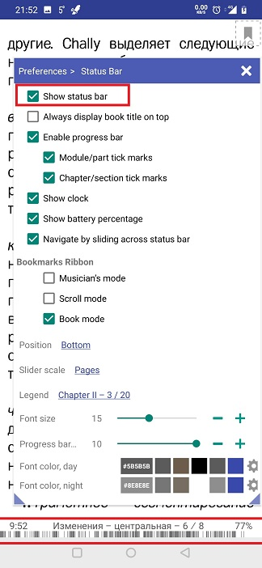
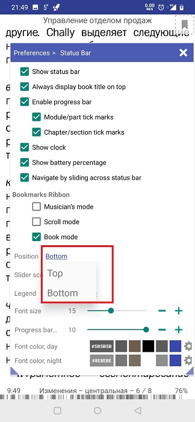
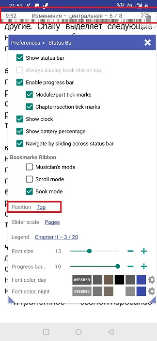
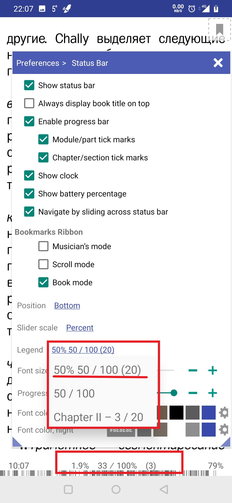
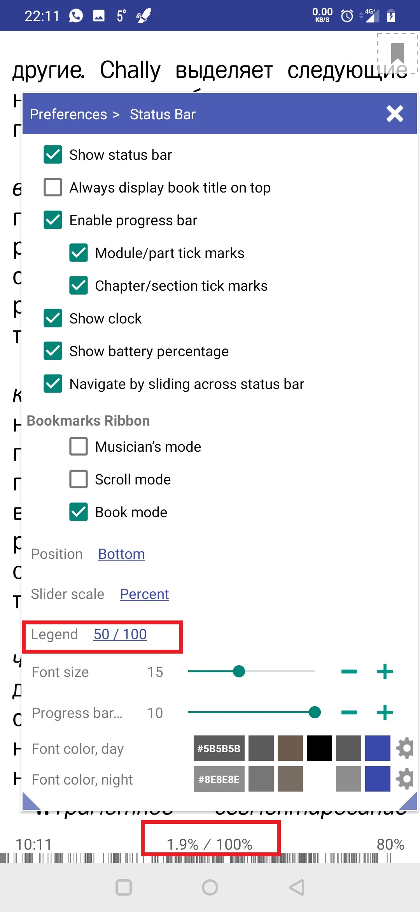
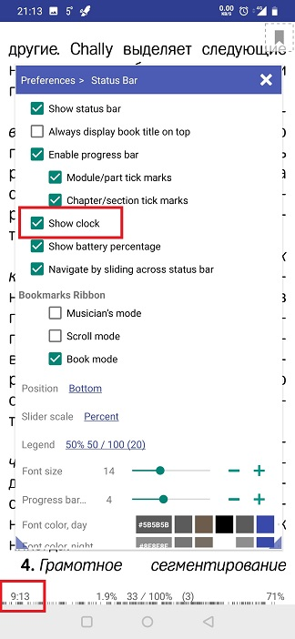
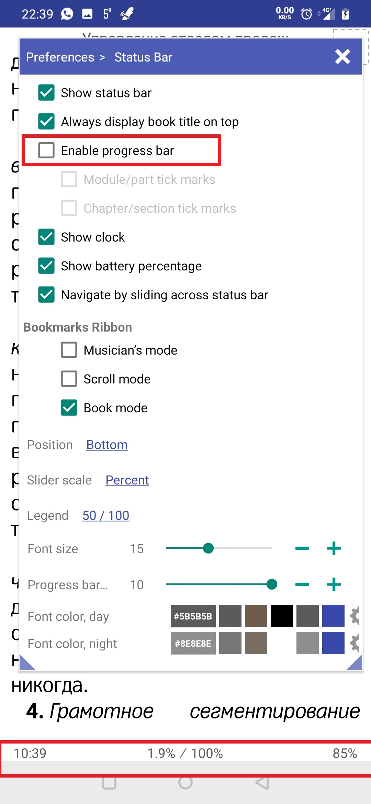
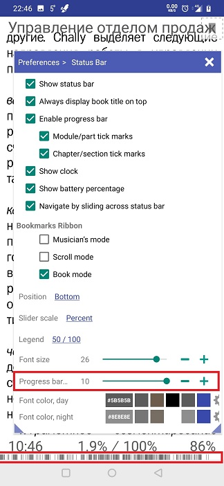

[<](/wiki/faq)
---
# Definindo a barra de status

> Biblioteca permite configurar de forma flexível a interface da barra de status, exibindo ou removendo dela as informações necessárias durante a leitura.

Para acessar as configurações da barra de status, é necessário:
* Clique no ícone de configurações
* Selecione um item no menu &quot;Barra de status&quot;

||||
|-|-|-|
||||

Após as ações, você acessa a barra de status das configurações onde é possível configurar:
* Para ativar ou desativar a exibição da barra de status
* Ajuste sua posição na parte superior ou inferior da tela.

||||
|-|-|-|
||||

Alterar o tipo de informação sobre o livro exibido na parte de texto da barra de status

||||
|-|-|-|
||||

* Exibir o título do livro na barra de status
* Exibe a hora atual
* A porcentagem de carga da bateria.

||||
|-|-|-|
||||

* Ativar ou desativar a barra de progresso
* Configurando a exibição de etiquetas exibidas na barra de progresso
* Exibe o ícone do marcador. Marque a caixa de seleção em quais modos exibir esse ícone.

||||
|-|-|-|
||||

* Altere o tamanho do texto na barra de status e no cabeçalho
* Para redimensionar a barra de status
* Mude a cor na barra de status e no cabeçalho.

||||
|-|-|-|
||||
