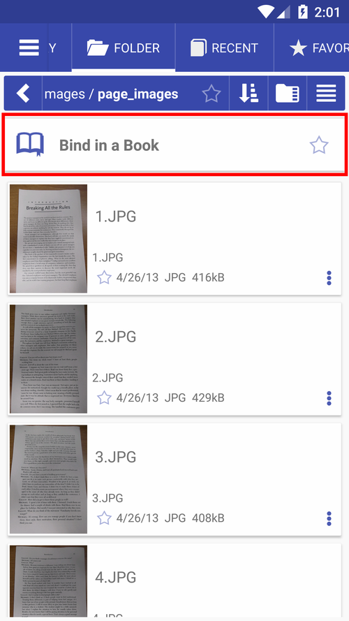

[<](/wiki/faq)

# Open folder with images as a book (Bind in a Book)
It's easy to make a book of image files stored in a folder.

* Open a folder with images (they should be renamed to indicate virtual page numbers) and press **Bind a Book**
* Your book in grid layout
* Crop pages in Librera and adjust contrast and brightness

||||
|-|-|-|
||||

