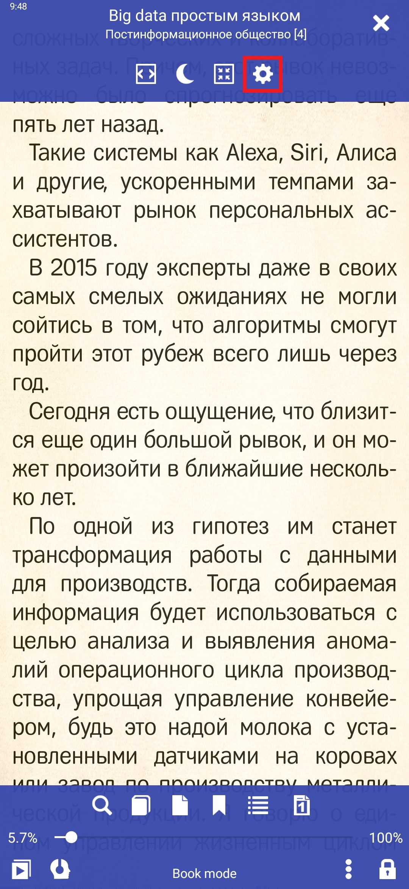
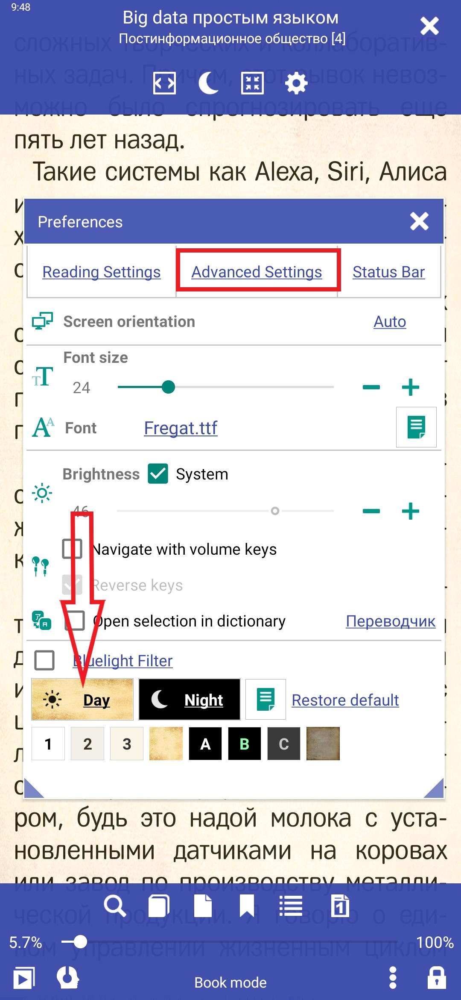
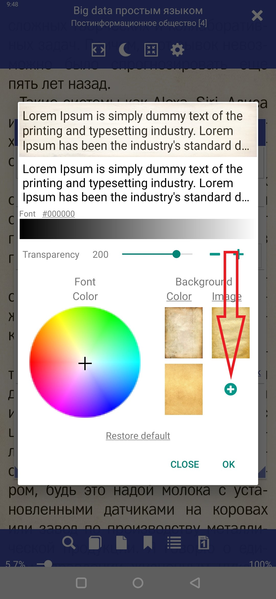
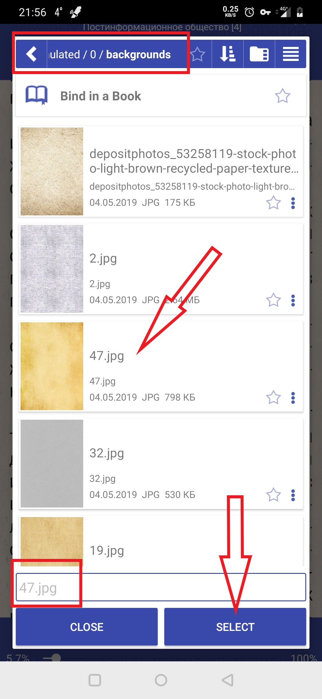

[<](/wiki/faq)
---

# Title sample FAQ

# Customize your reading background

Click settings (Fig 1)
In the settings, select the profile where you want to change the background. For example, "day" (Fig.)
In settings profile click icon plus (rice 3) If there is only color palette the choose von-image of the.
Next, select the folder where your background lies. Enter it, click the\Tapan need, look at the bottom, you should see its name, click select.(figure 4)
Exit the settings, watch the result.

||||
|-|-|-|
|||||
