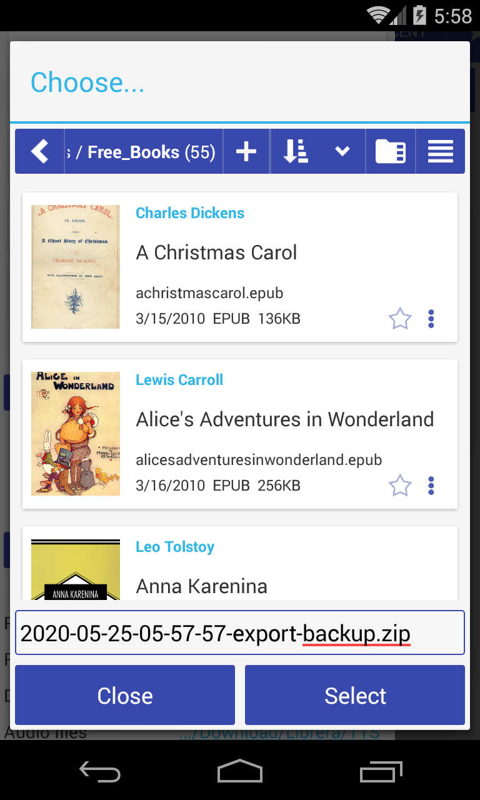

# Резервное копирование и миграция данных

> Резервное копирование данных необходимо, если вам нужно перенести книги на новое устройство, в новую папку или на новую SD-карту.

# Экспорт (резервная копия)

Нажмите кнопку экспорта, чтобы сохранить все настройки приложения в ZIP-файле.

Экспорт экономит:

* Настройки приложения
* закладки
* Прогресс чтения
* метки пользователя
 
# импорт
Нажмите импорт, чтобы восстановить резервную копию из .zip файла
Запустите миграцию при необходимости

# миграция

Миграция заменяет только пути к файлам в файлах конфигурации приложения.

Полный путь к книге хранится в настройках, например, если ваши книги были помещены в папку

/storage/Books/example.pdf

а затем вы перемещаете книгу в папку **MyBooks**

Вам нужно установить местоположение новых книг в настройках приложения

/storage/MyBooks/example.pdf

Вы должны запустить «Миграция» и заменить:

Старый путь: **/ Книги /**
Новый путь: **/ MyBooks /**

Если вы размещаете книги на **внешней SD-карте**, легко исправить пути для нового места
Миграция:/хранение/AAAA-AAAA/Книги в/хранение/BBBB-BBBB/Книги

старый путь: **/ хранилище/AAAA-AAAA /**
новый путь: **/ хранилище/BBBB-BBBB /**

 
 

|1|2|3|
|-|-|-|
||||
