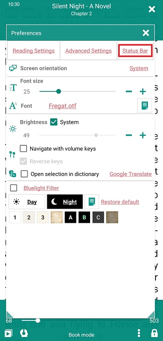
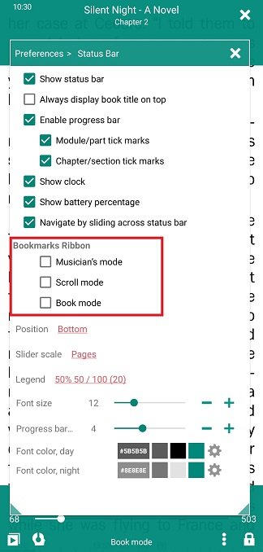
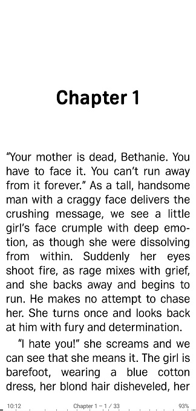
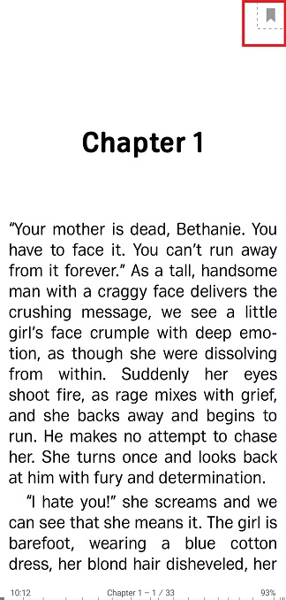
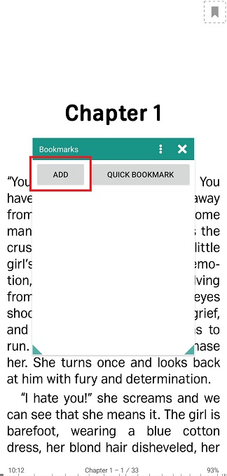
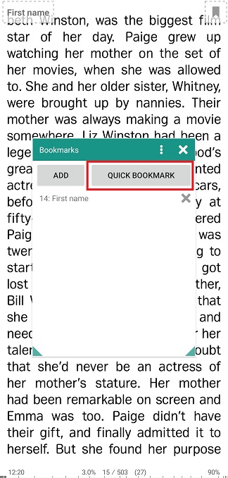

# Trabalhando com favoritos no modo avançado (faixa de opções Favoritos)

> Você pode fazer com que **Librera** exiba seus favoritos na tela o tempo todo enquanto lê um livro. Eles serão mostrados na parte superior da tela na chamada _Bookmarks Ribbon_. Esse modo de marcador estendido deve ser útil quando você precisar adicionar novos marcadores ou alternar entre eles em um instante.
> Esperamos que esse recurso interessante seja muito procurado por músicos, enquanto o aplicativo é executado no modo _Músico_. Portanto, ele vem com a faixa de opções ativada neste modo por padrão.

Para habilitá-lo nos outros modos:

* Toque no ícone _Settings_ para abrir a janela **Preferences**
* Toque na guia _Status Bar_
* No painel _Bookmarks Ribbon_, marque a caixa ao lado do modo para o qual você deseja ativar a Ribbon.

||||
|-|-|-|
||||

As operações com a _ Ribbonmarks Ribbon_ são ilustradas no modo _Book_. Tudo funciona da mesma maneira nos três modos.

> Se você não precisar mais da _Bookmark Ribbon_, poderá desativá-la desmarcando a respectiva caixa na guia _Status bar_.

||||
|-|-|-|
||||

**Adicionando marcadores**

> O indicador flutuante de marcador no canto superior direito indica que você está atualmente no modo _Livros de marcadores_.

* Toque no flutuador de favoritos na página que você está prestes a favorito
* Toque em _ADD_ para adicionar o favorito na janela _Bookmarks_
* Faça um comentário no marcador. Observe que o nome do marcador vem do seu comentário (**primeiro marcador** em nosso exemplo).
* Toque em **ADICIONAR** para concluir o procedimento.

||||
|-|-|-|
||||

Seu novo favorito aparecerá na janela _Bookmarks_ e, ao mesmo tempo, você o verá na _Bookmarks Ribbon_ na parte superior. Agora, para voltar a este marcador, basta tocar nele na faixa de opções.

> Nota: Uma pressão prolongada em um marcador na faixa de opções abrirá uma janela de edição.
* Salve seus resultados de edição tocando em **SALVAR**
* Ou você pode excluir o marcador tocando em **DELETE**
A faixa de opções se tornará uma faixa completa na tela quando você tiver muitos marcadores. Você pode navegar por eles passando os dedos.

||||
|-|-|-|
||||

**Adicionando marcadores rápidos**

* Toque no flutuador de favoritos no canto superior direito para abrir a janela _Bookmarks_.
* Toque em **marcador rápido**
* Assim, um &quot;marcador rápido&quot; é criado, indicado pelo número da página na faixa de opções na parte superior. Na lista na janela _Bookmarks_, ela aparecerá como a página # e o _Quick Bookmark_ próximo a ela.
> Você pode pressionar longamente um marcador rápido na lista para permitir sua edição ou exclusão em uma janela pop-up de edição de marcador.

||||
|-|-|-|
||||

> Você pode ignorar algumas operações ao adicionar ou excluir favoritos usando a _Bookmarks Ribbon_:

* Uma pressão longa no flutuador de marcador no canto superior direito adicionará um marcador rápido.
* Uma pressão prolongada em um marcador na _ Fita de Marcadores_ abrirá um prompt sugerindo que você o exclua.
