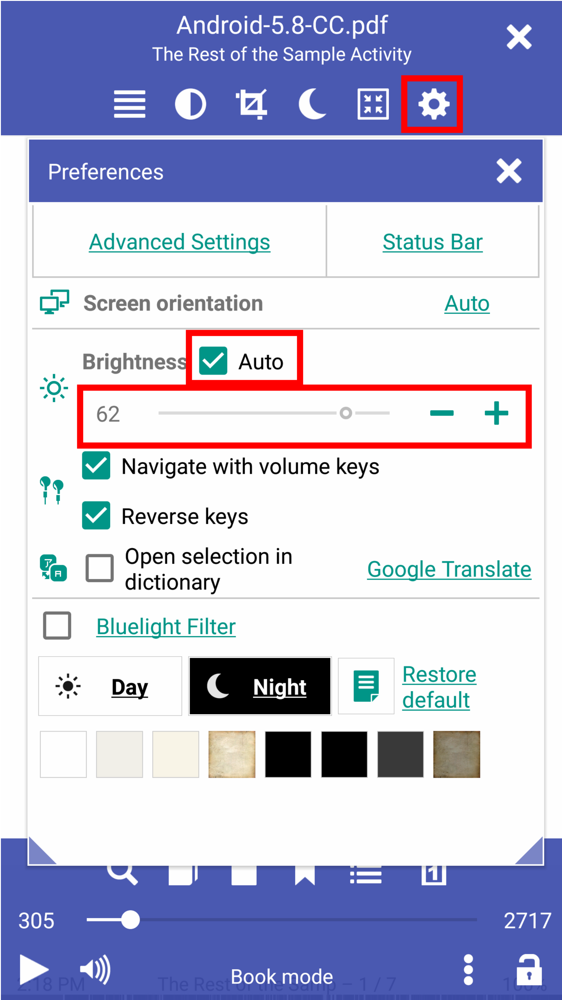
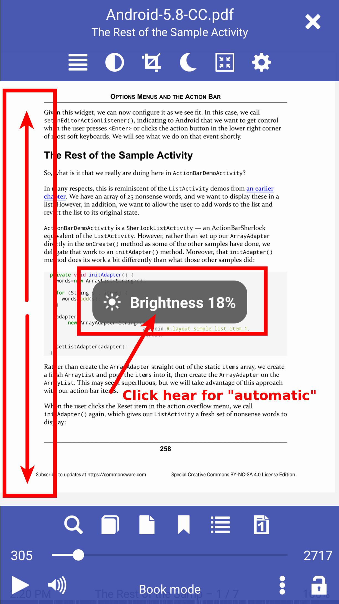
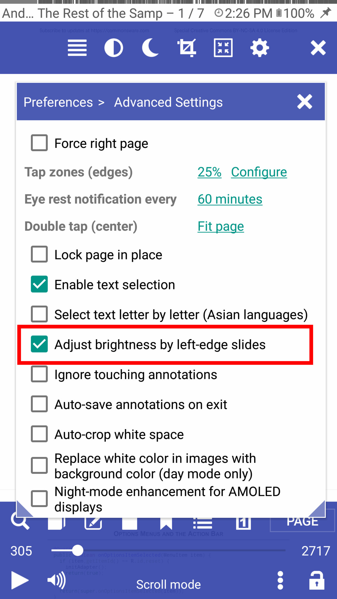
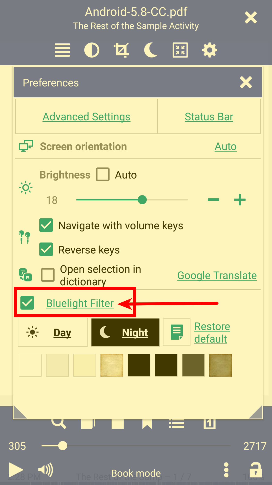
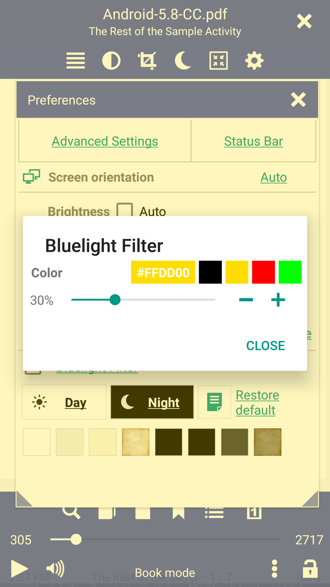
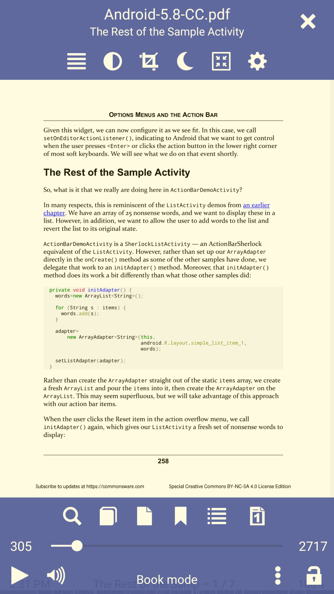

# Brightness Control and Bluelight Filter

> Brightness control in **Librera Reader** can be automatic, according to your system settings, or the user can set brightness manually.
Brightness can be changed in the **Preferences** window, or by sliding a finger along the left edge of the screen (check the corresponding box to turn this mode on).
Negative brightness indicates that your setting is darker than the system's one.
Negative brightness enables the bluelight filter and color Black by default.

* Set brightness to change automatically, depending on the ambient light (system settings)
* Change brightness by sliding your finger along the left edge of the screen
* Tap on the Brightness toast to switch to **Auto** mode
* Turn left-edge-slides on/off in the _Advanced Settings_ tab 

||||
|-|-|-|
||||

**Bluelight Filter**
> Bluelight filter depends on your brightness setting, it turns on automatically when the brightness setting has a negative value.

* Bluelight filter can be turned on manually by checking its box in the **Preferences** window
* Bluelight filter is turned on
* Tap on _Bluelight Filter_ to set up your preferred hue (color)

||||
|-|-|-|
||||
