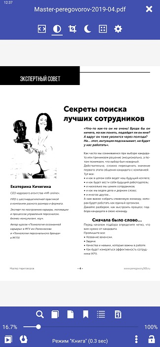
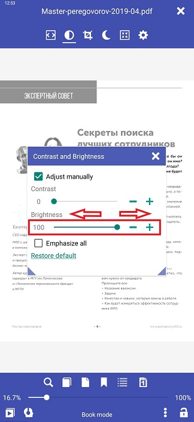
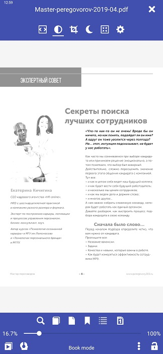

# Contrasto e luminosità in PDF (effetto bianco/nero)

> La leggibilità del PDF in **Librera Reader** può essere migliorata in modo significativo regolando manualmente le impostazioni di luminosità e contrasto. Quando passi alla modalità manuale, il documento verrà visualizzato in bianco e nero e vedrai i risultati delle tue regolazioni in tempo reale sullo sfondo, dietro la finestra **Contrasto e luminosità**.
> Le regolazioni imitano l'effetto spesso utilizzato nei lettori E-Ink.

È possibile regolare le seguenti impostazioni:
* Contrasto
* Luminosità
* O/e puoi applicare l'impostazione automatica _Emphasize all_ (un effetto in grassetto)

> Tutte e tre le impostazioni possono essere applicate separatamente oppure è possibile utilizzare tutte e tre le combinazioni.

## Contrasto
* Tocca l'icona _Contrasto/Luminosità_ nel menu di scelta centrale
* Seleziona la casella _Regola manualmente_ nella finestra **Contrasto e luminosità** e usa il cursore _Contrasto_ (o **-** e **+**) per regolare l'impostazione.
* Tocca fuori dalla finestra (o sul _x_ nell'angolo in alto a destra) per chiuderla.

||||
|-|-|-|
||||

## Luminosità
* Tocca l'icona _Contrasto/Luminosità_ nel menu di scelta centrale
* Seleziona la casella _Regola manualmente_ nella finestra **Contrasto e luminosità** e usa il cursore _Brightness_ (o **-** e **+**) per regolare l'impostazione.
* Tocca fuori dalla finestra (o sul _x_ nell'angolo in alto a destra) per chiuderla.

||||
|-|-|-|
||||

## Enfatizza tutto (effetto in grassetto)
* Tocca l'icona _Contrast/Brightness_ nel &quot;menu-tap-center&quot;
* Seleziona la casella _Regola manualmente_ e quindi la casella _Emphasize all_
* Tocca fuori dalla finestra (o sul _x_ nell'angolo in alto a destra) per chiuderla.

||||
|-|-|-|
||||

> Per annullare le impostazioni manuali, utilizzare il collegamento _ Ripristina predefinito_ nella parte inferiore della finestra **Contrasto e luminosità**.
