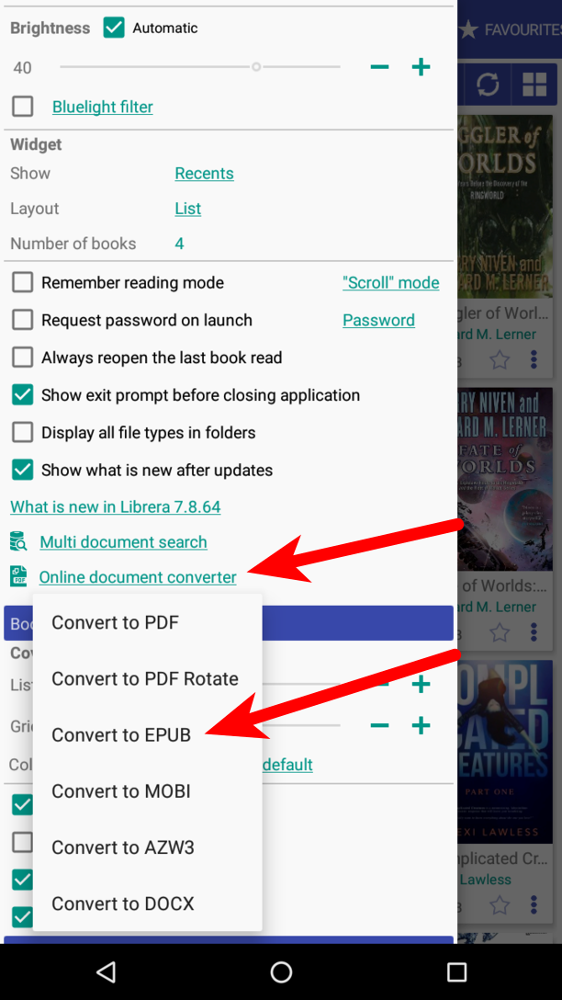
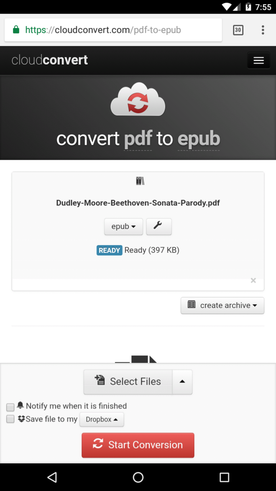
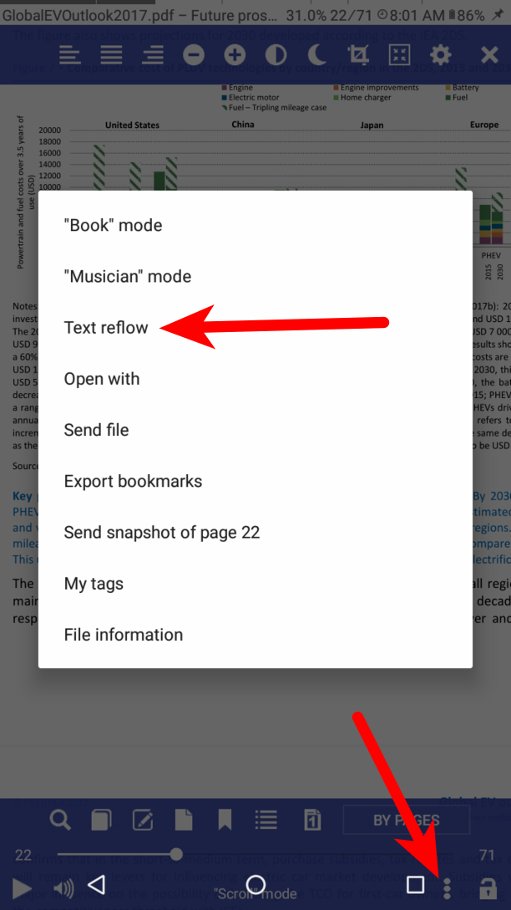
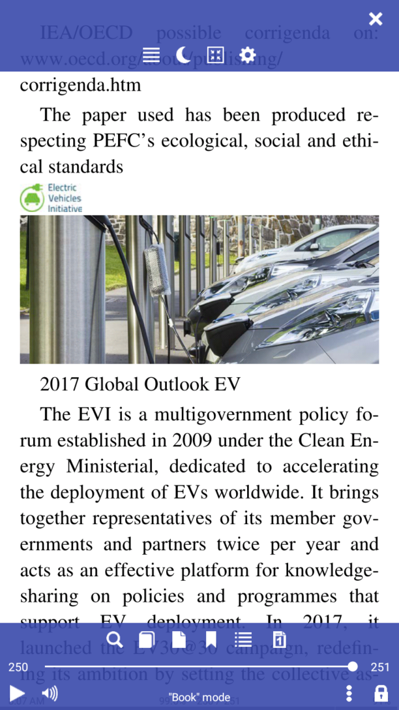
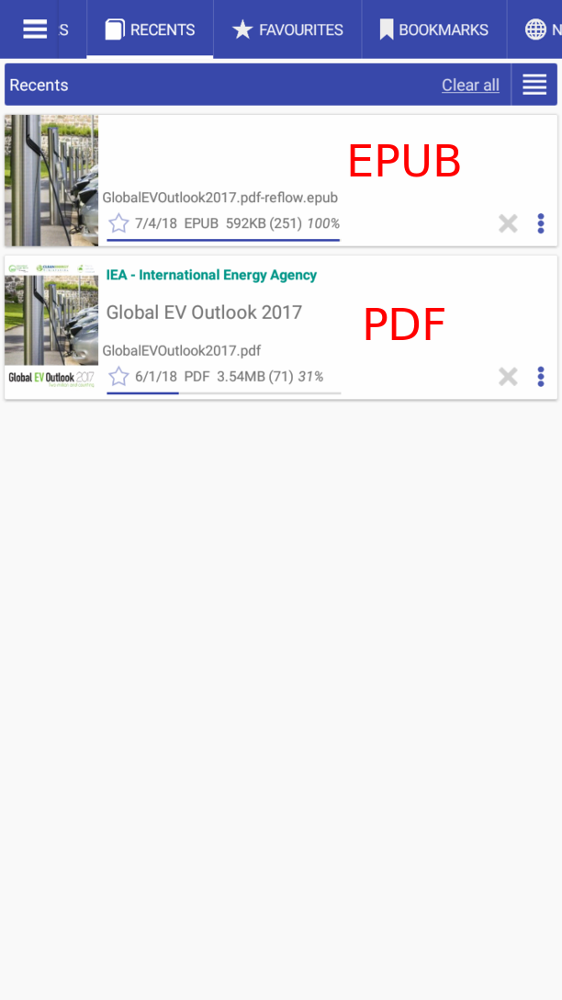

# تحويل PDF إلى EPUB

> **Librera** ستساعدك في تحويل أي تنسيق كتاب إلى تنسيق آخر باستخدام الموارد عبر الإنترنت. علاوة على ذلك ، يمكنك أيضًا تحويل PDF إلى EPUB باستخدام وضع _Reflow PDF_ للتطبيق.

**الوصول إلى محولات الإنترنت**

اضغط على _Convert Document Online_ link في قائمة التفضيلات **Preferences**

اختر _Convert إلى EPUB_

* حوّل ملف PDF إلى EPUB
* حمّل مستند PDF وابدأ عملية التحويل
* قم بتنزيل المستند بتنسيق EPUB

|1|2|3|
|-|-|-|
||||

**_Reflow PDF_ Mode (تحويل PDF داخلي)**

سيقوم الخيار _Reflow PDF_ بتحويل مستند PDF الخاص بك إلى تنسيق EPUB في وضع عدم الاتصال.
> سيتم الاحتفاظ بجميع الصور في الوثيقة.

* اضغط على أيقونة ثلاثية النقاط في الأسفل لفتح قائمة الكتب
* اضغط على عنصر _Reflow PDF_ في قائمة الكتاب
* مستند PDF في عرض تقديمي أكثر ملاءمة للعين
* إصدارات PDF و EPUB في علامة التبويب _Recent_

|4|5|6|
|-|-|-|
||||
> **سيتم حفظ نتيجة التحويل (EPUB) في مجلد _Librera/Downloads_ (التخزين الداخلي).**
