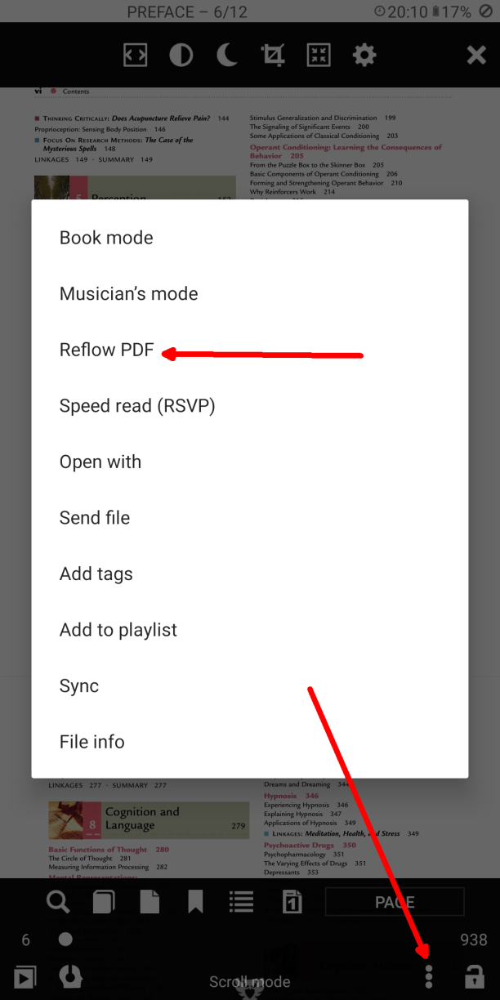

[<](/wiki/faq/ar)

# كيفية تحويل قوات الدفاع الشعبي إلى EPUB

> من الممكن تحويل أي تنسيق إلى أي شكل باستخدام Librera باستخدام الخدمات عبر الإنترنت ، أو تحويل PDF إلى EPUB باستخدام وضع تدفق النص (وضع الهاتف المتحرك/ar)

### محول الانترنت

في القائمة اليسرى ، ابحث عن __محول المستندات عبر الإنترنت__

اختر &quot;تحويل إلى EPUB&quot;

* تحويل PDF إلى EPUB
* حدد الوثيقة وبدء العملية
* تنزيل كتاب EPUB

|1|2|3|
|-|-|-|
||||

### Text Reflow (طريقة عرض الجوال طريقة تحويل PDF إلى EPUBe/ar)

PDF Text Reflow convent PDF to EPUB in offline.
الصور متوفرة.

* فتح قائمة الكتب -&gt; إنحسر النص
* إعادة تدفق النص (أو وضع عرض الجوال/ar)
* كتب PDF و EPUB

|4|5|6|
|-|-|-|
||||

