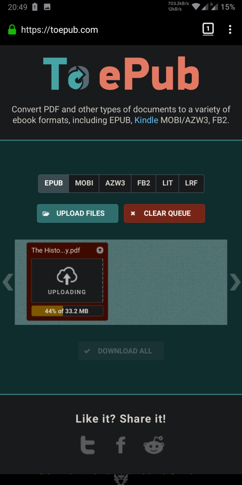

[<](/wiki/faq)

# So wandeln Sie PDF in EPUB um

> Es ist möglich, beliebige Formate von Librera mit Hilfe von Online-Diensten in ein beliebiges Format zu konvertieren oder PDF mit dem Text-Reflow-Modus (Mobile-Modus) in EPUB zu konvertieren.

### Online-Konverter

Im linken Menü finden Sie den __Online-Dokumentkonverter__

Wählen Sie &quot;In EPUB konvertieren&quot;

* PDF in EPUB konvertieren
* Dokument auswählen und Prozess starten
* Laden Sie EPUB Book herunter

|1|2|3|
|-|-|-|
||||

### Text Reflow (Mobile View modWie PDF in EPUBe konvertieren)

PDF Text Reflow verbindet PDF mit EPUB offline.
Bilder sind verfügbar.

* Öffnen Sie das Buchmenü -&gt; Text Reflow
* Text Reflow (oder mobiler Ansichtsmodus)
* PDF- und EPUB-Bücher

|4|5|6|
|-|-|-|
||||

