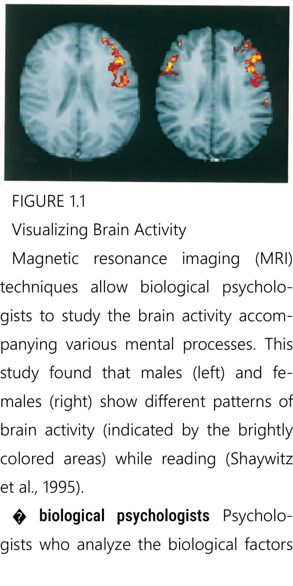

# Cómo convertir PDF a EPUB

> **Librera** lo ayudará a convertir cualquier formato de libro a otro formato mediante el uso de recursos en línea. También puede convertir PDF a EPUB utilizando el modo interno _Reflow PDF_ de la aplicación (modo móvil)

## Acceso a convertidores en línea

Toque **Convertir documento en línea** en el menú deslizable **Preferencias**

Elija _Convertir a EPUB_

* Convierta su archivo PDF a EPUB
* Cargue su documento PDF y comience la conversión
* Descargue su documento en formato EPUB

|1|2|3|
|-|-|-|
||||

## _Reflow PDF_ Mode (Conversión interna de PDF)

La opción _Reflow PDF_ convertirá su documento PDF a formato EPUB sin conexión.
Todas las imágenes en el documento serán preservadas.

* Toque &quot;tres puntos&quot; en la parte inferior para abrir el menú del libro y luego toque _Reflow PDF_
* Un documento PDF en una presentación más amigable
* Versiones guardadas de PDF y EPUB en la pestaña **Reciente**

|4|5|6|
|-|-|-|
||||

