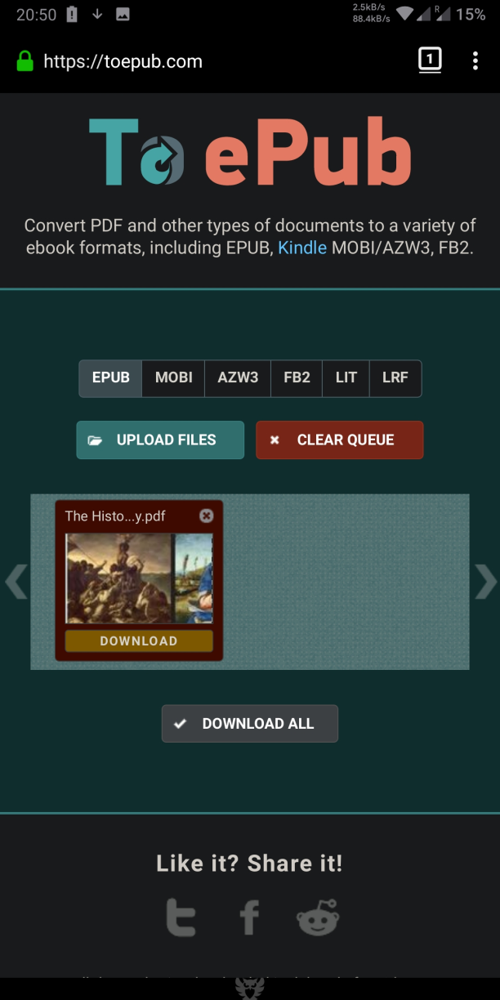

[<](/wiki/faq/fr)

# Comment convertir un fichier PDF en EPUB

> Il est possible de convertir n&#39;importe quel format de n&#39;importe quel format de Librera à l&#39;aide de services en ligne ou de convertir un fichier PDF en fichier EPUB en utilisant le mode de redistribution de texte (mode mobile).

### Convertisseur en ligne

Dans le menu de gauche, recherchez le __convertisseur de documents en ligne__

Choisissez &quot;Convertir en EPUB&quot;

* Convertir un PDF en EPUB
* Sélectionner un document et lancer le processus
* Télécharger le livre EPUB

|1|2|3|
|-|-|-|
||||

### Redistribution du texte (mode mobile, comment convertir un fichier PDF en fichier EPUBe)

Texte PDF Redistribuez PDF au format EPUB en mode hors connexion.
Les images sont disponibles.

* Ouvrir le menu du livre -&gt; Texte redistribué
* Redistribution du texte (ou mode d&#39;affichage mobile)
* Livres PDF et EPUB

|4|5|6|
|-|-|-|
||||

