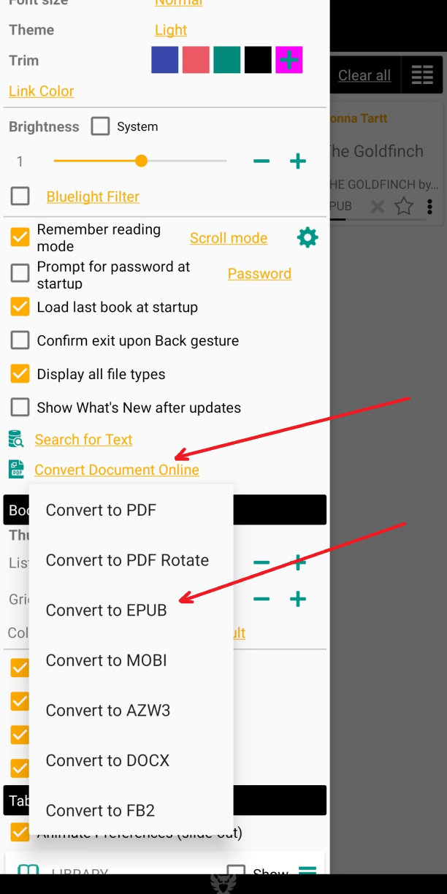

[<](/wiki/faq/ru)

# Как конвертировать PDF в EPUB

> Можно конвертировать любой в любой формат Librera с помощью онлайн-сервисов или конвертировать PDF в EPUB с использованием режима Text Reflow (мобильный режим)

### Онлайн-конвертер

В левом меню найдите __Online document converter__

Выберите «Преобразовать в EPUB»

* Конвертировать PDF в EPUB
* Выбрать документ и начать процесс
* Скачать книгу EPUB

|1|2|3|
|-|-|-|
||||

### Text Reflow (Mobile View modHow для преобразования PDF в EPUBe)

PDF Text Reflow convent PDF to EPUB в автономном режиме.
Доступны изображения.

* Откройте меню книги -&gt; Text Reflow
* Text Reflow (или режим мобильного просмотра)
* Книги PDF и EPUB

|4|5|6|
|-|-|-|
||||

