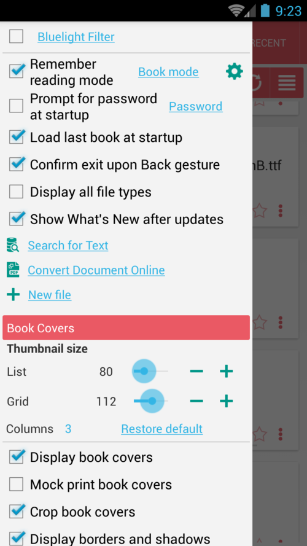
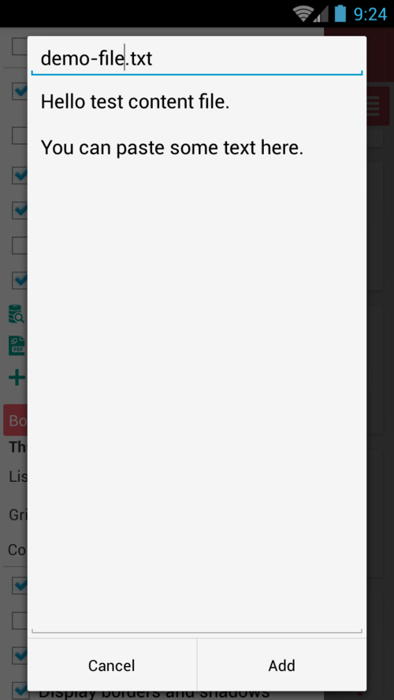

# Criando um novo arquivo TXT para anotações, cotações etc.

> Você pode usar a funcionalidade de bloco de notas do **Librera** para criar seus próprios arquivos no formato .txt. Será útil quando você decidir fazer uma compilação de citações dos livros que está lendo (copiando/colando), anotar suas anotações em um livro, compilar um arquivo para gravação de áudio (TTS) etc.

Para criar um novo arquivo:
* Toque no link _Novo arquivo_ na guia Preferências deslizante (menu)
* Digite um nome significativo para o seu arquivo, terminando em &quot;.txt&quot;
* Digite ou cole o conteúdo deste novo arquivo TXT e toque em _SAVE_
> **O novo arquivo será salvo na pasta _Downloads_ do seu dispositivo (armazenamento interno).**

||||
|-|-|-|
||||
