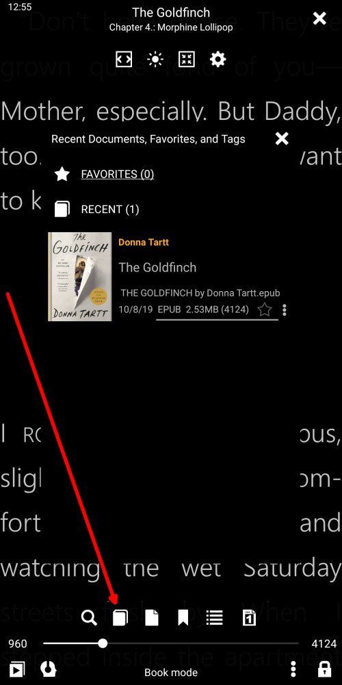
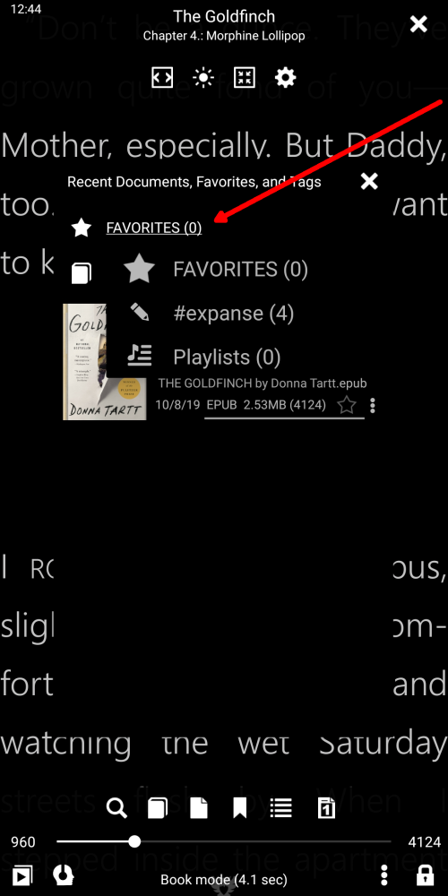

[<](/wiki/faq)

# Erstellen Sie benutzerdefinierte Tags

> In diesem Kapitel erfahren Sie, warum @ @ book tags__ benötigt wird und wie Sie sie zu den Büchern hinzufügen können. Markieren ist freie Form
Wörter, die den Büchern von irgendwelchen Dateien zustimmen, um die Bibliothek besser zu organisieren. Es ist möglich, dem selben Buch viele Tags zuzuweisen. Tags helfen Benutzern beim Erstellen von Büchern
in Sammlungen. Tags helfen dem Benutzer, Bücher in Listen oder Sammlungen einfach zu finden.
Tags sind vom Benutzer erstellte Metadaten, aber es gibt auch andere Metadaten wie [Series](), [Authors](), [Keywords](), [Genres](), die dazu beitragen
Buchsammlungen finden und orginalisieren.

### Es gibt viele Orte, an denen Benutzer # # Tags__ zum Buch hinzufügen können.

* Durch langes Tippen auf das Sternsymbol (Favoriten)
* Aus dem Buchmenü
* Aus dem Buchinformationsdialog

|1|2|3|
|-|-|-|
||||

### Hinzufügen von Tags ist sehr einfach, klicken Sie einfach

> Wenn das Tag gelöscht wird, wird dieses Tag aus allen zugewiesenen Büchern entfernt

* Tag hinzufügen
* Neues Tag erstellen
* Löschen Sie das zugewiesene Tag

|4|5|6|
|-|-|-|
||||

### Erstellen Sie benutzerdefinierte Listen und Sammlungen

* Weisen Sie dem Buch Tag zu
* Finden Sie alle Tag-Liste auf der Favoriten-Registerkarte
* Hol dir alle Bücher nach Tags

|7|8|9|
|-|-|-|
||||

### Siehe Tagsammlungen aus dem Buch

* Klicken Sie auf das Symbol für die letzten Tags
* Wählen Sie die gewünschten Sammlungen (Lieblingsbücher oder Benutzer-Tags)
* Anzeigen von Büchern nach Tag, klicken Sie, um ein Buch zu lesen

|10|11|12|
|-|-|-|
||||
