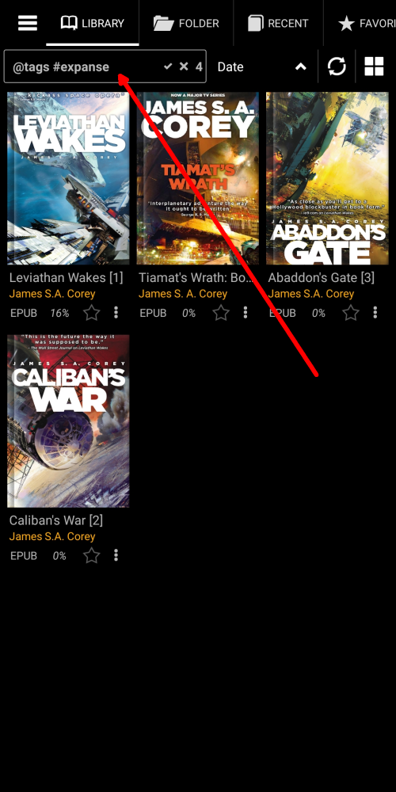

# Hinzufügen und Behandeln von benutzerdefinierten Tags

> Indem wir den Büchern in unserer Bibliothek benutzerdefinierte Tags hinzufügen, fügen wir den Metadaten der Bücher (für uns) aussagekräftige Informationen hinzu. Diese Tags werden sich als nützlich erweisen, wenn wir in Zukunft auf die Bücher verweisen, denen wir Tags zugewiesen haben. Sie helfen uns, Bücher in der Bibliothek zu organisieren, nach unseren Wünschen zu sortieren, benutzerspezifische Buchlisten zu erstellen, Bücher in der Bibliothek leicht zu finden usw.
> Benutzerdefinierte Tags werden für alle erdenklichen Zwecke zusammen mit bereits vorhandenen herkömmlichen E-Book-Tags verwendet, z. B. [Series](), [Authors](), [Keywords](), [Genres]() usw.

> Es gibt viele Möglichkeiten, einem Buch ein **neues Tag** hinzuzufügen.

* Durch langes Drücken auf das Sternsymbol (Favoriten)
* Rufen Sie das Buchmenü auf und tippen Sie auf &quot;Tags hinzufügen&quot;.
* Über das Fenster &quot;Dateiinfo&quot; (Tipp: Wenn Sie lange auf einen Buchdeckel drücken, gelangen Sie dorthin.)

|1|2|3|
|-|-|-|
||||

## Hinzufügen und Löschen von Tags (ganz einfach)

* Tippen Sie auf _Neues Tag_.
* Fügen Sie hier aussagekräftige Informationen hinzu
* Um ein Tag zu löschen, tippen Sie auf ein _x_ daneben und bestätigen Sie den Löschvorgang
> Das gelöschte Tag wird aus allen Büchern entfernt, denen es zugewiesen ist.

|4|5|6|
|-|-|-|
||||

## Erstellen einer benutzerdefinierten Bücherliste

* Weisen Sie einem Buch ein Tag zu, indem Sie es auswählen und auf _APPLY_ tippen.
* Ihre benutzerdefinierten Buchlisten werden auf dem Tab **Favoriten** angezeigt
* Tippen Sie auf einen Listennamen, um ihn auf dem Tab **Bibliothek** zu öffnen

|7|8|9|
|-|-|-|
||||

## Aufrufen Ihrer benutzerdefinierten _Favoriten_-Liste aus dem Buch, das Sie lesen

* Tippen Sie im Menü auf das Buchlisten-Symbol
* Tippen Sie auf _Favoriten_, um eine Dropdown-Liste zu öffnen
* Wählen Sie Ihre maßgeschneiderte Liste und genießen Sie

|10|11|12|
|-|-|-|
||||
