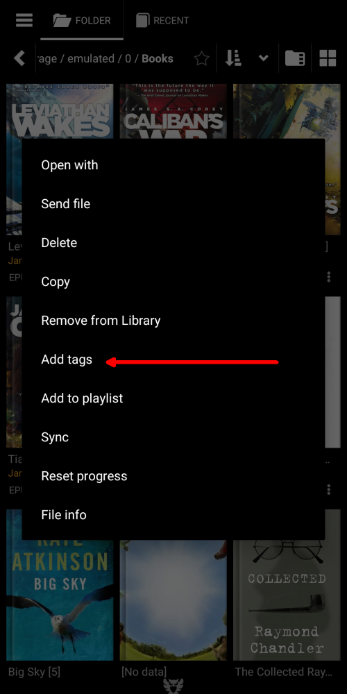
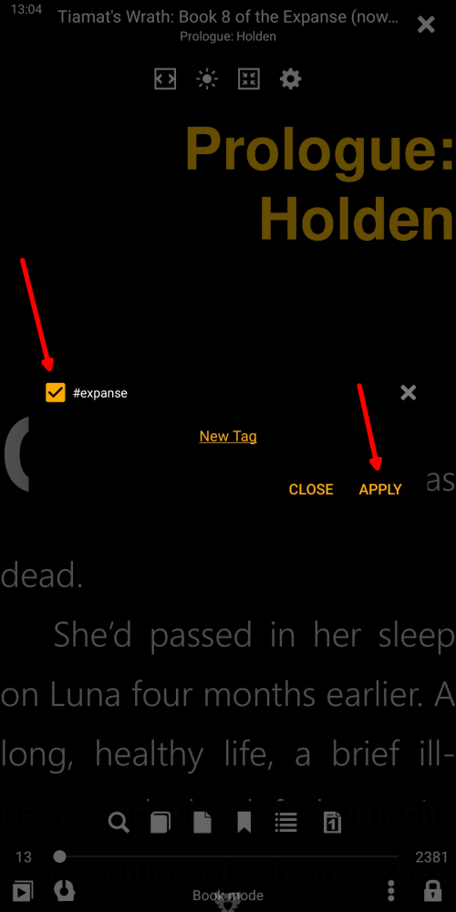

# Ajout et gestion des balises personnalisées

> En ajoutant des étiquettes personnalisées aux livres de notre bibliothèque, nous ajoutons des informations significatives (pour nous) aux métadonnées des livres. Ces balises nous seront utiles lors de nos futures références aux livres auxquels nous avons attribué des balises. Ils nous aideront à organiser les livres dans la bibliothèque, à les trier à notre guise, à créer des listes de livres spécifiques à l'utilisateur, à trouver facilement des livres dans la bibliothèque, etc.
> Les balises définies par l'utilisateur seront utilisées à toutes fins imaginables aux côtés des balises de livres électroniques déjà existantes, telles que [Série](), [Auteurs](), [Mots-clés](), [Genres](), etc.

> Il existe de nombreuses façons d’ajouter un **nouveau tag** à un livre.

* En appuyant longuement sur l’icône étoile (Favoris)
* En appelant le menu du livre et en appuyant sur _Ajouter des tags_
* Via la fenêtre _File info_ (Astuce: un appui long sur une couverture de livre vous y mènera)

|1|2|3|
|-|-|-|
||||

## Ajouter et supprimer des tags (simple comme bonjour)

* Appuyez sur _Nouveau tag_
* Ajoutez ici des informations utiles
* Pour supprimer une balise, appuyez sur un _x_ à côté de celle-ci, puis confirmez la suppression.
> La balise supprimée sera supprimée de tous les livres auxquels elle est assignée.

|4|5|6|
|-|-|-|
||||

## Création d'une liste personnalisée de livres

* Attribuez un tag à un livre en le sélectionnant et en appuyant sur _APPLY_
* Vos listes de lecture personnalisées apparaissent dans l'onglet **Favoris**.
* Appuyez sur un nom de liste pour l'ouvrir dans l'onglet **Bibliothèque**.

|7|8|9|
|-|-|-|
||||

## Invocation de votre liste de favoris personnalisée dans le livre que vous lisez

* Appuyez sur l'icône de liste de livres dans le menu.
* Appuyez sur _Favorites_ pour ouvrir une liste déroulante.
* Sélectionnez votre liste personnalisée et profitez

|10|11|12|
|-|-|-|
||||
