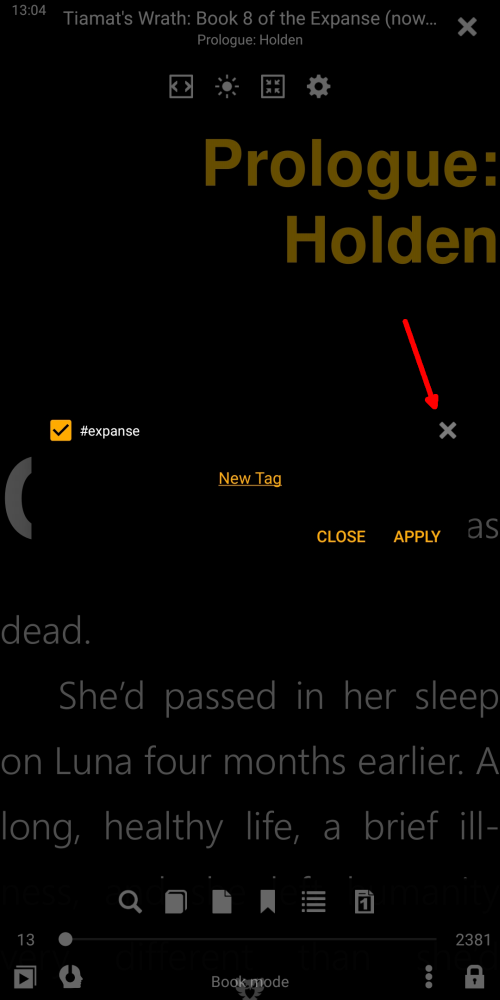

# Gestione dei tag personalizzati

> Aggiungendo tag personalizzati ai libri nella nostra Biblioteca, stiamo aggiungendo alcune informazioni significative (per noi) ai metadati dei libri. Questi tag torneranno utili nei nostri futuri riferimenti ai libri a cui abbiamo assegnato i tag. Ci aiuteranno a organizzare i libri nella Biblioteca, ordinarli a nostro piacimento, creare liste di libri specifiche per l'utente, trovare facilmente libri nella Biblioteca, ecc.
> I tag definiti dall'utente verranno utilizzati per tutti gli scopi immaginabili insieme ai tag di e-book convenzionali già esistenti, come [Serie](), [Autori](), [Parole chiave](), [Generi](), ecc.

## Esistono molti modi per aggiungere un **nuovo tag** a un libro.

* Premendo a lungo l'icona a stella (preferiti)
* Chiamando il menu del libro e toccando _Aggiungi tag_
* Tramite la finestra _File info_ (Suggerimento: una pressione prolungata sulla copertina di un libro ti porterà lì)

|1|2|3|
|-|-|-|
||||

## L'aggiunta e l'eliminazione di tag è semplice come una torta

* Tocca su _Nuovo tag_
* Aggiungi informazioni significative qui
* Per eliminare un tag, tocca un _x_ accanto ad esso e quindi conferma l'eliminazione
> Il tag eliminato verrà rimosso da tutti i libri a cui è assegnato

|4|5|6|
|-|-|-|
||||

## Creazione di un elenco personalizzato di libri

* Assegna un tag a un libro selezionandolo e premendo _Applica_
* Le tue liste di libri personalizzate appariranno nella scheda _Favoriti_
* Tocca il nome dell'elenco e si aprirà nella scheda _Library_

|7|8|9|
|-|-|-|
||||

## Richiamare la tua lista _Favorites_ su misura dal libro che stai leggendo

* Tocca l'icona degli elenchi di libri nel menu
* Tocca _Favoriti_ per aprire un elenco a discesa
* Seleziona il tuo elenco personalizzato e divertiti

|10|11|12|
|-|-|-|
||||
