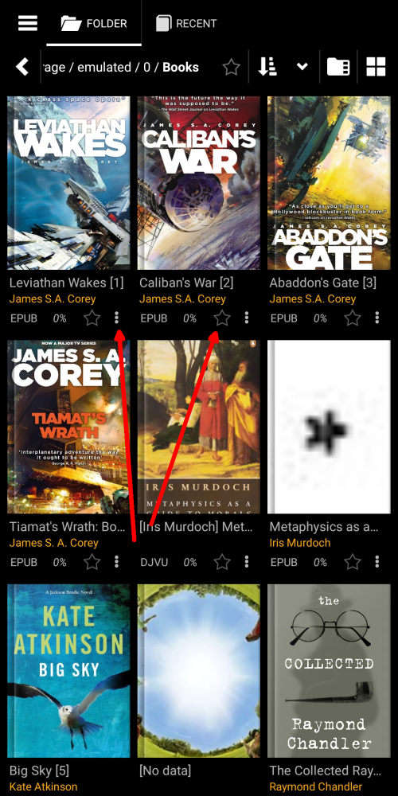

# Adicionando e manipulando tags personalizadas

> Ao adicionar tags personalizadas aos livros da nossa Biblioteca, adicionamos algumas informações significativas (para nós) aos metadados dos livros. Essas tags serão úteis em nossas futuras referências aos livros aos quais atribuímos tags. Eles nos ajudarão a organizar livros na Biblioteca, classificá-los ao nosso gosto, criar listas de livros específicas do usuário, encontrar livros facilmente na Biblioteca etc.
> As tags definidas pelo usuário serão usadas para todos os fins imagináveis, além das tags convencionais já existentes, como [Série](), [Autores](), [Palavras-chave](), [Gêneros](), etc.

> Existem várias maneiras de adicionar uma **Nova tag** a um livro.

* Pressionando longamente o ícone de estrela (Favoritos)
* Chamando o menu do livro e tocando em _Adicionar tags_
* Na janela _File info_ (Dica: uma pressão longa na capa do livro o levará até lá)

|1|2|3|
|-|-|-|
||||

## Adicionando e excluindo tags (tão fácil quanto uma torta)

* Toque em _Nova tag_
* Adicione informações significativas aqui
* Para excluir uma tag, toque em _x_ ao lado dela e confirme a exclusão
> A tag excluída será removida de todos os livros aos quais está atribuída.

|4|5|6|
|-|-|-|
||||

## Criando uma lista personalizada de livros

* Atribua uma tag a um livro, selecionando-a e tocando em _APPLY_
* Suas listas de livros personalizadas aparecerão na guia **Favoritos**
* Toque no nome de uma lista para abri-la na guia **Biblioteca**

|7|8|9|
|-|-|-|
||||

## Invocando sua lista _Favoritos_ personalizada do livro que você está lendo

* Toque no ícone das listas de livros no menu
* Toque em _Favoritos_ para abrir uma lista suspensa
* Selecione sua lista personalizada e aproveite

|10|11|12|
|-|-|-|
||||
