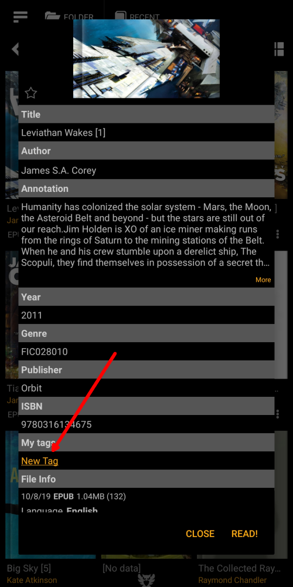
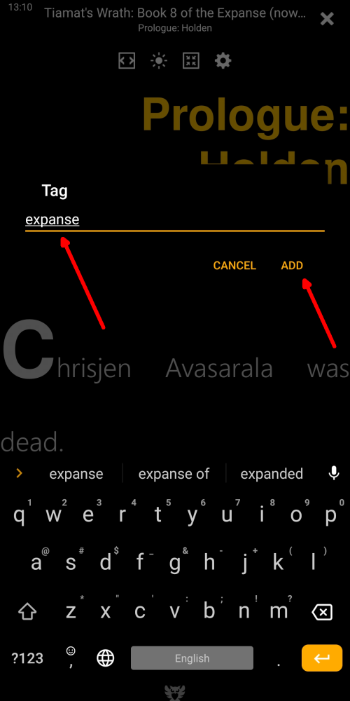

[<](/wiki/faq/zh)

# 创建自定义标签

> 本章的目的是了解为什么需要@＃book tags＃@以及如何将它们添加到书中。标记是自由形式
为了更好地组织图书馆，任何文件的书籍。可以为同一本书分配许多标签。标签可以帮助用户对书籍进行整理
在收藏中。标签可帮助用户轻松查找列表或集合中的图书。
标签是用户创建的元数据，但也存在其他元数据，如[系列]（），[作者]（），[关键字]（），[类型]（），这有助于
查找和整理书籍收藏。

### 有很多地方用户可以在书中添加@＃tags＃。

* 通过长按星标（收藏夹）图标
* 从书籍菜单
* 从书籍信息对话框

|1|2|3|
|-|-|-|
||||

### 添加标签非常简单，只需点击即可

> 如果删除标记，则会从分配的所有图书中删除此标记

* 添加标签
* 创建新标签
* 删除指定的标签

|4|5|6|
|-|-|-|
||||

### 创建自定义列表和集合

* 将标签分配给书籍
* 找到收藏夹选项卡中的所有标签列表
* 按标签获取所有书籍

|7|8|9|
|-|-|-|
||||

### 查看书中的标签集

* 单击recent-tags图标
* 选择您想要的收藏（最喜欢的书籍或用户标签）
* 按标签显示书籍，点击阅读任何书籍

|10|11|12|
|-|-|-|
||||
