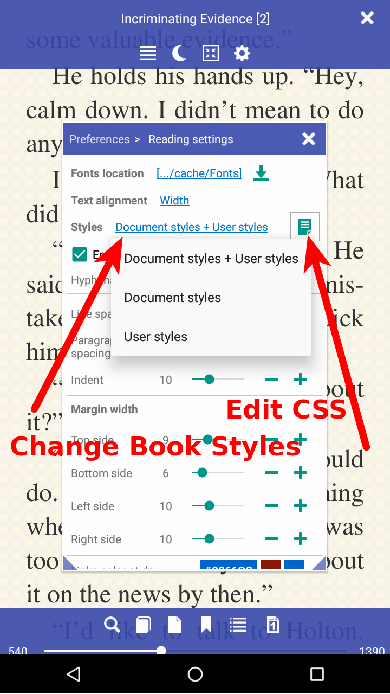
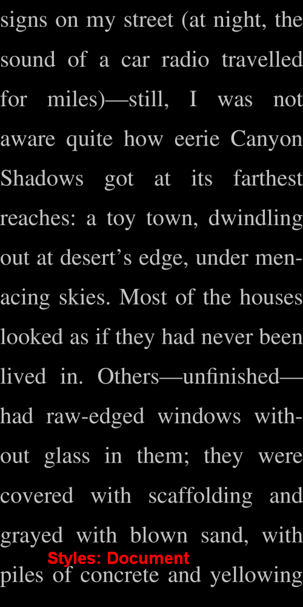

# Пользовательское CSS-кодирование

> Для отображения книги **Librera** обычно берет стили из файла .css книги, а также применяет ваши настройки из окна **Предпочтения**. Это может также использовать один или другой отдельно. Но иногда этого недостаточно. Некоторые книги имеют настолько своеобразный код CSS, что у вас нет другого выбора, кроме как редактировать их .css файлы для улучшения читабельности. **Librera**, однако, дает вам еще одну возможность: временно добавить пользовательский код CSS, который легко удалить, как только вы закончите с оспариваемой книгой.

Поддерживаются три режима **стилей**:

1. Документ + Пользовательский (берет хорошие вещи из двух миров)
2. Документ (использует только настройки книги .css)
3. Определяемый пользователем (использует только настройки пользователя, указанные на вкладках окна **Параметры**)

* Пользователь может переключаться между режимами с помощью раскрывающегося списка, вызываемого при нажатии на ссылку рядом с _Styles_.
* Нажмите на значок рядом со списком _Styles_, чтобы открыть окно **Пользовательский код CSS** и перейти к нему.

|1|2|3|
|-|-|-|
||||

Документ + Пользовательский режим включен по умолчанию

Пример на рис. 3 взят из реальной жизни.

{white-space: pre-line;}
Последовательности пустого пространства свернуты. Строки ломаются у символов новой строки, в   и по мере необходимости заполнять строки ящиков.

{white-space: pre;}
Последовательности пробелов сохраняются. Строки разбиваются только на символах новой строки в источнике и на   элементы.

пролет {дисплей: блок}
р&gt; Span {дисплей: встроенный}
Устраняет очень раздражающие пустые строки между страницами (исправление недостатков muPDF).
