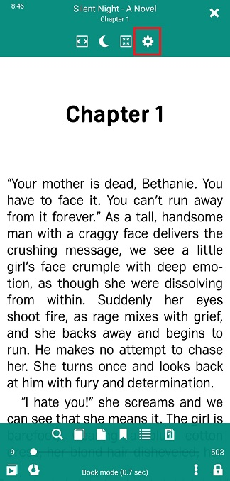
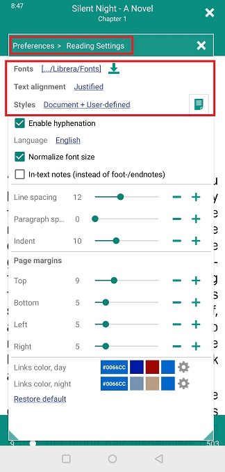
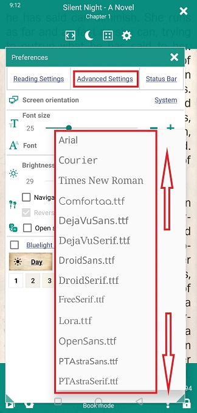
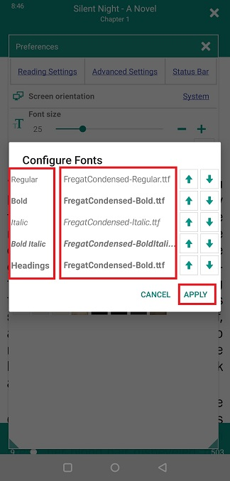
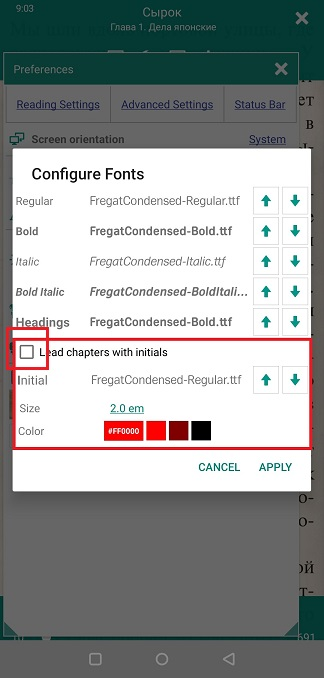
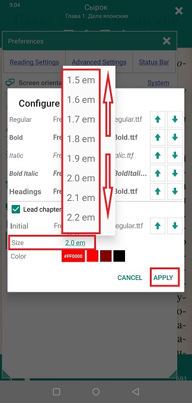
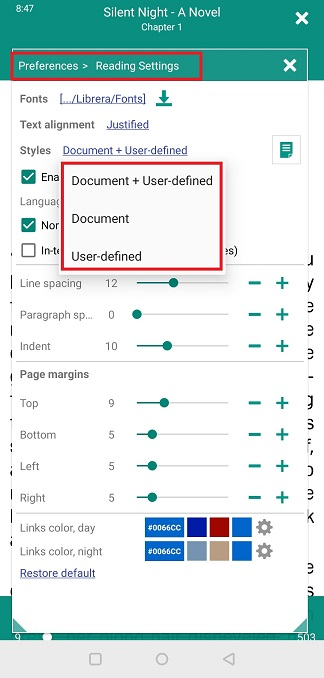
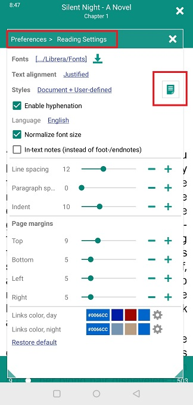
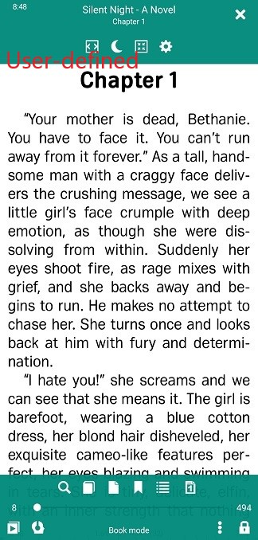

# Configurazione di caratteri e stili

> **Librera** ti consente di personalizzare l'aspetto del documento che stai leggendo: scegli i caratteri a tuo piacimento e regola le loro dimensioni, regola gli stili CSS e cambia le prime lettere in iniziali iniziali (FB2).

Farai tutto quanto sopra nella scheda principale della finestra **Preference** e, ovviamente, nella scheda _Leggi impostazioni_.

> Tocca l'icona **Impostazioni** per aprire la finestra **Preferenze**.

||||
|-|-|-|
||||

## Aggiustamenti dei caratteri

* Seleziona il carattere principale toccando il link _Font_ e scorrendo l'elenco a discesa dei caratteri disponibili.

> Puoi aggiungere i tuoi caratteri preferiti all'elenco:
1. Creare una cartella denominata _Fonts_ nella memoria interna del dispositivo.
> Nota: esiste un'altra cartella _Fonts_ nella memoria interna già creata automaticamente da **Librera**.
2. Salva i tuoi caratteri preferiti nella cartella _Fonts_ (o nella cartella _Fonts_ di **di Librera**).
> (Puoi anche scaricare alcuni caratteri interessanti dal nostro sito. Consulta la sezione **Impostazioni di lettura** per istruzioni.)
> Ricorda che i tuoi caratteri saranno onorati solo se i _Styles_ che hai selezionato nella scheda **Impostazioni di lettura** contengono _User-definite_.

Per impostare caratteri specifici dell'utente per diversi stili di carattere, toccare l'icona accanto al collegamento _Fonts_ per aprire la finestra _Configura caratteri_.

* Tocca l'impostazione per ogni stile e seleziona un carattere per esso.
* Utilizza i pulsanti **su** e **giù** per passare al carattere successivo nell'elenco (a volte questo sarà sufficiente per il tuo scopo).
* Non dimenticare di toccare **APPLICA** al termine.

||||
|-|-|-|
||||

||||
|-|-|-|
||||

## Iniziali principali nei libri di FB2

Puoi far iniziare ogni capitolo del tuo libro con un'iniziale gradevole.
 
> Questa impostazione non verrà visualizzata durante la lettura in nessun altro formato.

* Tocca l'icona accanto al link _Fonts_ per aprire la finestra _Configure Fonts_
* Seleziona la casella _Lead capitoli con iniziali_ per abilitare le iniziali
* Tocca il link font-face per selezionare un font per la tua iniziale da un elenco a discesa
* Ora scegli la dimensione e il colore della tua iniziale toccando i rispettivi collegamenti
* Tocca **APPLICA** per salvare le impostazioni

||||
|-|-|-|
||||

## La scheda **Impostazioni di lettura**

> Queste sono le impostazioni definite dall'utente. Sovrascrivono principalmente le impostazioni di stile codificate nel file .css del tuo libro. Devi scegliere gli stili definiti dall'utente per farlo funzionare.

* Seleziona il tuo allineamento di testo preferito dall'elenco a discesa.
* Usa i cursori o i tocchi **-** e **+** per regolare la spaziatura di riga e paragrafo, rientri del testo e margini della pagina.
* _normalizzando la dimensione-carattere_ si rendono uguali tutti i caratteri nel documento (1em, normale).
* È inoltre possibile specificare il colore dei collegamenti nel documento per ciascuna modalità (giorno e notte).

||||
|-|-|-|
||||

**Scegli saggiamente _Styles_ per il tuo libro**

* _Document_, verranno utilizzate le impostazioni .css del libro
* _ Definito dall'utente_, verranno utilizzate le impostazioni di questa scheda
* _Documento + Definito dall'utente_ (predefinito, consigliato), il nostro tentativo di incorporare le impostazioni dell'utente nelle impostazioni .css del libro (o viceversa). Funziona la maggior parte del tempo!

## La finestra **Codice CSS personalizzato**

Questa finestra si apre toccando l'icona accanto a _Styles_

Chi ha familiarità con la codifica CSS può personalizzare un po 'ad hoc il modo in cui il tuo libro viene visualizzato. (Vedi di più sotto le FAQ **Personalizza gli stili CSS del libro**).

> Non dimenticare di rimuovere il codice una volta terminato il libro! Potrebbe non funzionare nel prossimo.

||||
|-|-|-|
||||

||||
|-|-|-|
||||
