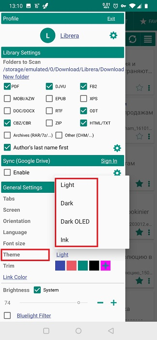
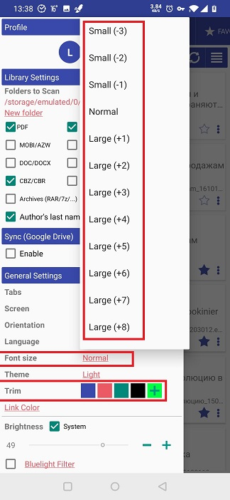
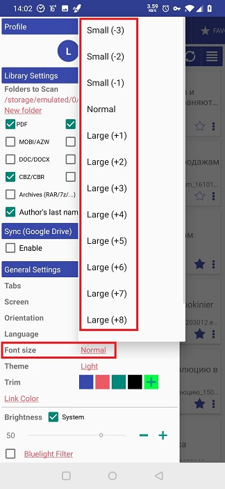
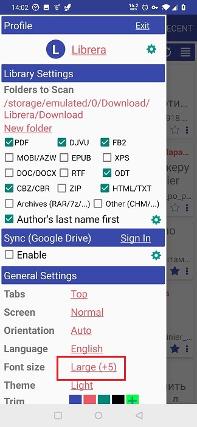
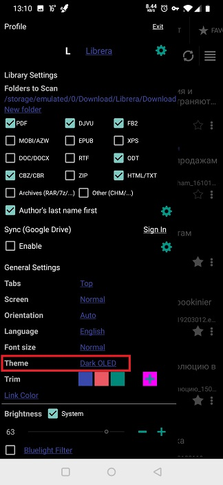

[<](/wiki/faq)

# Customize the theme and color of the app

> Librera allows you to customize the themes and interface to your color preferences.

You can customize:

* Font size by increasing or decreasing it
* Choose the color theme of the application
* Choose the color of the headers
* Choose the color of the links

**All settings of the program you can combine with each other.**

||||
|-|-|-|
||||

**Setting the font size:**

Click on the menu item " Font Size"
Choose the font size you want by increasing or decreasing it.

||||
|-|-|-|
||||

**Customize the app theme:**

Click on the "Theme" menu item
Select the theme you need. You can also choose a theme for the E-Ink screen.

||||
|-|-|-|
||||

