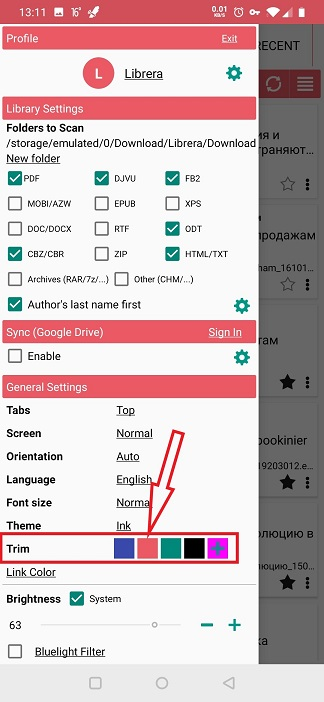
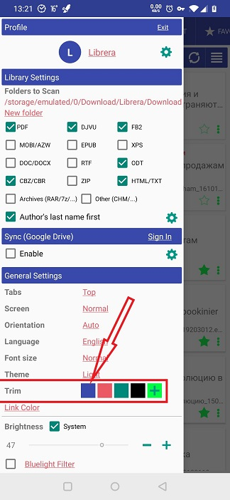
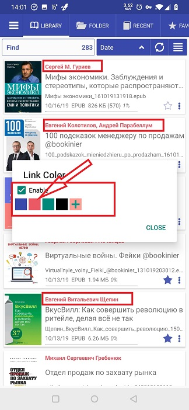
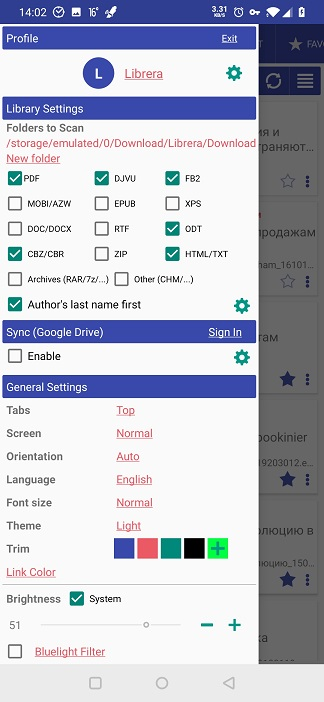

# Benutzeroberfläche von Theming Librera

> **Mit Librera** können Sie jedes Detail der Benutzeroberfläche individuell anpassen.

Im Bereich &quot;Allgemeine Einstellungen&quot; auf dem Tab &quot;**Einstellungen**&quot; können Sie Ihre persönlichen Einstellungen vornehmen:

* Schriftgröße
* Motiv und Farbe des Themas
* Farbe zuschneiden
* Linkfarbe

||||
|-|-|-|
||||

**Schriftgrößeneinstellung**

* Tippen Sie auf &quot;Schriftgröße&quot;, um eine Dropdown-Liste der relativen Schriftgrößen zu öffnen
* Wählen Sie die Schriftgröße aus, indem Sie die aktuelle Schriftgröße verringern oder erhöhen

||||
|-|-|-|
||||

**Allgemeine Themeneinstellung**

* Tippen Sie auf _Theme_, um eine Dropdown-Liste der verfügbaren Themen zu öffnen
* Wählen Sie das gewünschte Thema aus. Sie können auch das Thema für E-Ink-Bildschirme auswählen.

> _Einige zusätzliche Themen ergeben sich aus der Auswahl der Farben und Schriftarten, während Sie Ihre Tag/Nacht-Lesemodi einstellen_

||||
|-|-|-|
||||

**Einstellung für Kopf- und Titelfarbe (Zuschneiden)**

* Sie können eine der verfügbaren Voreinstellungen auswählen, indem Sie darauf tippen
* Oder Sie können etwas ganz anderes auswählen, indem Sie auf **+** tippen.
* Wählen Sie Ihre Farbe aus der geöffneten Farbpalette aus

||||
|-|-|-|
||||

**Link-Farbeinstellung**

* Sie müssen benutzerdefinierte Farben aktivieren, indem Sie die Systemeinstellungen überschreiben
* Wählen Sie eine der verfügbaren Voreinstellungen aus, indem Sie darauf tippen
* Oder Sie können etwas ganz anderes auswählen, indem Sie auf **+** tippen.
* Wählen Sie Ihre Farbe aus der geöffneten Farbpalette aus

||||
|-|-|-|
||||

> **Das Beste, was * Librera * bietet, ist die Möglichkeit, jedes darin erstellte Profil individuell zu gestalten. Sie können Ihre Profile thematisieren, die für Stimmungsänderungen, Lesen bei Tag und Nacht, Buchgenres usw. erstellt wurden.**
