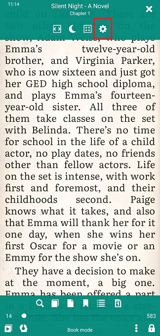
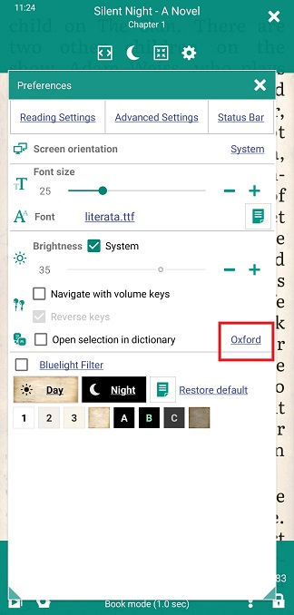
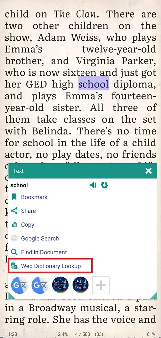
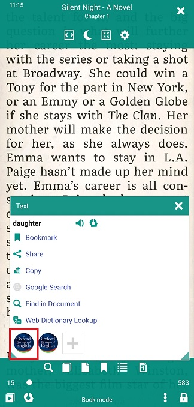
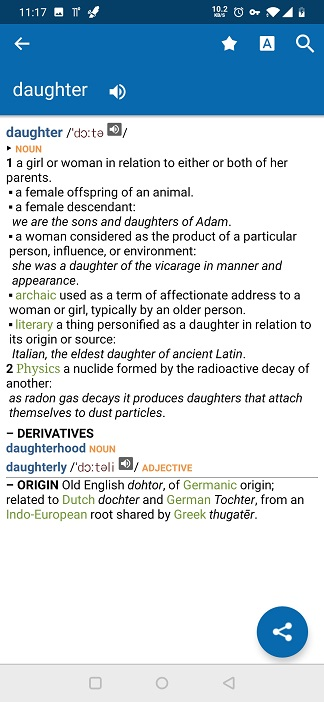
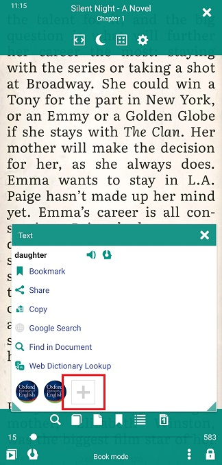

# Uso de diccionarios y traductores

> Cuando lees un libro, especialmente en un idioma extranjero, es posible que necesites buscar el significado de una palabra que no conoces en un diccionario. Con **Librera**, puede hacerlo fácilmente, con un solo clic, dentro y fuera de línea.

**Librera** le permite buscar una sola palabra o traducir pasajes completos utilizando traductores en línea (diccionarios).

Hay un montón de **ONLINE** diccionarios y traductores en Internet. Le permiten verificar el significado de una palabra sin instalar nada en su dispositivo.
> **Librera** abrirá una ventana del navegador para usted con la palabra seleccionada en el campo de búsqueda del diccionario elegido.
 
Puede elegir entre los siguientes (por nombrar solo algunos):

* Lingvo
* Oxford
* Longman
* Cambridge
* Macmillan
* Collins
* Merriam-Webster
* 1tudien
* veredicto
* Wikipedia
* Wikcionario
* Academic.ru
* Vocabulary.com
* Deepl.com
* Treccani.it, etc.

Es necesario instalar** OFFLINE** diccionarios y traductores en su dispositivo desde Google Play (o en cualquier otro lugar). Aparecerán una ventana con la traducción o definición de una palabra seleccionada, y no dependerán de Internet para funcionar.

1. Una lista de los diccionarios y traductores gratuitos más populares en Google Play es la siguiente:
* Traductor de Google
* Traductor de Microsoft
* Diccionario ruso multitran
* Diccionario Oxford
* Yandex.Translate, etc.
2. También puede instalar un **dictionary-shell**, que manejará diccionarios creados por compiladores de terceros, como, por ejemplo:
* GoldenDict
* Diccionario de foros, etc.
 
> **Si no ha encontrado en * Librera * el recurso en línea que está buscando, envíe su solicitud a los desarrolladores a librera.reader@gmail.com o plantee un problema en github.**

**Búsqueda de diccionario con un clic**
Para habilitar la búsqueda inmediata en el diccionario de una palabra seleccionada, debe:
* Abra la ventana **Preferencias** tocando el icono **Configuración**
* Marque la casilla _Abra la selección en el diccionario_ en la pestaña principal
* Seleccione una palabra (o una secuencia de palabras) presionando prolongadamente (y arrastrando)
||||
|-|-|-|
||||

**Configuración de un diccionario predeterminado**
También puede configurar su diccionario predeterminado (aquel cuya ventana aparecerá en una selección de palabras):
* Toque el enlace _Dictionary_ junto al cuadro _Abierta selección_
* Seleccione el diccionario que prefiera de la lista desplegable de diccionarios y traductores (Nota: la lista presenta diccionarios en línea y fuera de línea)

||||
|-|-|-|
||||

**Dejar la casilla de selección sin marcar**
Si deja la casilla _Abierta selección_ sin marcar, se le presentará la ventana **Texto** al seleccionar una palabra o secuencia de palabras. Aquí podrás:
* Busque o traduzca esta palabra (secuencia) en el recurso en línea que elija (tocando _Web Dictionary Lookup_)

||||
|-|-|-|
||||

* Encuentra (tocando **+** si es necesario) tu diccionario o traductor instalado preferido
* Toque su icono para invocar su ventana emergente con la traducción de la palabra (definición)

||||
|-|-|-|
||||

> Un recordatorio rápido: no olvides elegir tu diccionario predeterminado ANTES de marcar la casilla _Abra la selección en el diccionario_.

||||
|-|-|-|
||||
