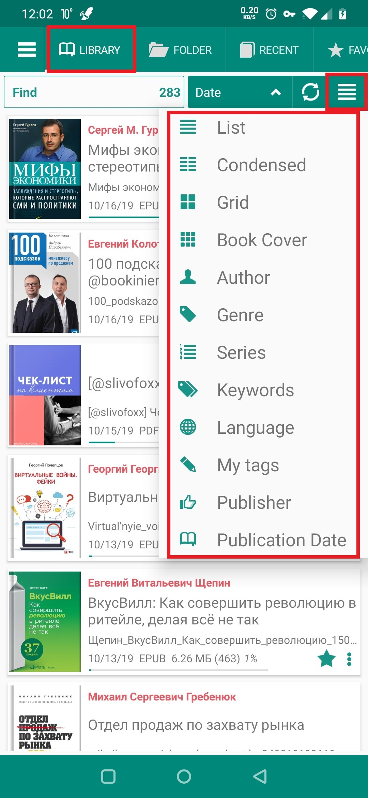
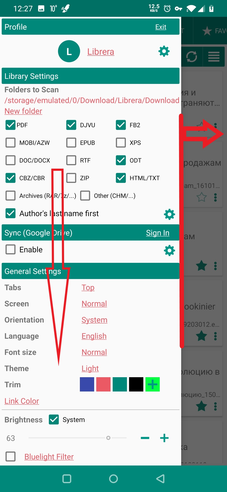
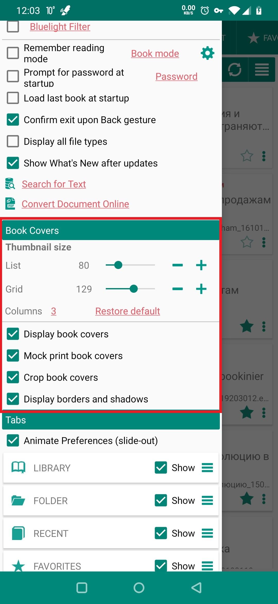
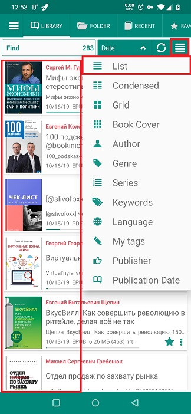
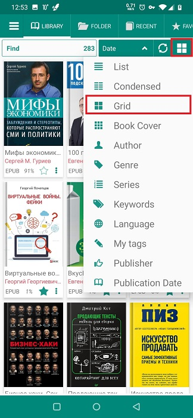
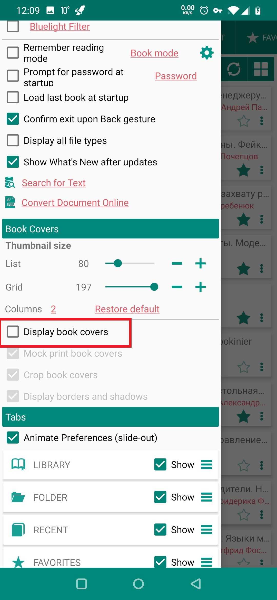
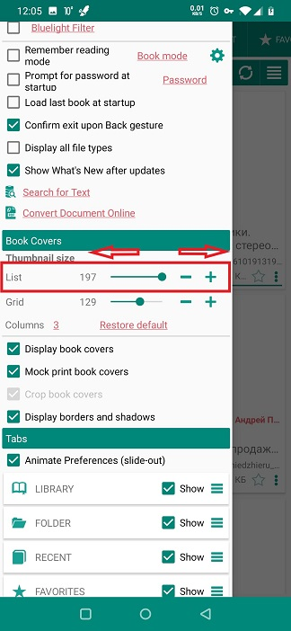

# تخصيص الشكل والمظهر لمكتبتك

> **Librera** يسمح لك بضبط طريقة عرض كتبك على &quot;أرفف&quot; مكتبتك. يمكنك تغيير عدد الكتب الموجودة على الرف ، ومظهرها ، وحجمها ، وتجميع الكتب وقوائمها ، إلخ.

يتم عرض كتبك في علامة التبويب _Library_ ، حيث يمكنك إجراء تعديلات على عرض الكتاب. توجد الإعدادات الإضافية التي تؤثر على طريقة عرض Library في علامة التبويب _Preferences_ المنبثقة ، لوحة _Book Covers_.

* لتغيير تخطيط الكتاب (قائمة ، شبكة ، مختصرة ، إلخ.) ، انقر فوق رمز الهامبرغر في الركن الأيمن العلوي من علامة التبويب _Library_
* مرر سريعًا من الحافة اليسرى من الشاشة لفتح علامة التبويب _Preferences_

> إذا حددت المربع _Preferences_ (لا توجد رسوم متحركة) ، فستجد علامة التبويب _Preferences_ إلى جانب علامة التبويب _Library_ في الأعلى.

* اسحب لأسفل وابحث عن لوحة _Book Covers_

||||
|-|-|-|
||||

* فيما يلي أمثلة على طرق عرض عدد قليل من خيارات التنسيق:
 
> تذكر ، هناك تخطيط آخر يبعد عن الصنبورين. يمكنك التبديل إلى الأكثر ملاءمة في أي وقت.

||||
|-|-|-|
||||

## لوحة _Book Covers_

* يمكنك إلغاء الاشتراك في مشاهدة أغلفة الكتب تمامًا من خلال إلغاء تحديد المربع المعني
* لا يزال لديك الكثير من خيارات التخطيط

||||
|-|-|-|
||||

* تعتمد عمليات التلاعب بحجم غلاف الكتب على التصميم الذي اخترته (قائمة أو شبكة)
* بالنسبة لـ &quot;القائمة&quot; ، استخدم شريط التمرير المناسب لتغيير حجم أغلفة الكتب (حجم الرف)

||||
|-|-|-|
||||

سيكون لديك المزيد من الخيارات لـ &quot;الشبكة&quot;.

* استخدم شريط التمرير ذي الصلة لتغيير حجم أغلفة الكتب
* يمكنك أيضًا اختيار عدد الأعمدة في شبكة مكتبتك

> ملاحظة: يمكنك دائمًا الرجوع إلى الإعدادات الأولية عن طريق النقر فوق _Restore default_ وتأكيد العملية بـ _OK_.

**إذا اخترت عرض أغلفة كتبك ، فاستخدم خيارات أخرى في لوحة _Book Covers_ لزيادة العرض.**

||||
|-|-|-|
||||
