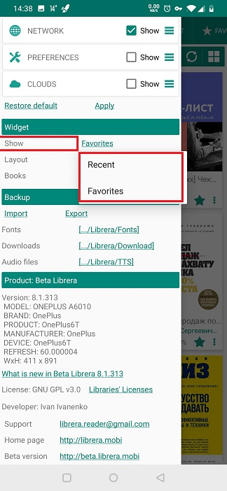
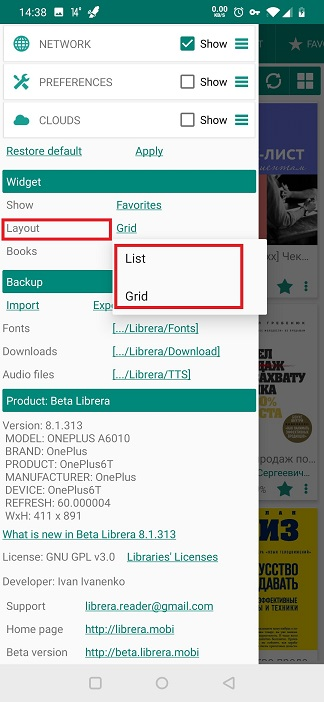

# Verwenden des Widgets von _Librera_

> Mit dem Widget können Sie **Librera** direkt vom Desktop Ihres Geräts aus starten. Und mit dem Buch Ihrer Wahl.

Um das Widget von **Librera** zu verwenden, sollten Sie es über den Tab _Widgets_ in Ihrem Launcher auf dem Desktop platzieren.

||||
|-|-|-|
||||

## Anpassen des Widgets

* Öffnen Sie den Tab &quot;Slide-Out&quot; **&quot;Einstellungen&quot;** und streichen Sie nach unten zum Fenster &quot;_Widget_&quot;

||||
|-|-|-|
||||

* Sie können dem Widget mitteilen, was angezeigt werden soll, indem Sie zwischen Ihren _Favoriten_ und _Neuesten_ Dokumenten wählen
* Wählen Sie das Layout für die Bücher im Widget von **Librera** aus
* Sie können die Größe des Widgets von **Librera** festlegen, indem Sie die Anzahl der Bücher im Bücherregal Ihres Widgets erhöhen oder verringern

||||
|-|-|-|
||||
