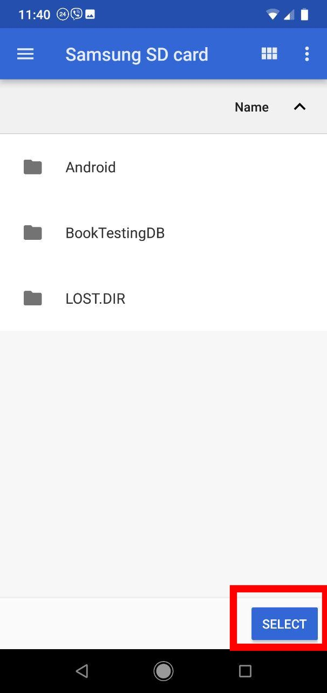
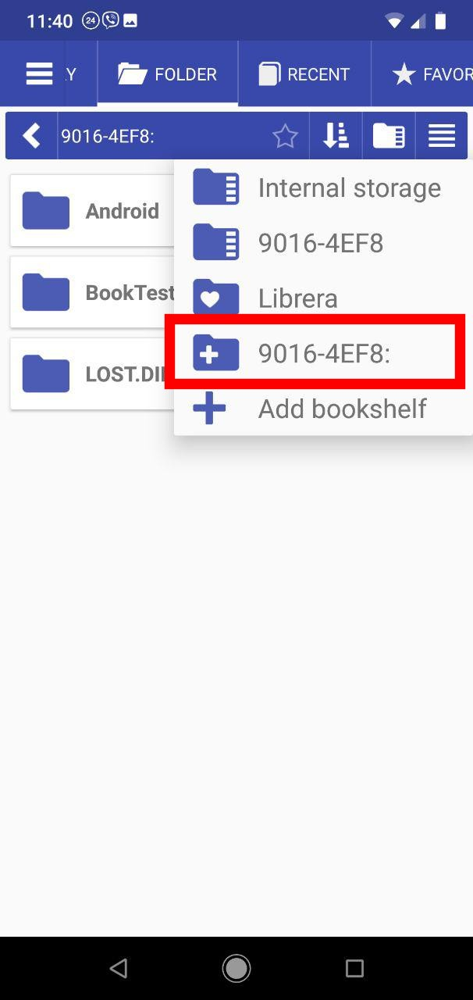

# How to Delete a Book from an External SD Card

> For security reasons, the system won't allow users to delete files from external SD cards on Android 7+.

In **Librera**, you need to add your SD card as a resource (_bookshelf_) and then allow deletion.

* In the _Folder_ tab, tap on the file manager icon to open the dropdown resources list
* Tap **+** to add a bookshelf
* Select your SD card
* Hit _SELECT_ to allow deletion from the chosen location

||||
|-|-|-|
||||

* Choose your SD card from the dropdown resources list
* Open the file menu of the book you intend to delete by tapping its triple-dot icon
* Hit _Delete_ and confirm the operation

||||
|-|-|-|
||||
