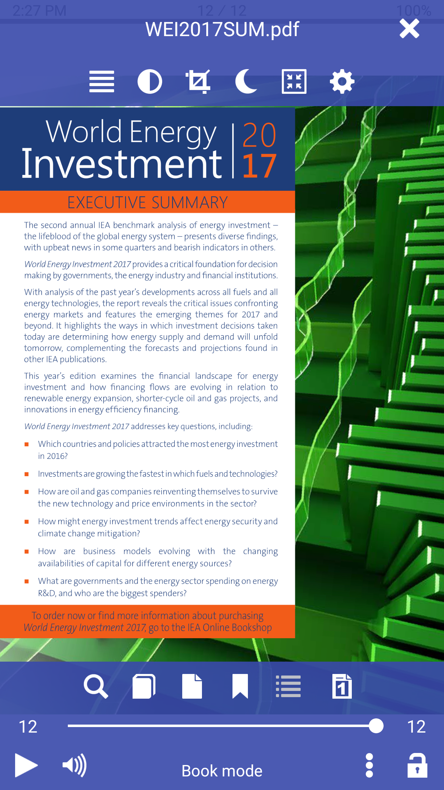
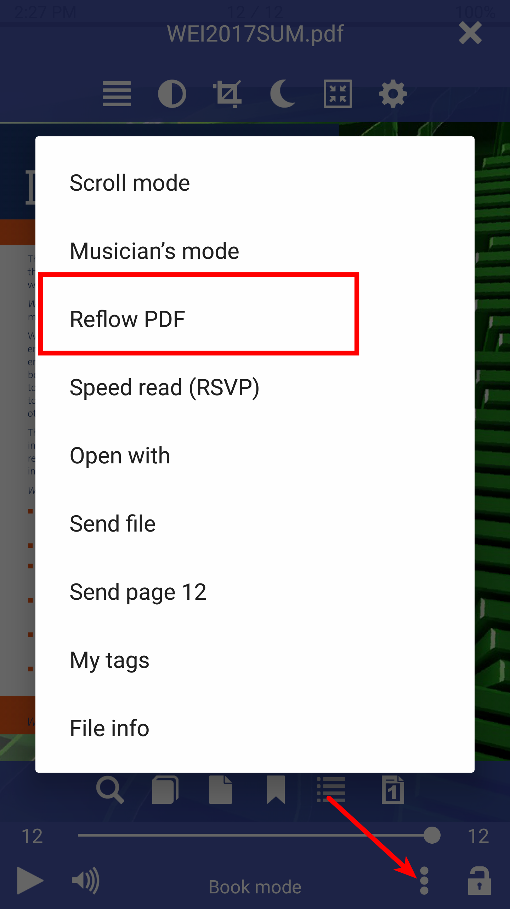

#增加PDF文档中的字体大小

要提高PDF文档的可读性(字符太小)，可以将其在**Librera**中转换为另一种文件格式(EPUB)：
*在**Librera**中打开您的PDF文档
*通过点击中心屏幕来打开常规菜单
*点击屏幕底部的书籍菜单图标(三点图标)
*点击_Reflow PDF_项，等待转换结束，然后在“ **首选项**”窗口中更改字体大小。

|1|2|3|
|-|-|-|
||||
