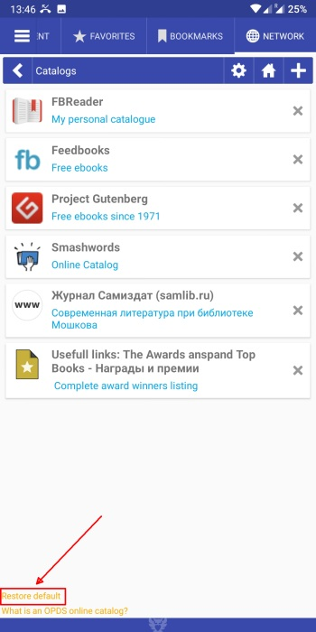
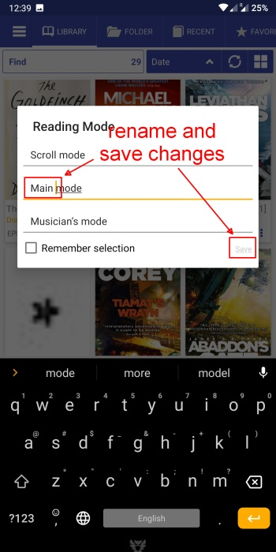
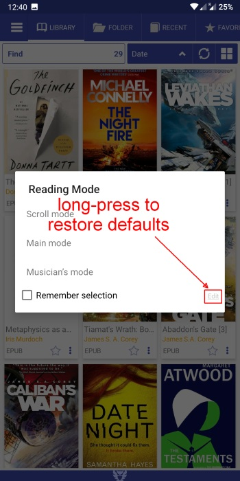

# Como restaurar configurações padrão/limpar cache

> **Librera** é um aplicativo muito flexível que permite ajustar e ajustar muitas configurações, com temas na interface do usuário e nas condições de leitura. Obviamente, pode acontecer que você não goste de alguns resultados de seus experimentos com a configuração de **Librera**. Não se preocupe! Sempre há uma maneira de reverter o aplicativo com facilidade e rapidez ao seu estado original. Em muitos aspectos, é semelhante à limpeza do cache (e às vezes é exatamente o que é).

## Redefinindo um perfil

> Às vezes, é mais fácil descartar alterações indesejadas no nível do perfil, revertendo o perfil atual para o estado original (o momento da criação). Basta seguir estes passos simples:
* Mantenha pressionado o nome do seu perfil atual no painel _Perfil_ da guia deslizante **Preferências**
* Confirme sua intenção em uma caixa de diálogo pop-up tocando em _OK_

**Nota: seus favoritos, tags e progresso da leitura não serão excluídos ou redefinidos!**

||||
|-|-|-|
||||

## Restaurando valores padrão em termos de configuração

> Antecipando sua ampla experiência com as configurações do **Librera**, fornecemos a um grande número deles uma ferramenta fácil de usar para descartar alterações e restaurar seus valores iniciais.
* Basta tocar no link _Restaurar padrão_ nas proximidades e começar de novo
> Veja exemplos abaixo:

||||
|-|-|-|
||||

## Renomeando modos de leitura e limpando alterações

> Com sua infinita flexibilidade, o **Librera** oferece a opção de alterar os nomes dos modos de leitura. Também permite restaurá-los em apenas uma etapa fácil.
* Toque no ícone de configurações ao lado de _Lembre-se do modo de leitura_ na guia deslizante **Preferências**
* Toque em _Edit_ na janela **Modo de leitura** para tornar os nomes editáveis
* Renomeie os modos e toque em _Salvar_
* Para descartar as alterações e voltar aos nomes padrão, pressione e segure _Edit_

||||
|-|-|-|
||||

> **Se, por qualquer motivo, você estiver preso a algo que não funcionará corretamente e precisar de uma &quot;lista limpa&quot;, poderá desinstalar o _Librera Reader_ do sistema e excluir manualmente a pasta _Librera_ do armazenamento interno no seu dispositivo.**
