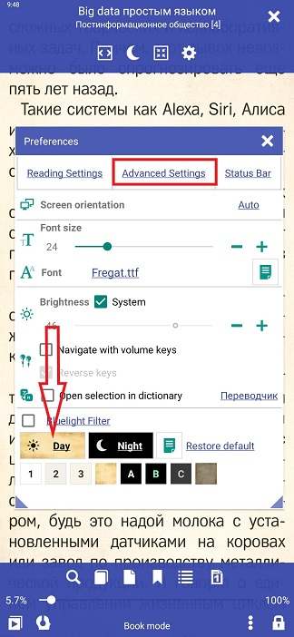
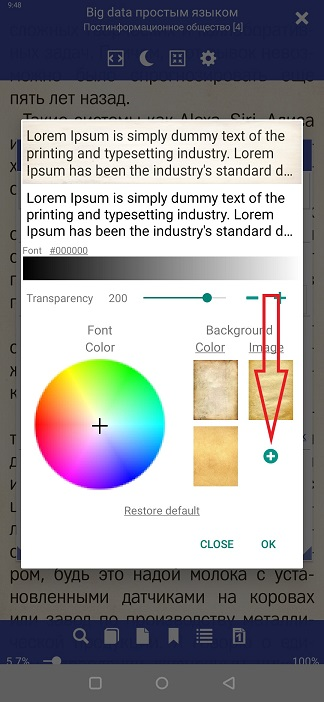

# تخصيص خلفية الصفحة

> **Librera** يتيح للمستخدم قراءة كتبهم على خلفية قابلة للتخصيص. يمكن أن يكون لدى المستخدم خلفية محددة لكل ملف تعريف ، يمكن تكوينه بشكل منفصل عن أوضاع القراءة ليلا ونهارا. يمكن أن تكون الخلفيات مجرد ألوان صلبة أو يمكن للمستخدم إضافة مواد (أو صور) إليها ، إما من ملفات عينة **Librera** أو باستخدام صورهم الخاصة.

## إعداد الخلفية الخاصة بك
* اضغط على أيقونة الإعدادات لفتح نافذة **التفضيلات**
* اضغط _Day_ لتغيير الخلفية لوضع اليوم (أو _Night_ للوضع الليلي)
* في لوحة _Background_ ، ستتمكن من تغيير لون وملمس الخلفية (أو يمكنك فقط تعليق صورتك في الخلفية)
* يمكن تغيير شفافية صورة الخلفية عن طريق سحب شريط تمرير _ الشفافية

||||
|-|-|-|
||||

## تغيير خلفية بلون خالص
* اضغط **Color** لفتح لوحة ألوان مع تقاطع واسحب التقاطع حول اللوحة (اتبع التغييرات في معاينة الصفحة في الوقت الحقيقي في الأعلى)
* يمكنك جعل خلفية الألوان الصلبة أفتح أو أغمق عن طريق سحب شريط التمرير عبر شريط الألوان
* لا تنس النقر على _OK_ لحفظ التغييرات بمجرد الانتهاء

||||
|-|-|-|
||||

## إضافة نسيج أو صورة إلى الخلفية
* اضغط **الصورة** في لوحة _Background_
* يمكنك استخدام أيٍّ من ملفات النسيج الداخلية ، عن طريق النقر عليه
* لإضافة صورتك الخاصة ، انقر فوق **+** وانتقل إلى المجلد مع الصورة التي أنت على وشك إضافتها
* ابحث عن صورتك ، واضغط عليها ، ثم انقر فوق _SELECT_
* اضبط شفافيتها باستخدام المعاينة في الوقت الفعلي
* اضغط _OK_ عند الانتهاء

||||
|-|-|-|
||||

> يمكنك دائمًا استخدام الإعدادات المسبقة للخط والخطوط الموضحة في الشكل 2. ويمكن تحريرها بسهولة في نافذة **تكوين** (انقر على أيقونة التحرير المشار إليها في السهم الأرجواني).
