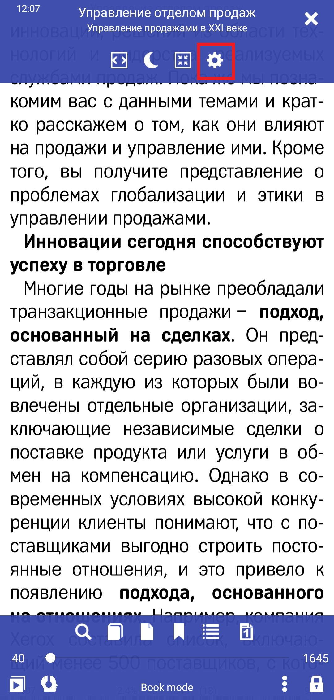
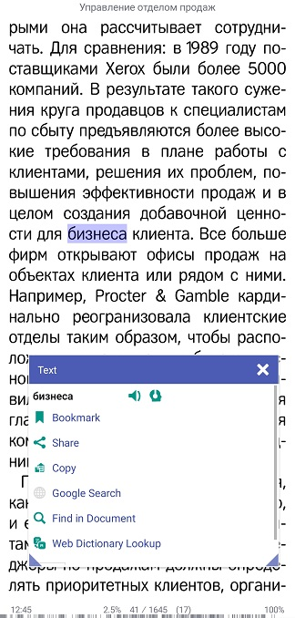
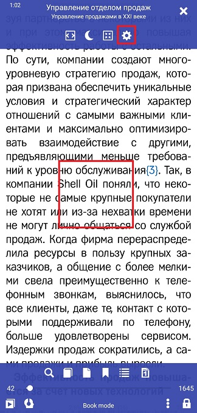

#如何在_Librera_中选择文本

> **Librera**的文本选择选项非常复杂。长按(并拖动)，您可以选择单词，段落和整页。然后，您可以轻松地通过单击复制文本以将其粘贴到另一个应用程序中，与其他用户共享您的选择，制作书签，将其发送到TTS引擎(以大声朗读)或打开/关闭线路翻译/词典等

要启用文本选择：
*点击中心屏幕以打开菜单
*点击设置图标以打开“ **首选项**”窗口
*转到“ _高级设置_”标签，然后选中相应的框

||||
|-|-|-|
||||

##文本选择选项
*不耐烦的用户可以选中_单击以选中_框。 (此选项与**“首选项”**窗口的主标签中的“在字典中选择_Open选项”非常有用)
*在某些亚洲语言中选择文本时，“按字母选择文本”选项应该派上用场

##选择文本段和整个页面
*长按您要选择的段落中的单词
*在选择方向上拖动手指。当看到开始和结束手柄时，您可以松开手指，关闭_Text_窗口，并通过拖动手柄继续选择文本
*要选择整个页面，请点击缩略图视图图标以打开“转到页面”窗口
*长按您要选择的页面，然后从下拉列表中选择一个选项

||||
|-|-|-|
||||
