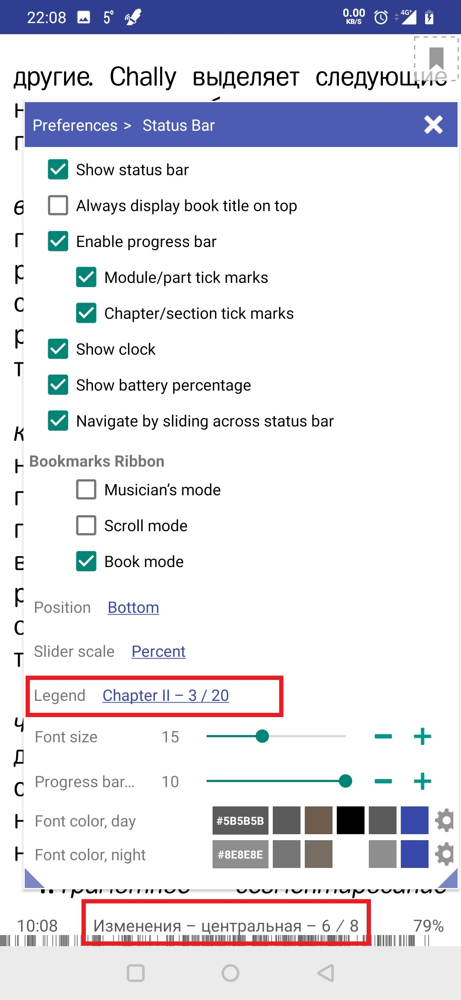
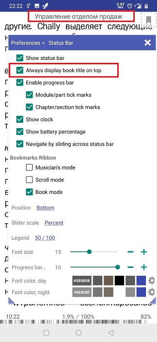
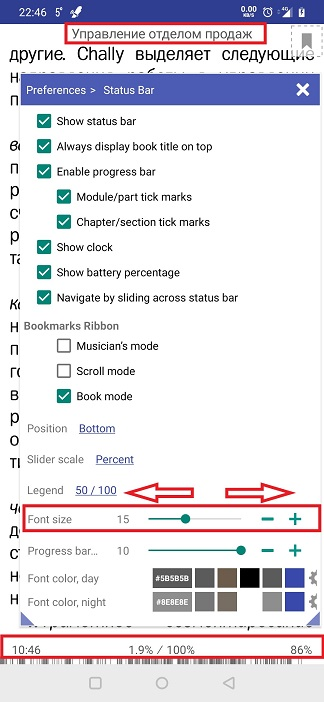

# Setting Up the Status Bar

> You can configure **Librera**'s status bar to display tons of useful information on your reading screen... or you can remove it altogether, as an annoying distraction.

You can make all changes to the status bar in the _Status Bar_ tab:
* Tap at center-screen to call the main menu
* Tap on the settings icon 
* Open the _Status Bar_ tab

||||
|-|-|-|
||||

By default, the status bar is located at the screen bottom. Use the _Position_ dropdown list to change its location.
> Note! If the _Top_ setting is selected, the _Always display book title on top_ will gray out.
* The _Show status bar_ box must be checked, if you want any information be displayed while you're reading a book

||||
|-|-|-|
||||

Check/uncheck the boxes according to your preferences. You can also:
* Change the scale of the slider that pops up at the bottom on a center-screen tap
* Select the way the numeric (dynamic) information is displayed in the status bar (chapters, pages, pages left to chapter end, etc.)
* Change the status bar's font size and color for both day and night modes 
* Enable/disable the bookmark ribbon on the reading screen

||||
|-|-|-|
||||

* If the status bar's position is _Bottom_, you can opt for permanent display of a book title on the top of the screen (even if the status bar is not showing)
* Additionally, you can select current time and remaining battery juice to be display with the book status
> **If the status bar is turned off, you can always take a peek at the clock by center-tapping the screen (look in the upper left corner)**
 
||||
|-|-|-|
||||

* Enable or disable the reading progress bar
* Select what tick marks on the progress bar you prefer (if any) 
* Opt for showing the bookmark ribbon on your reading screen

||||
|-|-|-|
||||

* Change the status bar's font size and color
* Change the height of the progress bar

||||
|-|-|-|
||||
