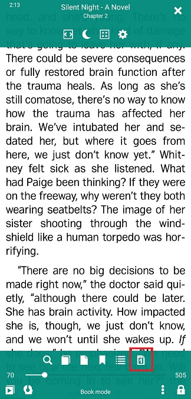
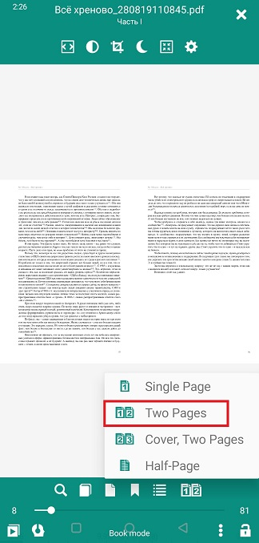
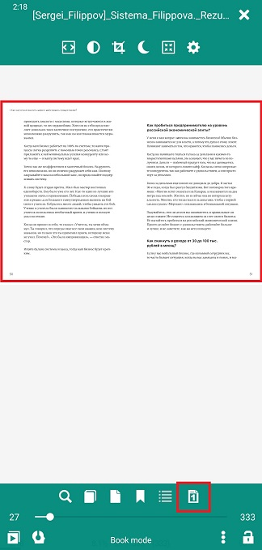
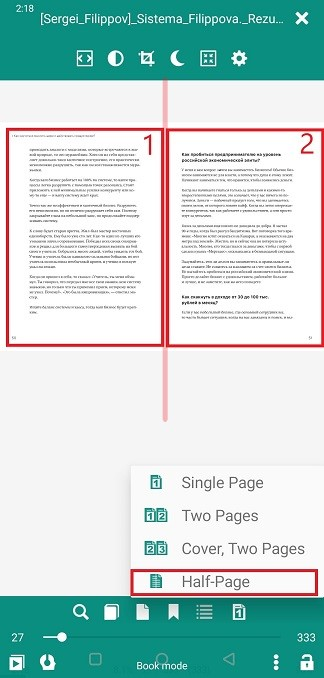
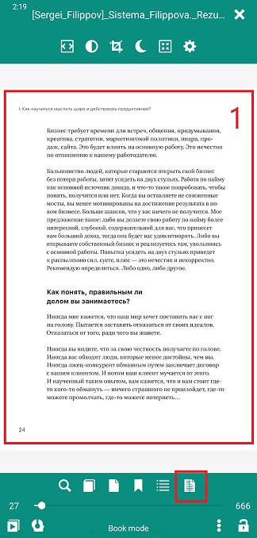

# Параметры просмотра страницы/макета

> Для обеспечения удобного чтения **Librera** позволяет пользователю вносить изменения в макет страницы во всех поддерживаемых форматах электронных книг.

Чтобы получить доступ к параметрам просмотра:
* Коснитесь экрана в центре, чтобы открыть меню
* Нажмите значок макета в правом нижнем углу, чтобы открыть раскрывающийся список опций

## Настройка макета страницы в форматах EPUB, MOBI, FB2, AWZ и др.

* макет _Single Page_ является предпочтительным для _Portrait_ ориентации экрана
* Если ваша ориентация экрана изменится (автоматически или вручную) на _Landscape_, вы можете перейти к макету _Two Pages_
* Переключитесь обратно на _Single Page_ после поворота устройства в ориентацию _Portrait_

> **Вы можете задавать комбинации ориентаций экрана и макетов страниц и использовать эти комбинации по профилю.**

||||
|-|-|-|
||||

## Настройка макета страницы в PDF/DjVu

«Жесткость» страницы в PDF/DjVu и размер экрана будут определять выбор макета страницы:
* Режим _Single Page_ или _Two Pages_ для ориентации _Portrait_ на больших экранах
* Режим _Two Pages_, предпочтительный для больших экранов и ориентации _Landscape_
* Иногда титульную страницу необходимо представлять отдельно, особенно если иллюстрации в вашей книге пересекаются с разворотами (в этом случае выберите _Cover, Two Pages_)

||||
|-|-|-|
||||

Режим * _Half-Page_ удобен в двухколоночных макетах страниц. Просто разделите вашу страницу на две, выбрав эту опцию

||||
|-|-|-|
||||
