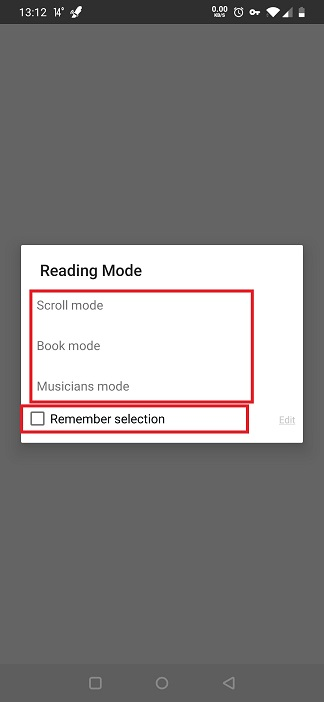
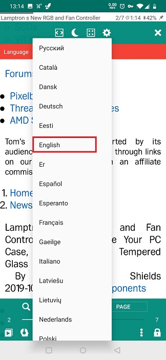
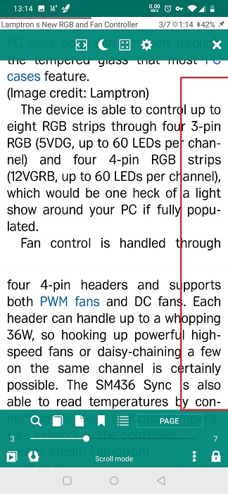
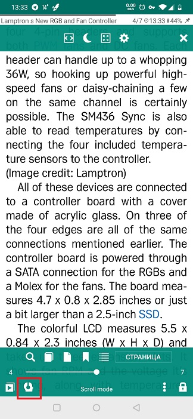

# Использование возможности TTS для чтения общих ресурсов из других приложений
> Вы можете поделиться материалами для чтения с **Librera** из любого приложения на вашем устройстве, которое поддерживает совместное использование.
> Например, вы можете делиться веб-страницами, статьями и другими интересными материалами из Интернета с **Librera**, сохранять их и использовать инструменты TTS **Librera**.

Чтобы вслух прочитать веб-страницу в **Librera**:
* Откройте страницу в вашем браузере.
* Нажмите на значок _Share_ в меню браузера (в нашем примере это Google Chrome)
* Выберите **Librera** в раскрывающемся списке доступных приложений.
* Выберите режим чтения для вашего браузера. Примечание: вы можете запомнить режим, выбранный для будущих ссылок, установив соответствующий флажок.

||||
|-|-|-|
||||

Теперь, когда веб-статья из браузера открыта в **Librera**, вы можете настроить ее читабельность: включить переносы, для начала.

||||
|-|-|-|
||||

Теперь вы можете заставить **Librera** прочитать вам вслух веб-страницу:
* Нажмите на значок **TTS** в левом нижнем углу.
* В окне **Настройки TTS** проверьте, установлен ли движок TTS (или выберите тот, который вы будете использовать, если у вас будет достаточно). Если его нет, мы рекомендуем вам установить Google TTS Engine с Google Play.
* Выберите язык для используемого движка.
* Хит _Play_ и наслаждайтесь.

> Вы можете закрыть окно **Настройки TTS**, если вам не требуется дополнительная настройка. Элементы управления воспроизведением останутся для вашего удобства внизу экрана.
* Чтобы выйти из режима TTS, коснитесь значка _X_.

||||
|-|-|-|
||||
