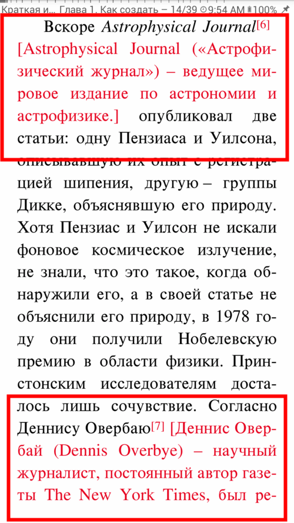

# In-Text Notes vs. Footnotes
> For your convenience, and **for the sake of TTS Reading**, **Librera** will replace foot- or endnotes in your document with in-text notes, which immediately follow note indicators.
To opt for in-text note presentation:
* Go to the _Reading Settings_ tab in the **Preferences** window
* Check the _In-text notes_ box and enjoy
* You can configure the color of your notes for each reading condition (day, night) separately 
> This functionality works in EPUB, FB2, and AZW/MOBI formats.
**Tip: We recommend using in-text notes for _TTS Reading_**

||||
|-|-|-|
||||
