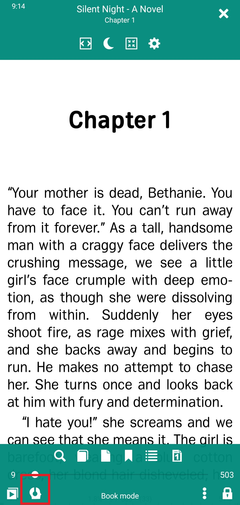
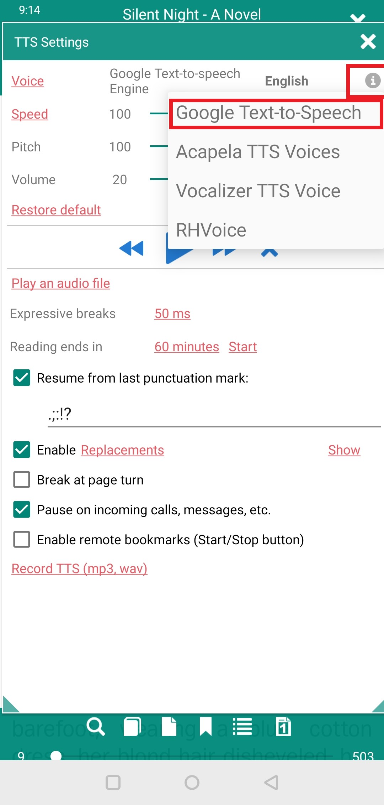
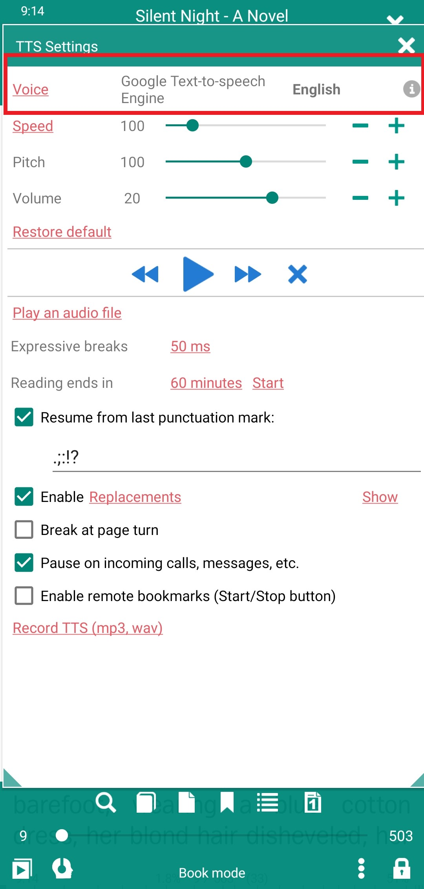
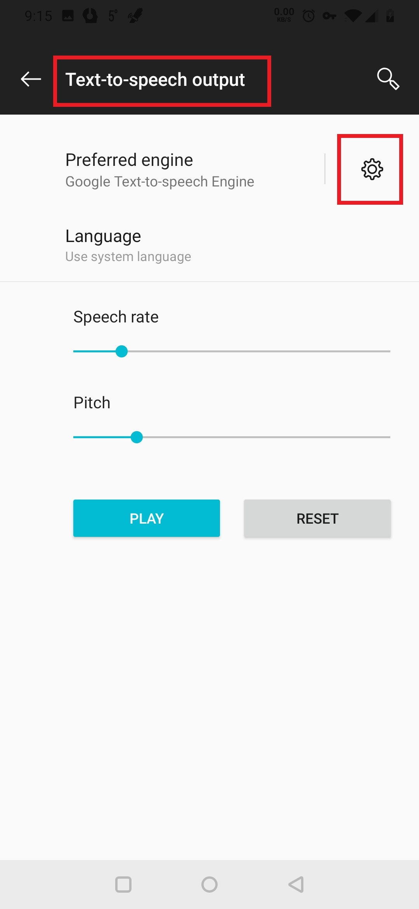
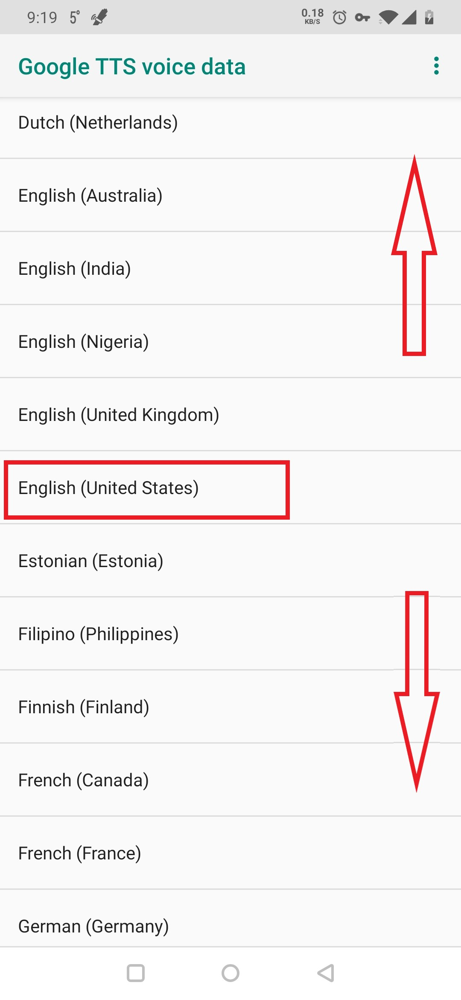
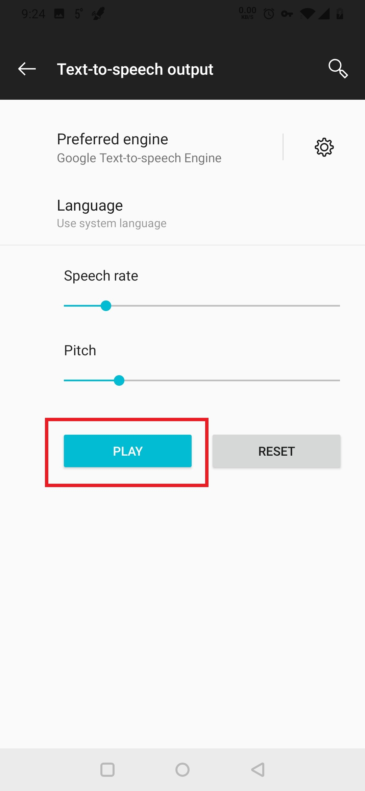

# Using a Text-to-Speech Engine with _Librera_ 

> **Librera** can read your books (and other documents) out loud using a third-party Text-to-Speech (TTS) engine installed on your Android system. It supports read-aloud for a great number of ebook formats, from EPUB to Kindle to PDF.

# Choosing a TTS Engine

* Tap on the TTS icon at the bottom of the screen to open the **TTS Settings** window
* Tap **"i"** to open a dropdown list of TTS engines
* Select whatever engine you like. If the engine you've chosen is not installed yet on your system, you'll be redirected to Google Play Store. Follow the instructions for your preferred engine in order to set it up, download main and additional voices, etc.

> Note: You may be charged for extra features, e.g., additional voices, by the engine's developers.

||||
|-|-|-|
||||

## Example: Setting Up Google Text-to-Speech Engine

* In **Librera**'s **TTS Settings** window, follow the _Voice_ link to your system's **Text-to-speech output** settings page
* Tap the settings icon next to _Preferred engine_
* Tap _Install voice data_ to select your TTS language and voice
* Test the voice you've selected by tapping _PLAY_ back on the **Text-to-speech output** page

> You can fine-tune the engine's settings (e.g., reading speed, pitch, and/or volume) in **Librera**'s **TTS Settings** window.

||||
|-|-|-|
||||

||||
|-|-|-|
||||

> Note: Voice setup in other TTS engines is conducted in a similar fashion. Remember that voice data files could be quite large. To spare your limited cellular data plans, make sure they are downloaded via WiFi connection only.
