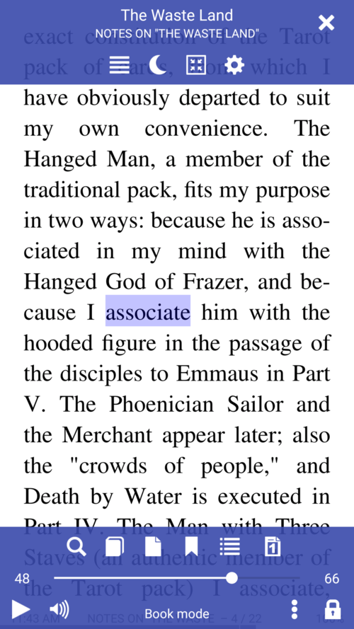
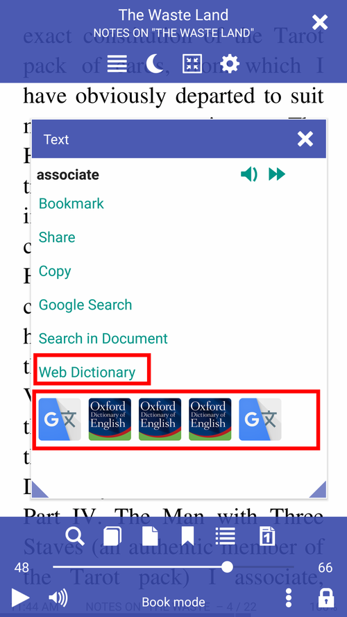
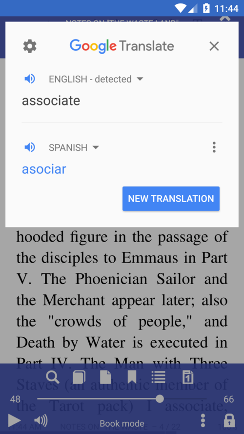
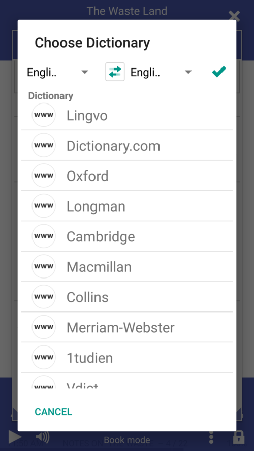
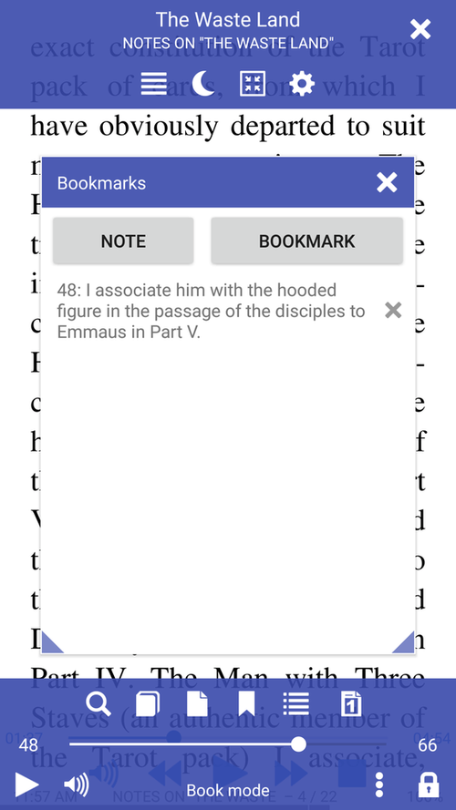

[<](/wiki/faq/fr)

# Librera pour l'apprentissage des langues étrangères

> Utilisez l'application beaucoup d'étudiants et de gens qui lisent des livres dans différentes langues.
L'information sera utile aux étudiants qui apprennent des langues ou lisent simplement des livres dans d'autres langues.

L'application peut traduire le mot en surbrillance ou l'application avec les attributs.
Les dictionnaires peuvent être un programme sur un ordinateur ou des dictionnaires Web.

||||
|-|-|-|
||||

Vous pouvez activer l'option permettant d'ouvrir immédiatement un mot connu ou une phrase du dictionnaire sélectionné.

||||
|-|-|-|
||||

* Écoutez la prononciation du mot ou de la phrase sélectionnée
* Écoutez le livre à voix haute
* Ajoutez des mots et des phrases aux notes.

||||
|-|-|-|
||||

* Ajouter un fichier audi qui va au livre
* Écoutez le livre à voix haute
* Ajoutez des mots et des phrases aux notes.

||||
|-|-|-|
||||

Librera peut lire des fichiers audio externes avec le livre.
L'application affiche les formats .mp3, .mp4, .wav, .ogg, .m4a, .flac
Cliquez longuement sur le bouton lecture \ pause pour réinitialiser la piste au début

* Ajouter un fichier audi qui va au livre
* Gérer l'écoute, mettre en pause
* Consultez toutes les notes de votre livre.

||||
|-|-|-|
||||
