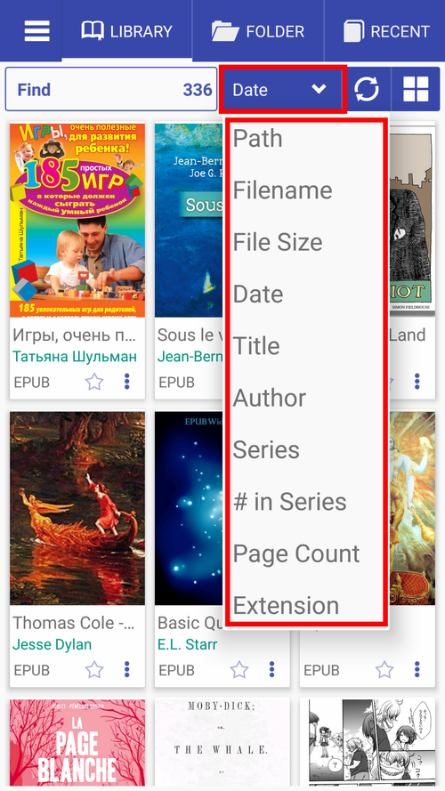
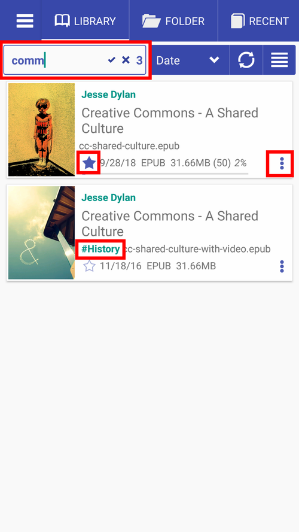
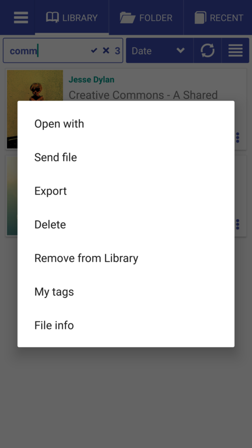
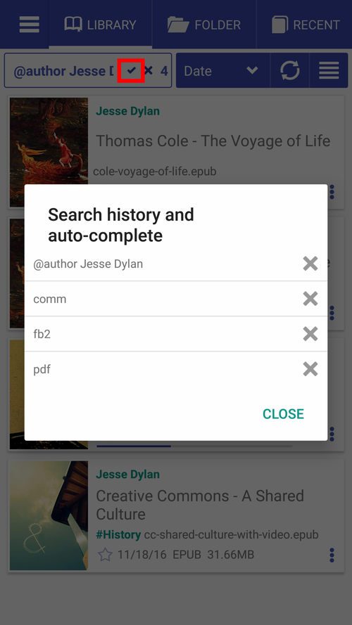

# Navigating the _Library_ Tab

> Once installed, **Librera** by default will open with its _Library_ tab, rife with useful information about the books (and other documents) found on your device. Here is a quick guide around the _Library_ tab.

* The _Library_ tab, default view
* Sort books on the shelves of your Library according to certain criteria (by filename, author, date, etc.)
* You can change the way your books are showcased on the shelves by changing the Library's layout (list, grid, book covers, etc.)

||||
|-|-|-|
||||

* Condensed (two-column) view
* Grid view
* Book covers only

||||
|-|-|-|
||||

* Find books in your Library
* Tap the star icon to add a book to **Favorites**
* Tap the triple-dot icon to open the book menu
* A long-press on the star icon will prompt you to add a custom tag
* Tap #History to add a custom tag to a book
* Long-press on a book cover to open the **Book Info** window

||||
|-|-|-|
||||

* Find a book by extension (FB2, in our example below)
* Tap the author's name to find all the books by this author in the Library
* Tap _x_ to clear search results
* Long-press on the tick-mark to view and edit the search history and auto-complete list
* View **Book Info** and check out how far you are into this book (Tip: You can reset your reading progress via the book menu)

||||
|-|-|-|
||||
