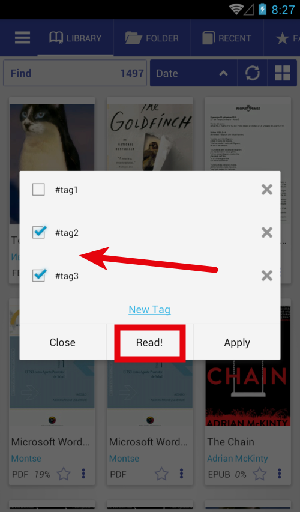
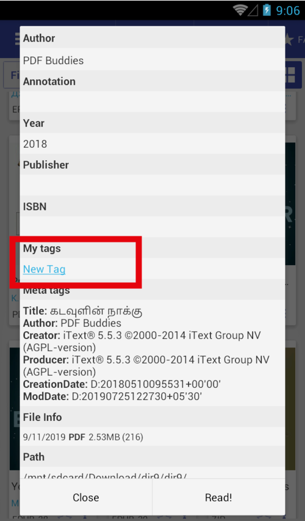

# Открыть книгу с помощью «Менеджера тегов»

> Можно организовывать книги в коллекции с тегами. «Tag Manager» упростит этот процесс

Невозможно установить тег для нескольких книг, но можно открыть диспетчер тегов перед открытием книги.

* Установите с помощью (помните режим чтения) «Диспетчер тегов»
* Нажмите на любую книгу, вы увидите диалог
* Вы можете установить \ удалить метки и нажать «Применить»
* Вы можете установить \ удалить теги и нажать «Читать», теги также будут применены
* Новые теги вы можете найти на вкладке &quot;Избранное&quot;

||||
|-|-|-|
||||

# Открыть менеджер тегов

Есть много способов установить \ удалить теги для книг

* Длительное нажатие на значок звездочки, чтобы открыть менеджер тегов
* Откройте меню книги, нажмите «Добавить теги»
* Информация о файле диалоговое окно «Добавить теги»

||||
|-|-|-|
||||
