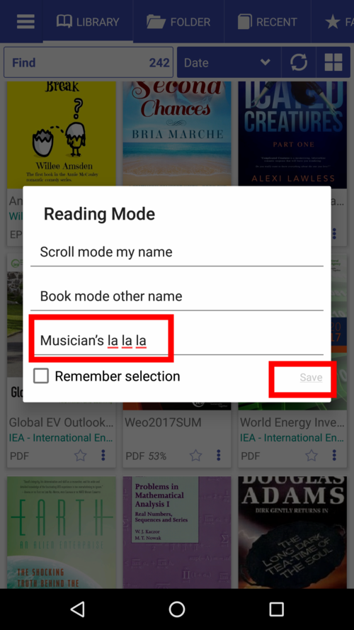
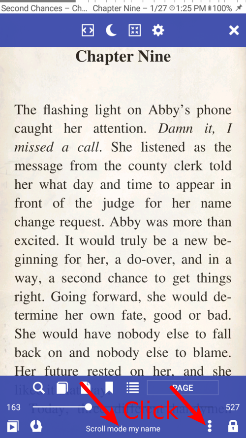
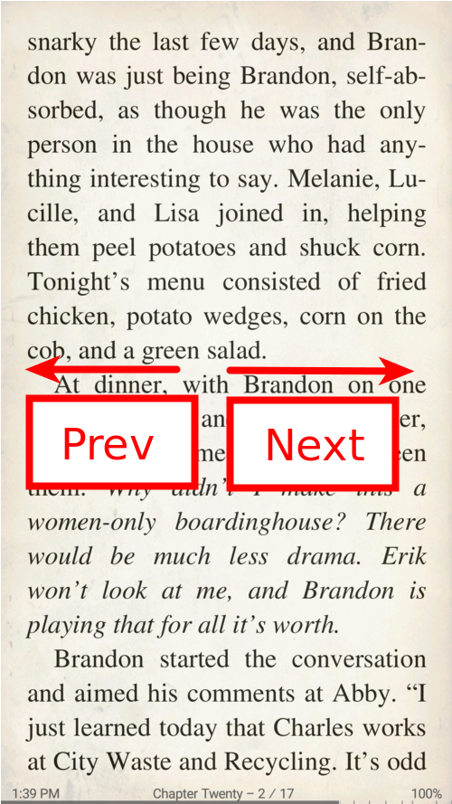

# Lesemodi: Blättern, Buch und Musiker

> **Librera** ermöglicht dem Leser die Auswahl zwischen drei Lesemodi. Jeder geht auf bestimmte Anforderungen ein und der Benutzer kann ganz einfach von einem Modus in einen anderen wechseln.

Im **Bildlaufmodus** werden Buchseiten mit dem Finger nach oben und unten gescrollt

> Sie können auch das automatische Scrollen aktivieren und die Geschwindigkeit einstellen.

Im **Buchmodus** werden die Seiten horizontal gespiegelt, wenn Sie mit dem Finger nach links, rechts oder oben oder unten streichen (oder auf die Bildschirmränder tippen).

Der** Musiker-Modus** ist ein Fall des Auto-Scroll-Modus, der speziell für Musiker entwickelt wurde.

* Wenn Sie auf ein Buch tippen, wird das Fenster **Lesemodus** geöffnet, in dem Sie einen Lesemodus für dieses Buch auswählen können
* Aktivieren Sie das Kontrollkästchen &quot;Lesemodus speichern&quot; und wählen Sie den Standardmodus für alle Bücher aus
* Sie können die Namen der Lesemodi bearbeiten, nachdem Sie auf &quot;Bearbeiten&quot; getippt haben.
* Wenn Sie lange auf &quot;Bearbeiten&quot; drücken, werden die Standardnamen wiederhergestellt

||||
|-|-|-|
||||

**Sie können auch Standard-Lesemodi für jedes E-Book-Format festlegen.**

* Tippen Sie auf das Einstellungssymbol, um den Voreinstellungsdialog aufzurufen
* Aktivieren Sie das Kontrollkästchen, um Voreinstellungen zu aktivieren und die Listen bei Bedarf zu bearbeiten
* Vergessen Sie nicht, auf _SAVE_ zu tippen, wenn Sie Änderungen vorgenommen haben
* Sie können die Standardeinstellungen der Listen wiederherstellen, indem Sie auf _Restore default_ tippen.

||||
|-|-|-|
||||

* Um den Lesemodus für ein aktuelles Buch zu ändern, tippen Sie in der Mitte auf den Bildschirm und anschließend auf das Dreifachpunktsymbol unten
* Tippen Sie im Dialogfeld auf den bevorzugten Modus
* Voilà!

||||
|-|-|-|
||||

## Bildlaufmodus
* Wählen Sie die Größe Ihrer Bildlaufstreifen aus: nach Seite, Bildschirm, Bildschirmprozentsatzvorgaben oder einem benutzerdefinierten Wert

> **Blättern Sie mit den Lautstärketasten, Hardwaretasten, Tasten Ihres Bluetooth-Geräts und tippen Sie auf den Bildschirm.**

||||
|-|-|-|
||||

## Buchmodus
* Streichen Sie horizontal zur nächsten/vorherigen Seite
* Streichen Sie vertikal zur nächsten/vorherigen Seite
* Ändern Sie die Reaktion auf Ihre vertikalen Wischbewegungen
> **Blättern Sie durch Seiten mit Lautstärketasten, Hardwaretasten, Tasten auf Ihrem Bluetooth-Gerät oder tippen Sie auf den Bildschirm.**

**Denken Sie daran, dass Ihre Tap-Zonen in Bezug auf Größe und Aktion anpassbar sind.**

||||
|-|-|-|
||||

## Musikermodus
* Tippen Sie einmal, um den automatischen Bildlauf zu starten/zu stoppen
* Tippen Sie in bestimmten Bereichen auf, um zur nächsten/vorherigen Seite zu gelangen
* Ändern Sie die Geschwindigkeit des automatischen Bildlaufs im laufenden Betrieb
* Tippen Sie oben auf, um die Steuerelemente anzuzeigen
* Tippen Sie auf das Zurückspul-Symbol, um zu einem beliebigen Zeitpunkt zum Anfang zurückzukehren

||||
|-|-|-|
||||
